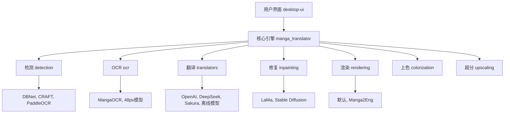
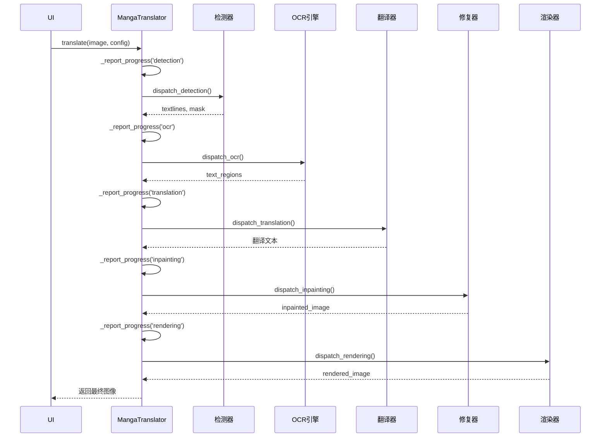
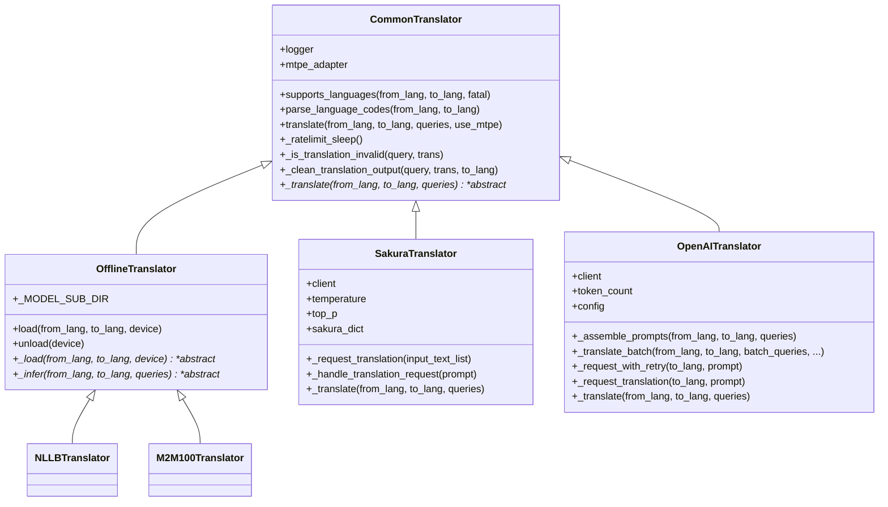

# 开发者指南

<cite>
**本文档中引用的文件**  
- [manga_translator.py](file://manga_translator\manga_translator.py)
- [__init__.py](file://manga_translator\translators\__init__.py)
- [common.py](file://manga_translator\translators\common.py)
- [sakura.py](file://manga_translator\translators\sakura.py)
- [chatgpt.py](file://manga_translator\translators\chatgpt.py)
- [config.py](file://manga_translator\config.py)
- [app_logic.py](file://desktop-ui\app_logic.py)
- [translation_service.py](file://desktop-ui\services\translation_service.py)
</cite>

## 目录
1. [项目结构分析](#项目结构分析)
2. [核心组件与架构](#核心组件与架构)
3. [添加自定义翻译器插件](#添加自定义翻译器插件)
4. [Python API 集成](#python-api-集成)
5. [桌面UI服务层扩展](#桌面ui服务层扩展)
6. [调试与日志](#调试与日志)
7. [最佳实践](#最佳实践)

## 项目结构分析

本项目是一个功能完备的漫画图像翻译系统，其结构清晰地分为几个核心模块：

- **`manga_translator`**: 核心翻译引擎，包含检测、OCR、翻译、修复、渲染等所有处理逻辑。
- **`desktop-ui`**: 桌面应用程序的用户界面和服务层。
- **`dict` 和 `models`**: 存放翻译字典和机器学习模型。
- **`examples`**: 配置文件和模板示例。

核心业务逻辑位于 `manga_translator` 包中，而 `desktop-ui` 则作为前端，通过调用核心引擎来实现图形化操作。



**图源**
- [manga_translator.py](file://manga_translator\manga_translator.py)
- [config.py](file://manga_translator\config.py)

## 核心组件与架构

### MangaTranslator 核心类

`MangaTranslator` 类是整个系统的核心，它协调了从图像输入到翻译输出的整个流水线。

**关键属性**:
- **`_progress_hooks`**: 进度钩子列表，用于在处理过程中报告进度。
- **`device`**: 指定运行设备（CPU、CUDA、MPS）。
- **`models_ttl`**: 模型在内存中保留的时间（秒），为0表示常驻内存。

**关键方法**:
- **`translate`**: 主翻译入口点，处理单张图片。
- **`_translate`**: 实际执行翻译流水线的私有方法，包含检测、OCR、翻译、修复、渲染等步骤。
- **`parse_init_params`**: 解析初始化参数，配置翻译器行为。



**图源**
- [manga_translator.py](file://manga_translator\manga_translator.py#L150-L300)

### 翻译器模块 (translators)

翻译器模块采用插件式设计，允许轻松添加新的翻译后端。

**核心机制**:
1.  **注册机制**: 所有翻译器在 `translators/__init__.py` 中的 `TRANSLATORS` 字典里注册。
2.  **基类**: 所有翻译器都继承自 `CommonTranslator` 或 `OfflineTranslator` 基类。
3.  **接口**: 必须实现 `_translate` 抽象方法。



**图源**
- [common.py](file://manga_translator\translators\common.py#L1-L150)
- [sakura.py](file://manga_translator\translators\sakura.py#L1-L100)
- [chatgpt.py](file://manga_translator\translators\chatgpt.py#L1-L150)

## 添加自定义翻译器插件

本节将指导您如何创建一个名为 `MyCustomTranslator` 的新翻译器插件，该插件对接一个假想的 "MyAwesomeAPI"。

### 步骤 1: 创建翻译器文件

在 `manga_translator/translators/` 目录下创建新文件 `my_custom.py`。

### 步骤 2: 实现翻译器类

```python
# manga_translator/translators/my_custom.py

import asyncio
import aiohttp
from typing import List
from .common import CommonTranslator, LanguageUnsupportedException

# 定义您的API密钥
MY_AWESOME_API_KEY = "your_api_key_here"
MY_AWESOME_API_BASE = "https://api.myawesome.com/v1"

class MyCustomTranslator(CommonTranslator):
    """
    对接 MyAwesomeAPI 的自定义翻译器。
    """

    # 定义 MyAwesomeAPI 支持的语言代码映射
    _LANGUAGE_CODE_MAP = {
        'CHS': 'zh',
        'JPN': 'ja',
        'ENG': 'en',
        'KOR': 'ko',
        # 添加更多支持的语言...
    }

    # 设置请求速率限制
    _MAX_REQUESTS_PER_MINUTE = 60

    def __init__(self):
        super().__init__()
        # 初始化您的API客户端
        self.session = None
        self.api_key = MY_AWESOME_API_KEY
        self.base_url = MY_AWESOME_API_BASE

    async def _translate(self, from_lang: str, to_lang: str, queries: List[str]) -> List[str]:
        """
        实现核心翻译逻辑。
        """
        # 1. 验证语言支持
        if not self.supports_languages(from_lang, to_lang, fatal=True):
            return queries

        # 2. 将内部语言代码转换为API所需代码
        api_from_lang, api_to_lang = self.parse_language_codes(from_lang, to_lang)
        if not api_from_lang or not api_to_lang:
            return queries

        # 3. 处理空查询
        if not queries:
            return queries

        # 4. 创建HTTP会话（如果尚未创建）
        if self.session is None:
            self.session = aiohttp.ClientSession()

        # 5. 准备请求数据
        payload = {
            "source_lang": api_from_lang,
            "target_lang": api_to_lang,
            "texts": queries
        }

        # 6. 发送API请求
        try:
            # 遵守速率限制
            await self._ratelimit_sleep()

            async with self.session.post(
                f"{self.base_url}/translate",
                json=payload,
                headers={"Authorization": f"Bearer {self.api_key}"}
            ) as response:
                if response.status != 200:
                    self.logger.error(f"MyAwesomeAPI 返回错误: {response.status}")
                    # 返回原文作为降级方案
                    return queries

                result = await response.json()
                # 假设API返回一个包含翻译文本的列表
                translations = result.get("translations", [])

                # 7. 清理和验证输出
                cleaned_translations = []
                for query, trans in zip(queries, translations):
                    cleaned = self._clean_translation_output(query, trans, to_lang)
                    cleaned_translations.append(cleaned)

                return cleaned_translations

        except Exception as e:
            self.logger.error(f"调用 MyAwesomeAPI 时发生错误: {e}")
            # 返回原文作为降级方案
            return queries

    async def unload(self):
        """
        释放资源，例如关闭HTTP会话。
        """
        if self.session:
            await self.session.close()
            self.session = None
```

### 步骤 3: 注册翻译器

编辑 `manga_translator/translators/__init__.py` 文件，将您的新翻译器注册到系统中。

```python
# manga_translator/translators/__init__.py

# ... (其他导入)

from .my_custom import MyCustomTranslator # 新增导入
from ..config import Translator, TranslatorConfig, TranslatorChain

# ... (其他翻译器定义)

# 在 TRANSLATORS 字典中添加您的翻译器
TRANSLATORS = {
    # ... (其他翻译器)
    Translator.my_custom: MyCustomTranslator, # 新增注册
    **GPT_TRANSLATORS,
    **OFFLINE_TRANSLATORS,
}

# ... (其余代码)
```

### 步骤 4: 定义配置枚举

为了让配置系统识别您的翻译器，需要在 `config.py` 中的 `Translator` 枚举里添加一个条目。

```python
# manga_translator/config.py

class Translator(str, Enum):
    # ... (其他条目)
    sakura = "sakura"
    deepseek = "deepseek"
    groq = "groq"
    gemini = "gemini"
    gemini_2stage = "gemini_2stage"
    custom_openai = "custom_openai"
    my_custom = "my_custom" # 新增条目
    offline = "offline"
    # ... (其余条目)
```

完成以上步骤后，您就可以在配置文件或命令行中使用 `my_custom` 作为翻译器了。

**本节源码**
- [my_custom.py](file://manga_translator\translators\my_custom.py)
- [__init__.py](file://manga_translator\translators\__init__.py#L1-L200)
- [config.py](file://manga_translator\config.py#L1-L50)

## Python API 集成

您可以直接在任何Python项目中导入并使用 `MangaTranslator` 类，将其作为库集成。

### 基本用法

```python
from manga_translator.manga_translator import MangaTranslator
from manga_translator.config import Config, TranslatorConfig, Translator, RenderConfig

# 1. 创建配置对象
config = Config(
    translator=TranslatorConfig(
        translator=Translator.sakura, # 使用Sakura翻译器
        target_lang='CHS'             # 翻译成简体中文
    ),
    render=RenderConfig(
        renderer='default',           # 使用默认渲染器
        font_size_offset=2            # 字体大小增加2
    )
)

# 2. 初始化翻译器
translator = MangaTranslator({
    'use_gpu': True,                 # 启用GPU
    'verbose': True                  # 启用详细日志
})

# 3. 加载图片
from PIL import Image
image = Image.open("path/to/your/manga_page.jpg")

# 4. 执行翻译
try:
    result_context = await translator.translate(image, config)
    # 获取最终的翻译图像
    final_image = result_context.result
    # 保存图像
    final_image.save("translated_page.jpg")
except Exception as e:
    print(f"翻译失败: {e}")

# 5. 清理资源
await translator.cleanup() # 如果有清理方法
```

### 批量处理

对于批量处理多张图片，可以循环调用 `translate` 方法。

```python
import asyncio
from pathlib import Path

async def batch_translate(image_paths, output_dir):
    # 重用同一个MangaTranslator实例以提高效率
    translator = MangaTranslator({'use_gpu': True})
    
    for image_path in image_paths:
        try:
            image = Image.open(image_path)
            result_context = await translator.translate(image, config)
            
            output_path = Path(output_dir) / f"translated_{Path(image_path).name}"
            result_context.result.save(output_path)
            print(f"已翻译: {output_path}")
            
        except Exception as e:
            print(f"处理 {image_path} 时出错: {e}")
    
    # 所有任务完成后清理
    # ... 清理逻辑

# 运行批量任务
image_list = ["page1.jpg", "page2.jpg", "page3.jpg"]
asyncio.run(batch_translate(image_list, "./output"))
```

**本节源码**
- [manga_translator.py](file://manga_translator\manga_translator.py#L150-L200)

## 桌面UI服务层扩展

`desktop-ui` 项目通过服务层（`services`）和业务逻辑层（`app_logic.py`）为UI提供功能。

### 核心服务

- **`TranslationService`**: 管理翻译器的初始化和调用。
- **`ConfigService`**: 管理应用程序和翻译配置。
- **`FileService`**: 处理文件操作和过滤。
- **`StateManager`**: 管理应用的全局状态。

### 扩展点

#### 1. 扩展 `TranslationService`

您可以通过修改 `translation_service.py` 来添加新的翻译功能。

```python
# desktop-ui/services/translation_service.py

class TranslationService:
    # ... (现有代码)

    async def translate_text_with_context(self, text: str, context: str, 
                                       translator: Optional[Translator] = None,
                                       target_lang: Optional[str] = None) -> Optional[TranslationResult]:
        """
        一个扩展方法，允许在翻译时提供上下文。
        """
        if not TRANSLATOR_AVAILABLE or not text or not text.strip():
            return None

        # ... (获取 translator 和 target_lang)

        try:
            chain_string = f"{translator_to_use.value}:{target_lang_to_use}"
            chain = TranslatorChain(chain_string)
            ctx = Context()
            ctx.text = text
            # 将上下文信息传递给翻译器
            ctx.context = context  # 这是一个自定义字段
            queries = [text]

            # 假设您的翻译器能利用 ctx.context
            translated_texts = await dispatch_translator(
                chain,
                queries,
                args=ctx # 将包含上下文的ctx传入
            )

            if translated_texts:
                return TranslationResult(
                    original_text=text,
                    translated_text=translated_texts[0],
                    translator_used=translator_to_use.value
                )
            return None
        except Exception as e:
            self.logger.error(f"带上下文的翻译失败: {e}")
            raise
```

#### 2. 修改 `app_logic.py` 以定制UI逻辑

`app_logic.py` 是连接UI和后端服务的桥梁。您可以通过修改它来改变UI的行为。

```python
# desktop-ui/app_logic.py

class AppLogic:
    # ... (现有代码)

    def _build_backend_args(self) -> Any:
        """
        修改此方法以添加新的工作流参数。
        """
        try:
            from manga_translator.args import reparse
            current_config = self.config_service.get_config()
            args_list = []

            # 添加现有参数
            if current_config.get('load_text', False):
                args_list.append('--load-text')
            # ... (其他参数)

            # 添加新参数：启用上下文翻译
            if current_config.get('use_context_translation', False):
                args_list.append('--use-context') # 假设后端支持此参数

            self.logger.info(f"为后端动态构建参数: {args_list}")
            return reparse(args_list)
        except Exception as e:
            self.logger.error(f"构建后端参数时出错: {e}")
            return None

    def start_backend_task(self) -> bool:
        """
        修改此方法以在任务开始前执行自定义逻辑。
        """
        # 自定义预处理逻辑
        if not self._preprocess_files():
            return False

        # 调用原始的启动逻辑
        return super().start_backend_task()

    def _preprocess_files(self) -> bool:
        """
        自定义文件预处理方法。
        """
        # 例如，检查文件是否可读，或进行格式转换
        files = self.state_manager.get_current_files()
        for file_path in files:
            if not os.access(file_path, os.R_OK):
                self.logger.error(f"文件无读取权限: {file_path}")
                return False
        return True
```

**本节源码**
- [translation_service.py](file://desktop-ui\services\translation_service.py#L1-L50)
- [app_logic.py](file://desktop-ui\app_logic.py#L1-L100)

## 调试与日志

### 日志查看方法

1.  **控制台输出**: 运行程序时，所有日志会直接输出到控制台。
2.  **日志文件**: 系统会自动在 `result/` 目录下创建以时间戳命名的日志文件（如 `log_20231025143022.txt`），记录所有详细信息。
3.  **启用详细模式**: 在配置中设置 `verbose: true`，这会生成 `input.png`, `mask_raw.png`, `inpainted.png` 等调试图片，帮助您可视化处理过程。

### 调试技巧

- **检查模型路径**: 确保 `models/` 目录下的模型文件完整且路径正确。
- **验证API密钥**: 对于需要API密钥的翻译器（如OpenAI），确保环境变量（如 `OPENAI_API_KEY`）已正确设置。
- **使用小图片测试**: 在开发新功能时，使用小尺寸的图片可以显著加快调试速度。
- **利用 `ignore_errors` 参数**: 在 `MangaTranslator` 初始化时设置 `ignore_errors=True`，可以让翻译器在遇到错误时跳过该图片并继续处理，便于定位问题。

## 最佳实践

1.  **资源管理**: 对于长时间运行的应用，注意管理 `MangaTranslator` 实例的生命周期，避免内存泄漏。考虑使用 `models_ttl` 参数来自动卸载不常用的模型。
2.  **错误处理**: 在集成时，务必使用 `try...except` 块来捕获 `TranslationInterrupt` 和其他异常，确保程序的健壮性。
3.  **配置分离**: 将复杂的配置（如GPT提示词）放在独立的YAML文件中，而不是硬编码在代码里。
4.  **性能优化**: 对于批量处理，考虑实现并发处理，但要注意GPU内存的限制。
5.  **代码清晰**: 在实现新的翻译器时，遵循 `CommonTranslator` 基类的约定，确保 `_translate` 方法的逻辑清晰，并妥善处理错误和边界情况。