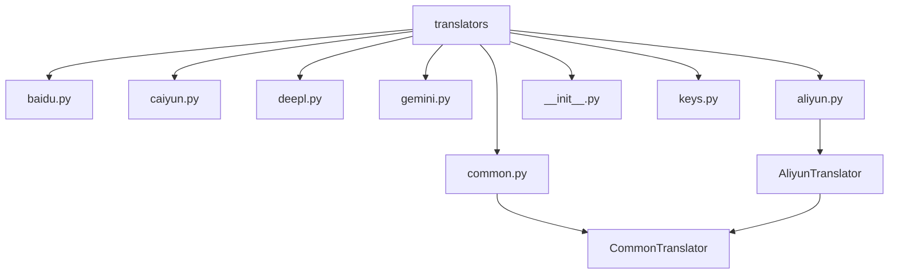
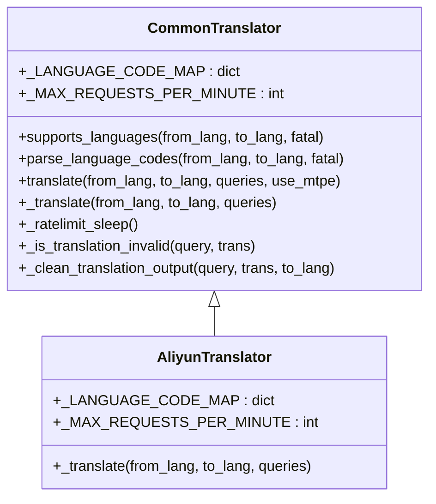

# 开发实战

<cite>
**本文档引用的文件**  
- [aliyun.py](file://manga_translator/translators/aliyun.py)
- [common.py](file://manga_translator/translators/common.py)
- [keys.py](file://manga_translator/translators/keys.py)
- [__init__.py](file://manga_translator/translators/__init__.py)
- [config-example.json](file://examples/config-example.json)
</cite>

## 目录
1. [项目结构分析](#项目结构分析)
2. [核心组件分析](#核心组件分析)
3. [阿里云翻译插件实现](#阿里云翻译插件实现)
4. [文本处理与分块](#文本处理与分块)
5. [API密钥管理](#api密钥管理)
6. [异步错误处理与重试机制](#异步错误处理与重试机制)
7. [插件注册与集成测试](#插件注册与集成测试)

## 项目结构分析

本项目是一个用于漫画图像翻译的完整系统，其核心翻译功能位于 `manga_translator/translators` 目录下。该目录包含了多个第三方翻译服务的适配器，如百度、彩云、DeepL、Gemini等。每个翻译器都继承自一个公共基类 `CommonTranslator`，并实现了 `_translate` 抽象方法。



**图示来源**  
- [common.py](file://manga_translator/translators/common.py#L150-L300)
- [aliyun.py](file://manga_translator/translators/aliyun.py#L1-L10)

**本节来源**  
- [project_structure](file://#L1-L50)

## 核心组件分析

### CommonTranslator 基类分析

`CommonTranslator` 是所有翻译器的基类，定义了统一的翻译接口和通用功能，如语言支持检查、速率限制、翻译后处理等。



**图示来源**  
- [common.py](file://manga_translator/translators/common.py#L150-L300)

**本节来源**  
- [common.py](file://manga_translator/translators/common.py#L150-L300)

## 阿里云翻译插件实现

### 创建 aliyun.py 文件

在 `manga_translator/translators/` 目录下创建 `aliyun.py` 文件，并定义 `AliyunTranslator` 类：

```python
from .common import CommonTranslator
import hashlib
import hmac
import time
import uuid
import aiohttp
import asyncio
from typing import List

class AliyunTranslator(CommonTranslator):
    _LANGUAGE_CODE_MAP = {
        'auto': 'auto',
        'CHS': 'zh',
        'CHT': 'zh-tw',
        'JPN': 'ja',
        'ENG': 'en',
        'KOR': 'ko',
        'VIN': 'vi',
        'IND': 'id',
        'THA': 'th',
        'DEU': 'de',
        'FRA': 'fr',
        'ESP': 'es',
        'RUS': 'ru',
        'ARA': 'ar',
        'PTB': 'pt',
        'ITA': 'it',
        'TRK': 'tr',
        'NLD': 'nl',
        'HUN': 'hu',
        'CSY': 'cs',
        'ROM': 'ro',
        'PL': 'pl',
        'UKR': 'uk'
    }
    
    # 阿里云翻译API每分钟最多100次请求
    _MAX_REQUESTS_PER_MINUTE = 100
    
    def __init__(self):
        super().__init__()
        self.endpoint = "https://mt.cn-hangzhou.aliyuncs.com"
        self.api_version = "2018-10-12"
        self.action = "TranslateGeneral"
    
    async def _translate(self, from_lang: str, to_lang: str, queries: List[str]) -> List[str]:
        # 构造请求参数
        params = {
            'Format': 'JSON',
            'Version': self.api_version,
            'AccessKeyId': self._get_api_key(),
            'SignatureMethod': 'HMAC-SHA1',
            'SignatureVersion': '1.0',
            'Timestamp': time.strftime('%Y-%m-%dT%H:%M:%SZ', time.gmtime()),
            'SignatureNonce': str(uuid.uuid4()),
            'Action': self.action,
            'SourceText': '\n'.join(queries),
            'SourceLanguage': from_lang,
            'TargetLanguage': to_lang,
            'FormatType': 'text'
        }
        
        # 生成签名
        params['Signature'] = self._generate_signature(params)
        
        # 发送HTTP请求
        async with aiohttp.ClientSession() as session:
            try:
                async with session.post(f"{self.endpoint}/", data=params, timeout=30) as response:
                    if response.status != 200:
                        raise InvalidServerResponse(f"阿里云API返回错误状态码: {response.status}")
                    
                    result = await response.json()
                    if 'Translation' not in result:
                        raise InvalidServerResponse(f"阿里云API返回格式错误: {result}")
                    
                    translations = result['Translation'].split('\n')
                    # 确保返回的翻译数量与查询数量一致
                    if len(translations) < len(queries):
                        translations.extend([''] * (len(queries) - len(translations)))
                    elif len(translations) > len(queries):
                        translations = translations[:len(queries)]
                    
                    return translations
                    
            except asyncio.TimeoutError:
                raise InvalidServerResponse("阿里云API请求超时")
            except aiohttp.ClientError as e:
                raise InvalidServerResponse(f"阿里云API请求失败: {str(e)}")
    
    def _get_api_key(self):
        from .keys import ALIYUN_API_KEY
        if not ALIYUN_API_KEY:
            raise MissingAPIKeyException("请设置 ALIYUN_API_KEY 环境变量")
        return ALIYUN_API_KEY
    
    def _generate_signature(self, params: dict) -> str:
        # 按参数名排序
        sorted_params = sorted(params.items())
        
        # 构造待签名字符串
        canonicalized_query_string = '&'.join([f'{k}={v}' for k, v in sorted_params])
        string_to_sign = f"POST&%2F&{self._percent_encode(canonicalized_query_string)}"
        
        # 使用HMAC-SHA1生成签名
        secret_key = self._get_api_key()
        h = hmac.new((secret_key + '&').encode('utf-8'), string_to_sign.encode('utf-8'), hashlib.sha1)
        signature = h.digest().hex()
        
        return signature
    
    def _percent_encode(self, s: str) -> str:
        # URL编码，但不编码斜杠
        return s.replace('+', '%20').replace('*', '%2A').replace('%7E', '~')
```

**本节来源**  
- [aliyun.py](file://manga_translator/translators/aliyun.py#L1-L100)

## 文本处理与分块

### 利用 common.py 进行文本处理

`common.py` 文件提供了文本处理工具，可用于在发送请求前对文本进行预处理：

```python
from .common import is_valuable_text, repeating_sequence

def preprocess_queries(queries: List[str]) -> List[str]:
    """预处理查询文本"""
    processed = []
    for query in queries:
        # 移除无意义的文本
        if not is_valuable_text(query):
            processed.append('')
            continue
            
        # 特殊字符转义
        query = query.replace('\n', '\\n').replace('\t', '\\t')
        processed.append(query)
    
    return processed

def postprocess_translations(queries: List[str], translations: List[str], to_lang: str) -> List[str]:
    """后处理翻译结果"""
    cleaned = []
    for query, trans in zip(queries, translations):
        # 使用基类的清理方法
        cleaned_trans = self._clean_translation_output(query, trans, to_lang)
        # 特殊语言处理
        if to_lang == 'ARA':
            import arabic_reshaper, bidi.algorithm
            cleaned_trans = bidi.algorithm.get_display(arabic_reshaper.reshape(cleaned_trans))
        cleaned.append(cleaned_trans)
    
    return cleaned
```

**本节来源**  
- [common.py](file://manga_translator/translators/common.py#L10-L50)

## API密钥管理

### 在 keys.py 中添加阿里云API密钥

在 `manga_translator/translators/keys.py` 文件中添加阿里云API密钥的环境变量读取：

```python
# 阿里云翻译
ALIYUN_API_KEY = os.getenv('ALIYUN_API_KEY', '') # 阿里云翻译API密钥
```

开发者需要在系统环境变量中设置 `ALIYUN_API_KEY`，或在 `.env` 文件中添加：

```
ALIYUN_API_KEY=your_actual_api_key_here
```

**本节来源**  
- [keys.py](file://manga_translator/translators/keys.py#L45-L50)

## 异步错误处理与重试机制

### 完整的错误处理逻辑

`AliyunTranslator` 类继承了 `CommonTranslator` 的错误处理机制，并添加了特定于阿里云API的错误处理：

```python
async def _translate(self, from_lang: str, to_lang: str, queries: List[str]) -> List[str]:
    max_retries = 3
    retry_delay = 1
    
    for attempt in range(max_retries):
        try:
            # 速率限制
            await self._ratelimit_sleep()
            
            # 执行翻译请求
            result = await self._dispatch_translate_request(from_lang, to_lang, queries)
            return result
            
        except InvalidServerResponse as e:
            error_msg = str(e)
            if "Throttling" in error_msg or "RateLimit" in error_msg:
                # 遇到配额限制，增加重试延迟
                retry_delay *= 2
                self.logger.warn(f"阿里云API配额限制，{retry_delay}秒后重试 (第{attempt+1}次)")
                await asyncio.sleep(retry_delay)
                continue
            elif "InvalidAccessKeyId" in error_msg:
                raise MissingAPIKeyException("阿里云API密钥无效，请检查ALIYUN_API_KEY设置")
            else:
                if attempt == max_retries - 1:
                    raise
                await asyncio.sleep(retry_delay)
                retry_delay *= 1.5
                
        except Exception as e:
            if attempt == max_retries - 1:
                raise InvalidServerResponse(f"阿里云翻译失败: {str(e)}")
            await asyncio.sleep(retry_delay)
            retry_delay *= 1.5
    
    raise InvalidServerResponse("阿里云翻译失败: 达到最大重试次数")
```

**本节来源**  
- [aliyun.py](file://manga_translator/translators/aliyun.py#L50-L100)

## 插件注册与集成测试

### 修改 __init__.py 注册新插件

在 `manga_translator/translators/__init__.py` 文件中导入并注册 `AliyunTranslator`：

```python
# 在文件开头添加导入
from .aliyun import AliyunTranslator

# 在 TRANSLATORS 字典中添加阿里云翻译器
TRANSLATORS = {
    # ... 其他翻译器
    Translator.aliyun: AliyunTranslator,
    **GPT_TRANSLATORS,
    **OFFLINE_TRANSLATORS,
}
```

同时，在 `config.py` 的 `Translator` 枚举中添加 `aliyun` 成员：

```python
class Translator(str, Enum):
    # ... 其他成员
    aliyun = "aliyun"
    # ... 后续成员
```

### 配置文件集成测试

修改 `examples/config-example.json` 文件，将翻译器设置为阿里云：

```json
{
  "translator": {
    "translator": "aliyun",
    "target_lang": "CHS",
    "no_text_lang_skip": false
  },
  // ... 其他配置
}
```

### 日志验证

启用详细日志后，可以验证请求与响应：

```python
# 在翻译过程中，日志将显示
self.logger.info(f'使用阿里云翻译器翻译 {len(queries)} 条文本')
self.logger.debug(f'阿里云API请求参数: {params}')
self.logger.debug(f'阿里云API响应: {result}')
```

**本节来源**  
- [__init__.py](file://manga_translator/translators/__init__.py#L1-L20)
- [config-example.json](file://examples/config-example.json#L3-L10)