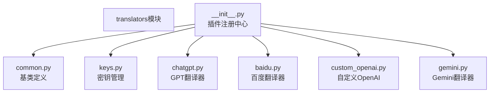
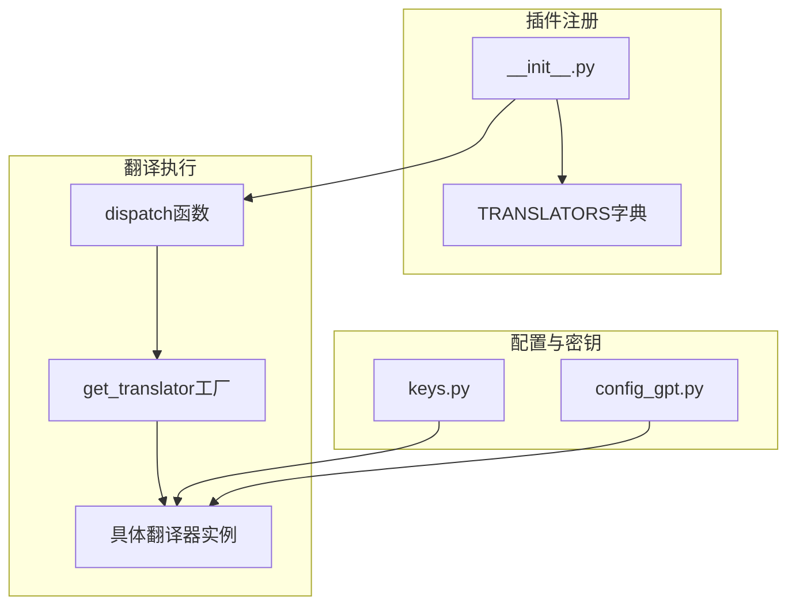
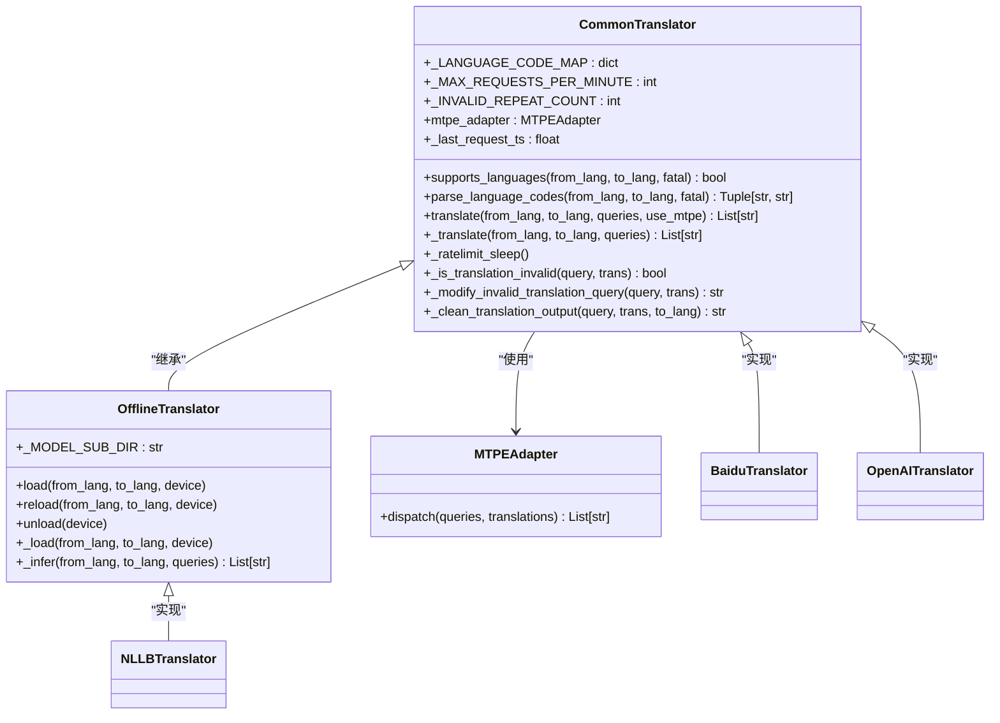
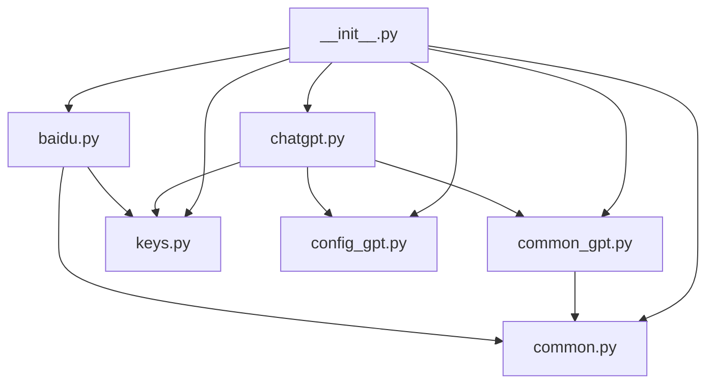

# 插件开发

<cite>
**本文档中引用的文件**   
- [manga_translator/translators/__init__.py](file://manga_translator/translators/__init__.py#L0-L194)
- [manga_translator/translators/common.py](file://manga_translator/translators/common.py#L0-L328)
- [manga_translator/translators/chatgpt.py](file://manga_translator/translators/chatgpt.py#L0-L799)
- [manga_translator/translators/common_gpt.py](file://manga_translator/translators/common_gpt.py#L0-L506)
- [manga_translator/translators/keys.py](file://manga_translator/translators/keys.py#L0-L49)
- [manga_translator/translators/config_gpt.py](file://manga_translator/translators/config_gpt.py#L0-L382)
</cite>

## 目录
1. [简介](#简介)
2. [项目结构](#项目结构)
3. [核心组件](#核心组件)
4. [架构概述](#架构概述)
5. [详细组件分析](#详细组件分析)
6. [依赖分析](#依赖分析)
7. [性能考虑](#性能考虑)
8. [故障排除指南](#故障排除指南)
9. [结论](#结论)

## 简介
本文档旨在为开发者提供一份详尽的插件开发指南，指导如何为系统添加新的翻译器插件。我们将深入解析`translators`模块的架构设计，特别是基类`Translator`及其抽象方法（如`dispatch_translate`、`_translate_batch`）的实现要求。文档将解释插件注册机制，提供一个从零开始创建自定义翻译器（例如对接阿里云翻译API）的完整示例，并介绍如何利用工具函数进行文本预处理和后处理。

## 项目结构
`manga_translator/translators`目录是所有翻译器插件的核心所在。该目录采用模块化设计，将不同功能的翻译器分离到独立的Python文件中。主要结构包括：
- `__init__.py`：定义了插件注册机制和全局翻译器字典`TRANSLATORS`。
- `common.py`：定义了所有翻译器继承的基类`CommonTranslator`和`OfflineTranslator`。
- `common_gpt.py`：为基于GPT的翻译器提供通用功能的基类。
- `keys.py`：集中管理所有API密钥的环境变量。
- `*.py`：各个具体的翻译器实现，如`baidu.py`、`chatgpt.py`等。



**图示来源**
- [manga_translator/translators/__init__.py](file://manga_translator/translators/__init__.py#L0-L194)

**本节来源**
- [manga_translator/translators/__init__.py](file://manga_translator/translators/__init__.py#L0-L194)

## 核心组件
`translators`模块的核心是`CommonTranslator`基类，它定义了所有翻译器必须遵循的接口和通用功能。关键组件包括：
- **CommonTranslator**: 抽象基类，定义了`_translate`抽象方法和通用的翻译流程，包括速率限制、无效翻译检测和重试逻辑。
- **OfflineTranslator**: 继承自`CommonTranslator`，为离线翻译模型（如NLLB）提供模型加载和卸载的接口。
- **TRANSLATORS字典**: 全局字典，存储所有可用的翻译器类，是插件注册的核心。
- **get_translator函数**: 工厂函数，根据键名从`TRANSLATORS`字典中获取并实例化翻译器。

**本节来源**
- [manga_translator/translators/common.py](file://manga_translator/translators/common.py#L0-L328)
- [manga_translator/translators/__init__.py](file://manga_translator/translators/__init__.py#L0-L194)

## 架构概述
整个翻译器系统的架构遵循工厂模式和依赖注入原则。`__init__.py`文件作为中心枢纽，通过`TRANSLATORS`字典注册所有翻译器。当系统需要翻译时，`dispatch`函数会根据配置的翻译链，调用`get_translator`工厂函数来获取相应的翻译器实例，并执行翻译任务。



**图示来源**
- [manga_translator/translators/__init__.py](file://manga_translator/translators/__init__.py#L0-L194)
- [manga_translator/translators/common.py](file://manga_translator/translators/common.py#L0-L328)

## 详细组件分析

### CommonTranslator 基类分析
`CommonTranslator`是所有翻译器的基类，它封装了通用的翻译逻辑，确保了不同翻译器之间行为的一致性。



**图示来源**
- [manga_translator/translators/common.py](file://manga_translator/translators/common.py#L0-L328)

**本节来源**
- [manga_translator/translators/common.py](file://manga_translator/translators/common.py#L0-L328)

### GPT类翻译器分析
以`OpenAITranslator`为代表的GPT类翻译器，继承了`CommonGPTTranslator`基类，实现了与大型语言模型交互的复杂逻辑。

#### GPT翻译流程序列图
```mermaid
sequenceDiagram
participant User as "用户"
participant Dispatch as "dispatch函数"
participant Factory as "get_translator"
participant GPTTrans as "OpenAITranslator"
participant API as "OpenAI API"
User->>Dispatch : 发起翻译请求
Dispatch->>Factory : get_translator('chatgpt')
Factory-->>Dispatch : 返回OpenAITranslator实例
Dispatch->>GPTTrans : translate()
GPTTrans->>GPTTrans : _assemble_prompts()
GPTTrans->>GPTTrans : _translate_batch()
loop 重试机制
GPTTrans->>GPTTrans : _request_with_retry()
GPTTrans->>API : _request_translation()
API-->>GPTTrans : 返回响应
GPTTrans->>GPTTrans : _parse_response()
alt 格式有效
GPTTrans-->>Dispatch : 返回翻译结果
break 成功
else 格式无效
GPTTrans->>GPTTrans : 记录警告并重试
end
end
alt 重试失败
GPTTrans->>GPTTrans : _translate_batch()拆分请求
end
```

**图示来源**
- [manga_translator/translators/chatgpt.py](file://manga_translator/translators/chatgpt.py#L0-L799)
- [manga_translator/translators/common_gpt.py](file://manga_translator/translators/common_gpt.py#L0-L506)

**本节来源**
- [manga_translator/translators/chatgpt.py](file://manga_translator/translators/chatgpt.py#L0-L799)

## 依赖分析
`translators`模块的依赖关系清晰，各组件职责分明。



**图示来源**
- [manga_translator/translators/__init__.py](file://manga_translator/translators/__init__.py#L0-L194)
- [manga_translator/translators/common.py](file://manga_translator/translators/common.py#L0-L328)
- [manga_translator/translators/common_gpt.py](file://manga_translator/translators/common_gpt.py#L0-L506)

**本节来源**
- [manga_translator/translators/__init__.py](file://manga_translator/translators/__init__.py#L0-L194)

## 性能考虑
系统在设计时充分考虑了性能和稳定性：
- **速率限制**: `CommonTranslator`基类通过`_MAX_REQUESTS_PER_MINUTE`和`_ratelimit_sleep`方法实现了请求节流，防止对API造成过大压力。
- **批处理**: `_assemble_prompts`方法将多个查询合并到一个提示中，减少了API调用次数，提高了效率。
- **错误重试与降级**: `OpenAITranslator`实现了多层重试机制（超时、限流、服务器错误），并在失败时支持拆分请求或切换到备用模型，保证了翻译任务的鲁棒性。
- **缓存**: `get_translator`函数使用`translator_cache`字典缓存已创建的翻译器实例，避免了重复初始化的开销。

## 故障排除指南
在开发和使用翻译器插件时，可能会遇到以下常见问题：

**本节来源**
- [manga_translator/translators/common.py](file://manga_translator/translators/common.py#L0-L328)
- [manga_translator/translators/chatgpt.py](file://manga_translator/translators/chatgpt.py#L0-L799)

### 缺少API密钥
**问题**: 启动时抛出`MissingAPIKeyException`。
**解决方案**: 确保在`keys.py`文件中正确设置了相应的环境变量，例如`OPENAI_API_KEY`。检查`.env`文件或系统环境变量。

### 翻译结果为空或无效
**问题**: 翻译结果为空字符串或与原文相同。
**解决方案**: 
1. 检查`_is_translation_invalid`方法的逻辑，确认是否误判。
2. 查看日志，确认是否因格式错误（如缺少`<|1|>`前缀）而重试。
3. 调整`_MAX_SPLIT_ATTEMPTS`参数，允许更深层次的请求拆分。

### 请求超时或被限流
**问题**: 日志中出现"Request timed out"或"Hit RateLimit"。
**解决方案**:
1. 适当增加`_TIMEOUT`和`_MAX_REQUESTS_PER_MINUTE`的值。
2. 实现更智能的退避算法，如指数退避。
3. 确认网络连接和代理设置（`OPENAI_HTTP_PROXY`）是否正确。

## 结论
本文档详细解析了`manga-translator`系统的插件开发框架。通过继承`CommonTranslator`基类并实现其抽象方法，开发者可以轻松地为系统添加新的翻译服务。`__init__.py`中的`TRANSLATORS`字典是插件注册的关键，而`keys.py`则提供了统一的密钥管理方案。GPT类翻译器展示了如何处理复杂的API交互、错误重试和性能优化。遵循此指南，开发者可以创建出功能强大且稳定的自定义翻译器插件。