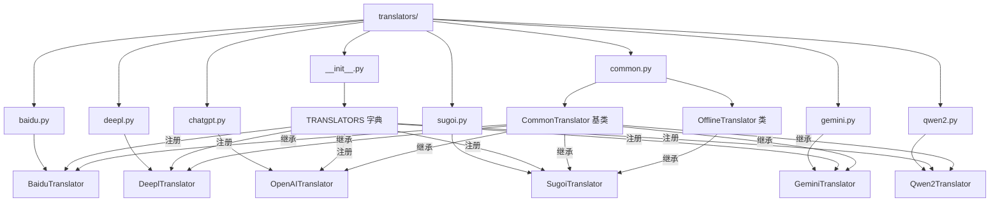
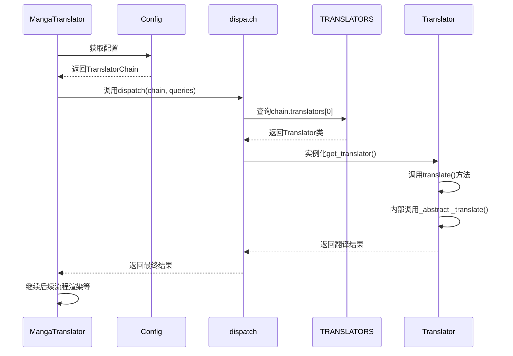
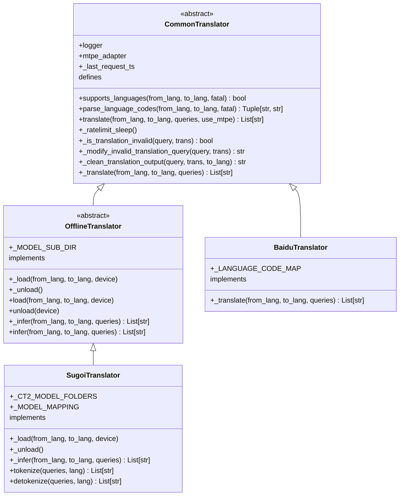
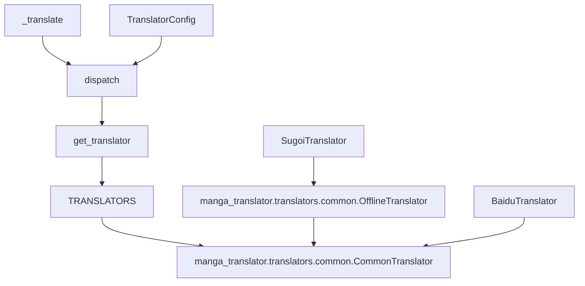

# 插件架构

<cite>
**本文档引用的文件**  
- [manga_translator/translators/__init__.py](file://manga_translator/translators/__init__.py)
- [manga_translator/translators/common.py](file://manga_translator/translators/common.py)
- [manga_translator/translators/sugoi.py](file://manga_translator/translators/sugoi.py)
- [manga_translator/config.py](file://manga_translator/config.py)
- [manga_translator/manga_translator.py](file://manga_translator/manga_translator.py)
</cite>

## 目录
1. [引言](#引言)
2. [项目结构](#项目结构)
3. [核心组件](#核心组件)
4. [架构概述](#架构概述)
5. [详细组件分析](#详细组件分析)
6. [依赖分析](#依赖分析)
7. [性能考量](#性能考量)
8. [故障排除指南](#故障排除指南)
9. [结论](#结论)

## 引言
本插件架构文档深入解析了漫画图像翻译器（manga-image-translator）中翻译器插件系统的模块化设计。该系统通过一个精心设计的抽象基类和全局注册机制，实现了对多种翻译API（如RESTful、WebSocket）的灵活适配与集成。文档将详细阐述`Translator`基类的契约、`TRANSLATORS`全局字典的注册发现机制、`__init__.py`中的动态导入模式，以及配置模型与插件的交互方式。

## 项目结构
翻译器插件系统位于`manga_translator/translators/`目录下，采用模块化设计，每个具体的翻译服务（如百度、DeepL、Sugoi）都由一个独立的Python文件实现。核心的抽象逻辑和公共功能定义在`common.py`中，而`__init__.py`文件则负责插件的注册、发现和调度。



**图源**
- [manga_translator/translators/__init__.py](file://manga_translator/translators/__init__.py)
- [manga_translator/translators/common.py](file://manga_translator/translators/common.py)
- [manga_translator/translators/sugoi.py](file://manga_translator/translators/sugoi.py)

## 核心组件

`manga_translator/translators/`目录下的核心组件包括：
- **`common.py`**: 定义了所有翻译器插件必须遵循的契约。`CommonTranslator`是一个抽象基类，强制子类实现`_translate`方法，并提供了通用的翻译流程控制，如速率限制、无效翻译检测与重试、机器翻译后编辑（MTPE）等。
- **`__init__.py`**: 实现了插件的注册与发现机制。通过`TRANSLATORS`全局字典将翻译器名称（如`Translator.sugoi`）映射到具体的类（如`SugoiTranslator`），并提供`get_translator`函数来实例化和缓存翻译器对象。
- **具体翻译器模块** (如`sugoi.py`, `baidu.py`): 实现了针对特定翻译API的逻辑，通过继承`CommonTranslator`或`OfflineTranslator`来适配不同的API类型。

**章节来源**
- [manga_translator/translators/common.py](file://manga_translator/translators/common.py#L1-L329)
- [manga_translator/translators/__init__.py](file://manga_translator/translators/__init__.py#L1-L195)

## 架构概述

整个翻译器插件系统与核心引擎（`MangaTranslator`）协同工作，形成一个完整的翻译流水线。当`MangaTranslator`需要翻译文本时，它会根据配置创建一个`TranslatorChain`，然后调用`dispatch`函数。`dispatch`函数会查询`TRANSLATORS`字典获取对应的翻译器实例，并执行翻译。



**图源**
- [manga_translator/manga_translator.py](file://manga_translator/manga_translator.py#L1-L800)
- [manga_translator/translators/__init__.py](file://manga_translator/translators/__init__.py#L1-L195)

## 详细组件分析

### Translator基类与抽象方法

`CommonTranslator`类定义了插件系统的核心契约。其关键抽象方法和流程如下：

#### 抽象方法契约


**图源**
- [manga_translator/translators/common.py](file://manga_translator/translators/common.py#L1-L329)
- [manga_translator/translators/sugoi.py](file://manga_translator/translators/sugoi.py#L1-L205)

- **`_translate`**: 这是一个抽象方法，所有子类都必须实现。它接收源语言、目标语言和待翻译的文本列表，返回翻译结果列表。这是与外部API交互的核心入口。
- **`translate`**: 这是一个具体方法，定义了翻译的通用流程。它首先进行参数验证和日志记录，然后调用`_ratelimit_sleep`处理速率限制，接着调用`_translate`执行实际翻译。之后，它会根据`_INVALID_REPEAT_COUNT`的值，使用`_is_translation_invalid`检测翻译结果的有效性，并在必要时通过`_modify_invalid_translation_query`修改查询进行重试。最后，它会调用`_clean_translation_output`清理输出，并根据`use_mtpe`参数决定是否启动机器翻译后编辑。
- **`_preprocess` 和 `_postprocess`**: 在提供的代码中，这些功能被内联在`translate`方法中。`_preprocess`的功能体现在对查询的初步筛选（跳过无价值文本）和语言代码的解析上。`_postprocess`的功能则体现在`_clean_translation_output`方法中，负责清理和格式化翻译结果。

#### 调用流程
1.  `MangaTranslator`调用`dispatch_translation`。
2.  `dispatch`函数根据`TranslatorChain`从`TRANSLATORS`字典中获取对应的翻译器类。
3.  调用`get_translator`函数，该函数会检查缓存，若无则创建新实例并缓存。
4.  调用翻译器实例的`translate`方法。
5.  `translate`方法执行通用流程，最终调用子类实现的`_translate`方法。
6.  对于离线翻译器（如Sugoi），`_translate`会调用`infer`，而`infer`又会调用`_infer`，形成一个调用链。

### TRANSLATORS全局字典与插件注册

`TRANSLATORS`字典是插件系统的核心，它充当了服务注册表的角色。

```python
# 在 __init__.py 中
TRANSLATORS = {
    Translator.youdao: YoudaoTranslator,
    Translator.baidu: BaiduTranslator,
    Translator.deepl: DeeplTranslator,
    # ... 其他翻译器
    **GPT_TRANSLATORS,  # 使用字典解包合并
    **OFFLINE_TRANSLATORS,
}
```

- **注册机制**: 每个具体的翻译器类（如`BaiduTranslator`）在`__init__.py`中被导入，并通过`TRANSLATORS[Translator.baidu] = BaiduTranslator`的方式注册到字典中。`GPT_TRANSLATORS`和`OFFLINE_TRANSLATORS`是两个预定义的字典，用于对翻译器进行分类，然后通过`**`操作符合并到主字典中。
- **发现机制**: `get_translator(key)`函数是发现机制的入口。它接收一个`Translator`枚举值作为键，检查`TRANSLATORS`字典中是否存在该键。如果存在，则检查缓存`translator_cache`，若缓存中没有，则使用字典中的类创建一个新实例并存入缓存，最后返回该实例。这实现了单例模式，避免了重复创建开销巨大的翻译器对象。

**章节来源**
- [manga_translator/translators/__init__.py](file://manga_translator/translators/__init__.py#L1-L195)

### 动态导入与插件适配

`__init__.py`文件通过`from .baidu import BaiduTranslator`等语句实现了动态导入。这种模式使得添加新的翻译器插件变得非常简单：只需在`translators/`目录下创建一个新的`.py`文件，实现一个继承自`CommonTranslator`的类，然后在`__init__.py`中导入该类并将其注册到`TRANSLATORS`字典中即可。

插件通过继承和重写方法来适配不同的API：
- **RESTful API (如百度、DeepL)**: 继承`CommonTranslator`，重写`_translate`方法，使用`requests`库发送HTTP请求。
- **WebSocket API (如某些GPT服务)**: 同样继承`CommonTranslator`，但`_translate`方法需要处理WebSocket的连接、消息发送和接收。
- **离线模型 (如Sugoi、NLLB)**: 继承`OfflineTranslator`（它本身继承自`CommonTranslator`和`ModelWrapper`），需要重写`_load`、`_unload`和`_infer`方法。`_load`负责加载本地模型文件，`_infer`负责执行模型推理。

### 配置模型与插件交互

`Config`模型（定义在`config.py`中）通过`TranslatorConfig`类与翻译器插件进行交互。

```python
# 在 config.py 中
class TranslatorConfig(BaseModel):
    translator: Translator = Translator.sugoi
    target_lang: str = 'ENG'
    gpt_config: Optional[str] = None
    translator_chain: Optional[str] = None
    # ... 其他配置项
```

- **传递配置**: `MangaTranslator`在初始化时会解析命令行参数或配置文件，生成一个`Config`对象。当调用`dispatch_translation`时，这个`Config`对象中的`translator_config`会被传递给`dispatch`函数。
- **解析配置**: 在`dispatch`函数中，`if translator_config: translator.parse_args(translator_config)`这行代码会将配置传递给具体的翻译器实例。例如，`chatgpt.py`中的翻译器会读取`gpt_config`字段来加载API密钥和提示词模板。
- **传递API参数**: `target_lang`和`translator`字段直接决定了翻译的目标语言和使用的翻译器。`use_mtpe`参数则控制是否启用机器翻译后编辑。

**章节来源**
- [manga_translator/config.py](file://manga_translator/config.py#L1-L364)

### 错误处理、异步支持与日志集成

- **错误处理**: 系统定义了多种自定义异常，如`InvalidServerResponse`、`MissingAPIKeyException`和`LanguageUnsupportedException`。这些异常在`_translate`方法中被抛出，并在`translate`的通用流程中被捕获和处理，确保错误信息能被清晰地报告给用户。
- **异步支持**: 整个系统基于`asyncio`构建。`_translate`、`_load`、`_unload`等关键方法都是`async`函数，允许非阻塞的I/O操作（如网络请求、文件读写），从而提高整体处理效率。
- **日志集成**: 每个`CommonTranslator`实例都拥有一个`logger`属性。在`translate`、`_ratelimit_sleep`等方法中，都使用`self.logger.info()`或`self.logger.warn()`来记录关键事件，便于调试和监控。

#### sugoi.py中的重试机制
`sugoi.py`中的`SugoiTranslator`类继承了`CommonTranslator`的通用重试机制。`CommonTranslator`的`translate`方法会根据`_INVALID_REPEAT_COUNT`的值（在`SugoiTranslator`中为0，意味着不重试）来决定是否重复翻译。虽然Sugoi本身不启用重试，但其父类的框架为其他可能需要重试的翻译器提供了支持。

## 依赖分析



**图源**
- [manga_translator/translators/__init__.py](file://manga_translator/translators/__init__.py)
- [manga_translator/translators/common.py](file://manga_translator/translators/common.py)
- [manga_translator/translators/sugoi.py](file://manga_translator/translators/sugoi.py)
- [manga_translator/manga_translator.py](file://manga_translator/manga_translator.py)
- [manga_translator/config.py](file://manga_translator/config.py)

## 性能考量
该架构通过缓存翻译器实例（`translator_cache`）和预加载模型（`prepare`函数）来优化性能。异步I/O确保了在等待网络响应时不会阻塞主线程。对于离线模型，内存占用是主要考量，系统通过`unload`函数提供了显式卸载模型的能力。

## 故障排除指南
- **找不到翻译器**: 检查`TRANSLATORS`字典中是否注册了对应的`Translator`枚举值。
- **API密钥错误**: 确保`MissingAPIKeyException`被正确抛出，并检查配置文件或环境变量。
- **语言不支持**: 检查`LanguageUnsupportedException`，确认`_LANGUAGE_CODE_MAP`是否正确映射了语言代码。
- **翻译结果无效**: 检查`_is_translation_invalid`的逻辑，可能需要调整阈值或正则表达式。

## 结论
该翻译器插件系统通过清晰的抽象、灵活的注册机制和强大的配置管理，成功地将核心翻译逻辑与具体实现解耦。其模块化设计使得添加新的翻译服务变得简单而安全，为系统的可扩展性和可维护性奠定了坚实的基础。