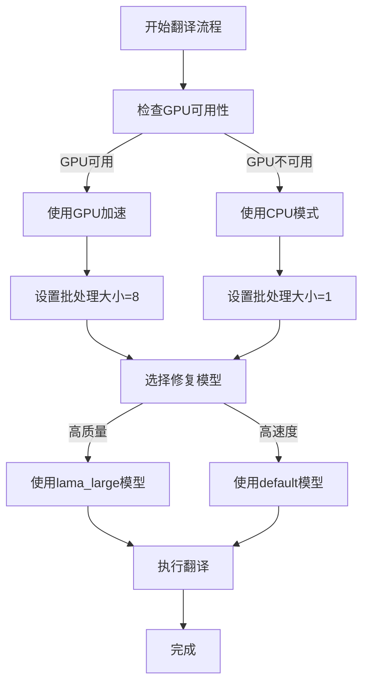

# 故障排除

<cite>
**本文档中引用的文件**   
- [log_service.py](file://desktop-ui/services/log_service.py#L1-L349)
- [restore_models.py](file://restore_models.py#L1-L36)
- [gemini_fix_plan.md](file://gemini_fix_plan.md#L1-L47)
- [download_models.py](file://download_models.py)
- [requirements_gpu.txt](file://requirements_gpu.txt)
- [requirements_cpu.txt](file://requirements_cpu.txt)
</cite>

## 目录
1. [安装问题](#安装问题)
2. [模型下载问题](#模型下载问题)
3. [翻译执行问题](#翻译执行问题)
4. [性能优化建议](#性能优化建议)

## 安装问题

### CUDA内存不足
当使用GPU进行翻译时，可能会遇到CUDA内存不足的错误。这通常发生在显存较小的GPU上。

**错误日志分析**:
在 `logs/app.log` 文件中，您可能会看到类似以下的错误信息：
```
2023-10-01 10:00:00 - MangaTranslatorUI - ERROR - Operation 'translation_start' failed: CUDA out of memory. Tried to allocate 2.00 GiB (GPU 0; 6.00 GiB total capacity; 3.50 GiB already allocated; 1.20 GiB free; 3.60 GiB reserved in total by PyTorch)
```

**解决方案**:
1. **降低批处理大小**: 在配置文件中将 `batch_size` 设置为1或更小的值。
2. **使用CPU模式**: 在命令行中添加 `--use-gpu-limited` 参数，或在配置文件中设置 `use_gpu` 为 `false`。
3. **升级硬件**: 使用具有更大显存的GPU。

**规避策略**:
- 在 `requirements_gpu.txt` 中确保安装了正确版本的PyTorch和CUDA支持库。
- 使用 `requirements_cpu.txt` 进行纯CPU环境安装，避免GPU相关问题。

**Section sources**
- [requirements_gpu.txt](file://requirements_gpu.txt#L1-L20)
- [requirements_cpu.txt](file://requirements_cpu.txt#L1-L15)

## 模型下载问题

### 模型文件缺失或损坏
在首次运行或更新后，可能会出现模型文件缺失或下载不完整的情况。

**错误日志分析**:
在 `logs/error.log` 文件中，您可能会看到：
```
2023-10-01 10:05:00 - MangaTranslatorUI - ERROR - Error: [Errno 2] No such file or directory: 'models/ocr/ocr_ar_48px.ckpt'
```

**解决方案**:
1. **使用恢复脚本**: 运行 `restore_models.py` 脚本来重新下载缺失的模型文件。
```python
python restore_models.py
```
2. **手动下载**: 从GitHub Releases页面手动下载模型文件并放置到正确的目录。

**规避策略**:
- 定期运行 `download_models.py` 脚本以确保所有模型都是最新的。
- 检查网络连接，确保下载过程中不会中断。

**Section sources**
- [restore_models.py](file://restore_models.py#L1-L36)
- [download_models.py](file://download_models.py#L1-L50)

## 翻译执行问题

### OCR识别失败
OCR识别失败可能是由于模型问题或图像质量问题导致的。

**错误日志分析**:
在 `logs/app.log` 中查找相关错误：
```
2023-10-01 10:10:00 - MangaTranslatorUI - WARNING - Operation: file_read | Details: {"file_path": "input/test.png", "success": false, "error": "Image file is corrupted"}
```

**解决方案**:
1. **检查图像文件**: 确保输入的图像文件没有损坏。
2. **更换OCR模型**: 尝试使用不同的OCR模型，如 `32px` 或 `mocr`。
3. **调整参数**: 修改 `min_text_length` 和 `prob` 参数以适应不同的图像质量。

### API调用限流
使用在线翻译服务时可能会遇到API调用频率限制。

**错误日志分析**:
在日志中查找HTTP 429错误：
```
2023-10-01 10:15:00 - MangaTranslatorUI - ERROR - Operation 'translation_request' failed: HTTP Error 429: Too Many Requests
```

**解决方案**:
1. **降低请求频率**: 增加请求之间的延迟时间。
2. **使用备用服务**: 配置多个翻译服务作为备用。
3. **检查API密钥**: 确保使用的API密钥有效且未达到使用限额。

对于Gemini服务的特定问题，请参考 `gemini_fix_plan.md` 中的已知解决方案。

**Section sources**
- [log_service.py](file://desktop-ui/services/log_service.py#L1-L349)
- [gemini_fix_plan.md](file://gemini_fix_plan.md#L1-L47)

## 性能优化建议

### 调整批处理大小
批处理大小对性能有显著影响。较大的批处理可以提高GPU利用率，但会增加内存消耗。

**建议**:
- **GPU用户**: 设置 `batch_size` 为4-8，根据显存大小调整。
- **CPU用户**: 设置 `batch_size` 为1-2，避免内存溢出。

### 选择合适的修复模型
不同的修复模型在速度和质量之间有不同的权衡。

**建议**:
- **高质量优先**: 使用 `lama_large` 模型，虽然速度较慢但效果最好。
- **速度优先**: 使用 `default` 模型，速度快但质量稍差。



**Diagram sources**
- [log_service.py](file://desktop-ui/services/log_service.py#L150-L200)

**Section sources**
- [log_service.py](file://desktop-ui/services/log_service.py#L1-L349)