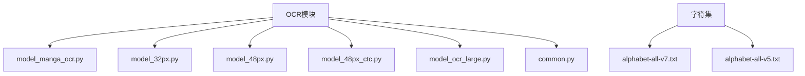
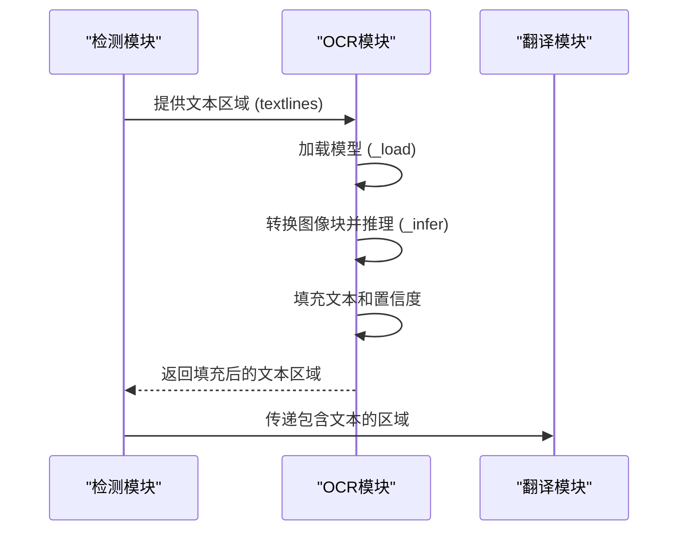
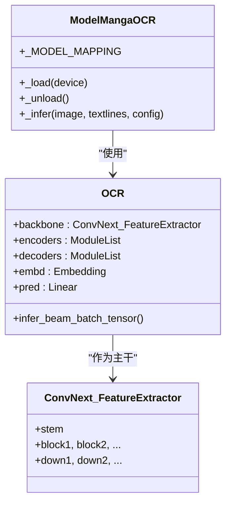
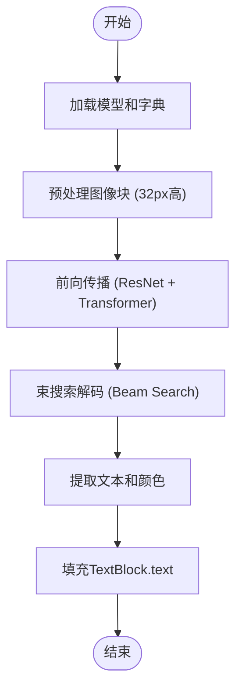
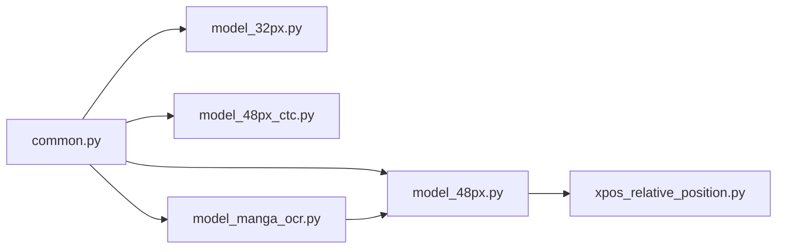

# OCR识别

<cite>
**本文档引用的文件**   
- [model_manga_ocr.py](file://manga_translator/ocr/model_manga_ocr.py)
- [model_32px.py](file://manga_translator/ocr/model_32px.py)
- [model_48px.py](file://manga_translator/ocr/model_48px.py)
- [model_48px_ctc.py](file://manga_translator/ocr/model_48px_ctc.py)
- [model_ocr_large.py](file://manga_translator/ocr/model_ocr_large.py)
- [common.py](file://manga_translator/ocr/common.py)
- [alphabet-all-v7.txt](file://models/ocr/alphabet-all-v7.txt)
- [alphabet-all-v5.txt](file://models/ocr/alphabet-all-v5.txt)
</cite>

## 目录
1. [简介](#简介)
2. [项目结构](#项目结构)
3. [核心组件](#核心组件)
4. [架构概述](#架构概述)
5. [详细组件分析](#详细组件分析)
6. [依赖分析](#依赖分析)
7. [性能考量](#性能考量)
8. [故障排除指南](#故障排除指南)
9. [结论](#结论)

## 简介
本技术文档深入探讨了漫画图像翻译系统中的OCR识别模块，该模块在“检测”与“翻译”两个关键环节之间扮演着桥梁角色。文档详细阐述了`model_manga_ocr.py`、`model_32px.py`、`model_48px.py`等多个OCR模型的架构差异、适用场景及其工作原理。特别说明了模型如何利用`alphabet-all-v7.txt`和`alphabet-all-v5.txt`中的字符集进行推理，并输出包含文本内容、置信度及字体颜色的结构化结果。同时，文档提供了配置指南，指导用户根据漫画风格选择最优模型，并讨论了识别精度的常见问题及解决方案。

## 项目结构
OCR识别模块位于项目的`manga_translator/ocr`目录下，其结构清晰，模块化程度高。主要包含多个针对不同场景优化的OCR模型实现文件，以及一个提供通用功能的`common.py`文件。字符集文件则独立存放在`models/ocr`目录中。

**图源**
- [manga_translator/ocr](file://manga_translator/ocr)
- [models/ocr](file://models/ocr)

## 核心组件
OCR模块的核心组件是多个继承自`OfflineOCR`基类的模型类，如`ModelMangaOCR`、`Model32pxOCR`等。这些类实现了`_load`、`_unload`和`_infer`等抽象方法，负责模型的加载、卸载和推理。`common.py`文件中的`CommonOCR`和`OfflineOCR`类提供了文本方向生成、结果识别等通用逻辑，是所有具体OCR模型的基石。

**组件源**
- [common.py](file://manga_translator/ocr/common.py#L1-L61)
- [model_manga_ocr.py](file://manga_translator/ocr/model_manga_ocr.py#L1-L295)
- [model_32px.py](file://manga_translator/ocr/model_32px.py#L1-L693)

## 架构概述
OCR模块采用分层架构，上层是具体的模型实现，下层是通用的基类和工具。当系统需要进行OCR识别时，会根据配置选择相应的模型。该模型首先通过`_load`方法加载预训练权重和字符集，然后在`_infer`方法中接收检测到的文本区域（`Quadrilateral`对象列表），将其转换为固定高度的图像块，输入模型进行推理，最后将识别出的文本和置信度填充回原始的`TextBlock`或`Quadrilateral`对象中，为后续的翻译阶段做准备。

**图源**
- [model_manga_ocr.py](file://manga_translator/ocr/model_manga_ocr.py#L150-L290)
- [model_32px.py](file://manga_translator/ocr/model_32px.py#L150-L200)

## 详细组件分析

### ModelMangaOCR 分析
`ModelMangaOCR`是一个高级OCR模型，它结合了内部的`MangaOcr`模型进行文本合并。其核心是`OCR`类，使用`ConvNext_FeatureExtractor`作为主干网络提取图像特征，并结合带有XPOS相对位置编码的Transformer解码器进行序列解码。

#### 架构图

**图源**
- [model_manga_ocr.py](file://manga_translator/ocr/model_manga_ocr.py#L1-L295)
- [model_48px.py](file://manga_translator/ocr/model_48px.py#L1-L866)

**组件源**
- [model_manga_ocr.py](file://manga_translator/ocr/model_manga_ocr.py#L1-L295)

### Model32pxOCR 分析
`Model32pxOCR`专为小字体文本设计，其输入图像块的高度为32像素。它使用`ResNet_FeatureExtractor`作为主干网络，结合标准的Transformer编码器-解码器架构。该模型适用于字体较小、排版密集的漫画场景。

#### 推理流程

**图源**
- [model_32px.py](file://manga_translator/ocr/model_32px.py#L1-L693)

**组件源**
- [model_32px.py](file://manga_translator/ocr/model_32px.py#L1-L693)

### 字符集与推理机制
所有OCR模型都依赖于`models/ocr`目录下的字符集文件（如`alphabet-all-v7.txt`）进行推理。模型在`_load`方法中读取该文件，构建一个字符到索引的映射字典。在推理时，模型输出的是字符索引序列，然后通过查表转换为最终的文本字符串。`<S>`和`</S>`分别代表序列的开始和结束。

**组件源**
- [model_manga_ocr.py](file://manga_translator/ocr/model_manga_ocr.py#L150-L160)
- [model_32px.py](file://manga_translator/ocr/model_32px.py#L150-L160)
- [alphabet-all-v7.txt](file://models/ocr/alphabet-all-v7.txt)

## 依赖分析
OCR模块内部依赖关系清晰。`common.py`是所有模型的基础，提供了`OfflineOCR`基类和通用工具。`model_48px.py`中的`XPOS`模块被`model_manga_ocr.py`所依赖。各模型文件之间相互独立，通过统一的接口与系统其他部分交互。

**图源**
- [common.py](file://manga_translator/ocr/common.py)
- [model_manga_ocr.py](file://manga_translator/ocr/model_manga_ocr.py)

## 性能考量
不同OCR模型在精度和速度上有所权衡。`model_32px.py`由于输入尺寸小，推理速度快，适合处理大量小字体文本。`model_48px.py`和`model_manga_ocr.py`精度更高，但计算量更大。用户应根据硬件性能和漫画风格选择合适的模型。启用`use_mocr_merge`配置可以提升长文本的识别准确率，但会增加处理时间。

## 故障排除指南
常见的OCR识别问题包括标点符号错误、生僻字识别失败和字体颜色提取不准确。

- **标点符号错误**：这通常是因为训练数据中某些标点符号的样本不足。解决方案是确保`alphabet-all-v7.txt`包含了所有需要的标点符号，并考虑使用`model_manga_ocr.py`，它对日文标点有专门优化。
- **生僻字识别失败**：检查`alphabet-all-v7.txt`是否包含该字符。如果缺失，需要重新训练模型或使用包含该字符的字典。
- **字体颜色提取不准确**：这可能是由于图像块的背景复杂或字体颜色与背景对比度低。可以尝试调整检测模块的参数，确保文本区域被更精确地分割。

**组件源**
- [model_manga_ocr.py](file://manga_translator/ocr/model_manga_ocr.py#L200-L250)
- [model_32px.py](file://manga_translator/ocr/model_32px.py#L180-L220)

## 结论
OCR识别模块是漫画翻译系统中至关重要的一环。通过提供多种模型选择，系统能够灵活应对不同风格和质量的漫画图像。`model_32px`适用于小字体，`model_48px`和`model_manga_ocr`则在精度上表现更佳。开发者和用户应根据具体需求和硬件条件，选择最合适的OCR模型，并通过配置文件进行微调，以达到最佳的识别效果。