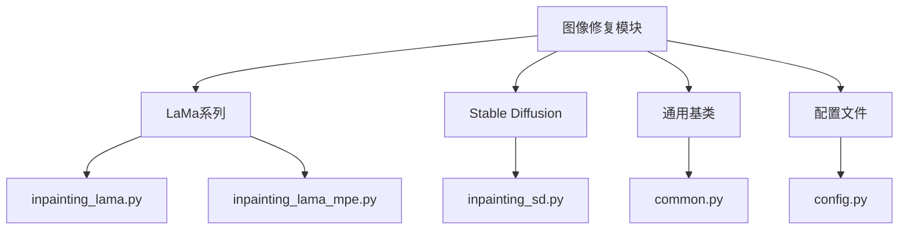
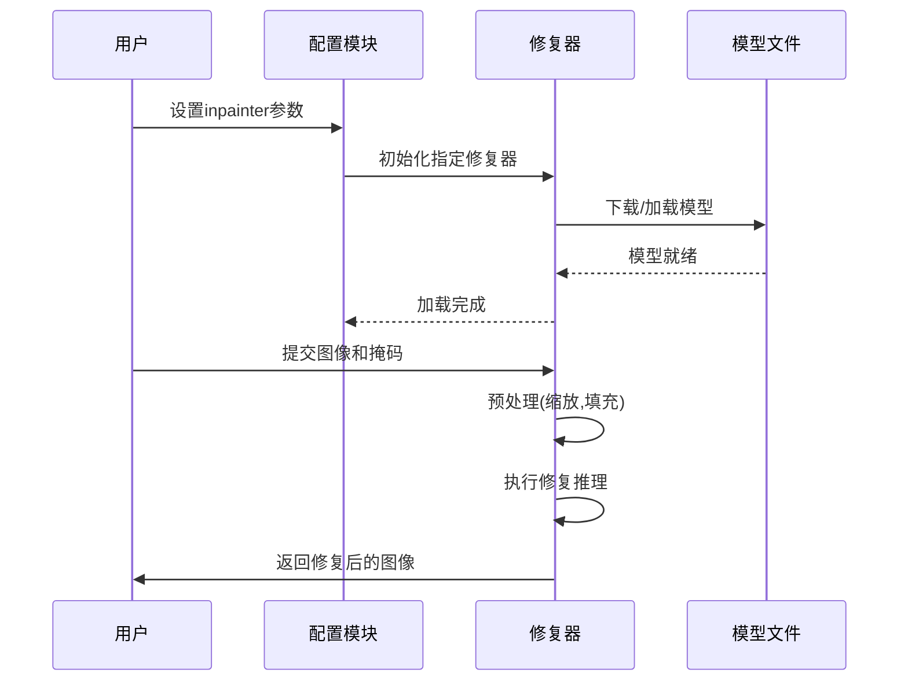
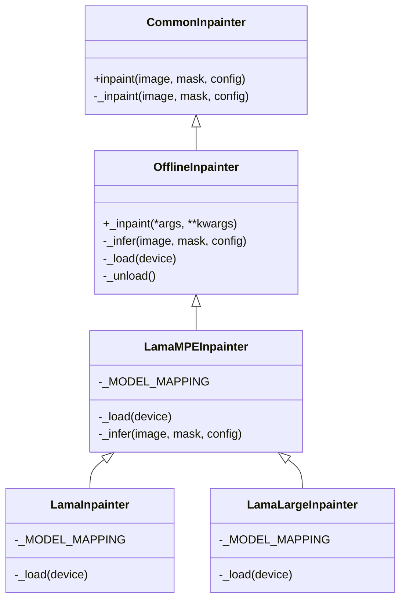
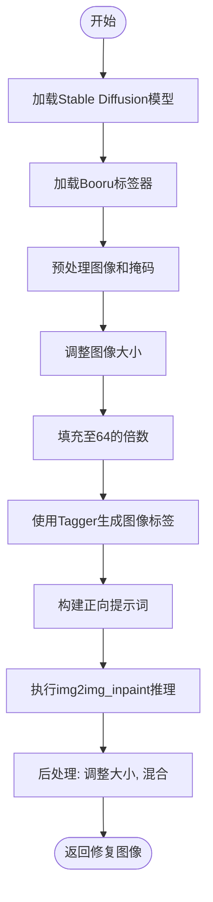
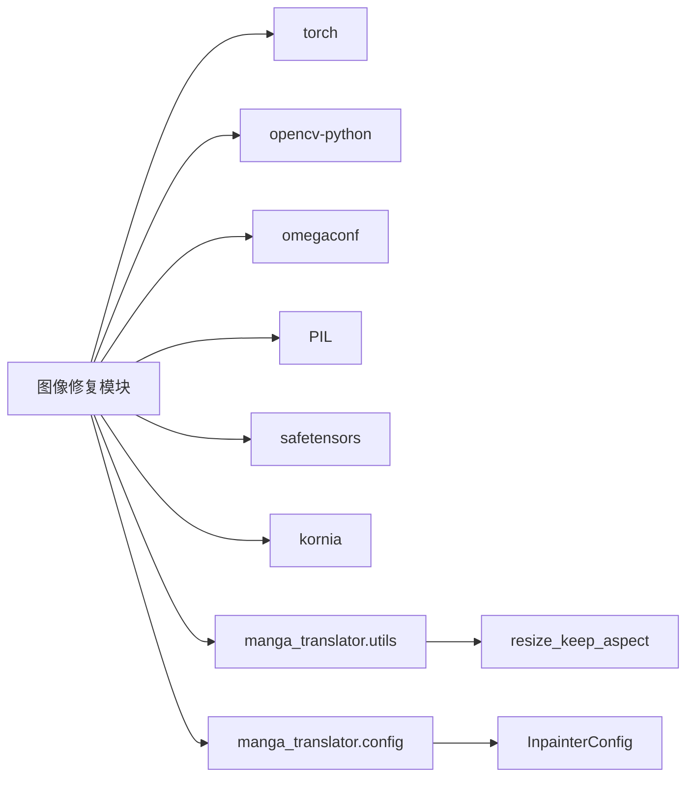

# 图像修复

<cite>
**本文档引用的文件**  
- [inpainting_lama.py](file://manga_translator/inpainting/inpainting_lama.py)
- [inpainting_sd.py](file://manga_translator/inpainting/inpainting_sd.py)
- [guided_ldm_inpainting.py](file://manga_translator/inpainting/guided_ldm_inpainting.py)
- [common.py](file://manga_translator/inpainting/common.py)
- [config.py](file://manga_translator/config.py)
</cite>

## 目录
1. [项目结构](#项目结构)  
2. [核心组件](#核心组件)  
3. [架构概览](#架构概览)  
4. [详细组件分析](#详细组件分析)  
5. [依赖分析](#依赖分析)  
6. [性能考量](#性能考量)  
7. [故障排除指南](#故障排除指南)  
8. [结论](#结论)

## 项目结构
图像修复模块位于 `manga_translator/inpainting/` 目录下，是漫画图像翻译流程中的关键环节，负责在文本擦除后恢复原始背景。该模块采用多种先进的深度学习模型，以适应不同复杂度和质量要求的修复任务。

**图示来源**  
- [inpainting_lama.py](file://manga_translator/inpainting/inpainting_lama.py)
- [inpainting_sd.py](file://manga_translator/inpainting/inpainting_sd.py)
- [common.py](file://manga_translator/inpainting/common.py)
- [config.py](file://manga_translator/config.py)

**本节来源**  
- [inpainting_lama.py](file://manga_translator/inpainting/inpainting_lama.py)
- [inpainting_sd.py](file://manga_translator/inpainting/inpainting_sd.py)

## 核心组件
图像修复模块的核心是 `CommonInpainter` 和 `OfflineInpainter` 两个基类，它们定义了修复器的统一接口和离线加载模式。具体实现包括基于LaMa的快速修复器和基于Stable Diffusion的高质量修复器。

**本节来源**  
- [common.py](file://manga_translator/inpainting/common.py#L1-L25)
- [inpainting_lama.py](file://manga_translator/inpainting/inpainting_lama.py#L1-L702)
- [inpainting_sd.py](file://manga_translator/inpainting/inpainting_sd.py#L1-L136)

## 架构概览
该模块采用插件式架构，通过配置文件动态选择不同的修复模型。其核心流程是接收带有掩码的图像，将被擦除的文本区域用自然的背景纹理填充，为后续的文本渲染提供一个干净的画布。

**图示来源**  
- [inpainting_lama.py](file://manga_translator/inpainting/inpainting_lama.py#L1-L702)
- [inpainting_sd.py](file://manga_translator/inpainting/inpainting_sd.py#L1-L136)
- [config.py](file://manga_translator/config.py#L1-L364)

## 详细组件分析

### LaMa修复器分析
`inpainting_lama.py` 实现了基于LaMa模型的修复器。LaMa模型以其快速的修复能力和轻量级特性著称，非常适合处理大规模漫画翻译任务。

#### 类图

**图示来源**  
- [inpainting_lama.py](file://manga_translator/inpainting/inpainting_lama.py#L1-L702)
- [inpainting_lama_mpe.py](file://manga_translator/inpainting/inpainting_lama_mpe.py#L1-L826)
- [common.py](file://manga_translator/inpainting/common.py#L1-L25)

**本节来源**  
- [inpainting_lama.py](file://manga_translator/inpainting/inpainting_lama.py#L1-L702)
- [inpainting_lama_mpe.py](file://manga_translator/inpainting/inpainting_lama_mpe.py#L1-L826)

### Stable Diffusion修复器分析
`inpainting_sd.py` 实现了基于Stable Diffusion的`StableDiffusionInpainter`。该方案在处理复杂纹理、图案和细节时表现出极高的质量，尤其适用于艺术性强的漫画背景。

#### 推理流程图

**图示来源**  
- [inpainting_sd.py](file://manga_translator/inpainting/inpainting_sd.py#L1-L136)

**本节来源**  
- [inpainting_sd.py](file://manga_translator/inpainting/inpainting_sd.py#L1-L136)

### 深度引导修复器分析
`guided_ldm_inpainting.py` 实现了`GuidedLDM`类，该类扩展了潜在扩散模型（Latent Diffusion Model），通过引入深度信息或其他条件来实现更精确的修复。`GuidedDDIMSample`类提供了改进的采样算法，允许更精细地控制去噪过程。

**本节来源**  
- [guided_ldm_inpainting.py](file://manga_translator/inpainting/guided_ldm_inpainting.py#L1-L255)

## 依赖分析
图像修复模块依赖于多个子系统和外部库。

**图示来源**  
- [inpainting_lama.py](file://manga_translator/inpainting/inpainting_lama.py#L1-L702)
- [inpainting_sd.py](file://manga_translator/inpainting/inpainting_sd.py#L1-L136)
- [common.py](file://manga_translator/inpainting/common.py#L1-L25)

**本节来源**  
- [inpainting_lama.py](file://manga_translator/inpainting/inpainting_lama.py#L1-L702)
- [inpainting_sd.py](file://manga_translator/inpainting/inpainting_sd.py#L1-L136)

## 性能考量
不同修复模型在速度和质量之间存在权衡：
- **LaMa系列**：速度快，内存占用低，适合批量处理。`lama_large`模型在质量和速度上取得了更好的平衡。
- **Stable Diffusion**：质量高，能处理复杂纹理，但推理速度慢，需要更多显存。
- **精度配置**：`InpaintPrecision`枚举（`fp32`, `fp16`, `bf16`）允许用户根据硬件条件调整计算精度，`bf16`通常在保持质量的同时提供最佳性能。

用户应在`config.py`中通过`inpainter`和`inpainting_precision`参数进行配置，以在修复速度和质量之间进行权衡。

## 故障排除指南
- **模型加载失败**：检查网络连接，确保能从指定URL下载模型文件，或手动将模型文件放入`models/inpainting/`目录。
- **CUDA内存不足**：降低`inpainting_size`参数，或使用`lama`而非`sd`模型。
- **修复结果异常**：尝试切换不同的`inpainter`或调整`inpainting_precision`。

**本节来源**  
- [inpainting_lama.py](file://manga_translator/inpainting/inpainting_lama.py#L1-L702)
- [inpainting_sd.py](file://manga_translator/inpainting/inpainting_sd.py#L1-L136)
- [config.py](file://manga_translator/config.py#L1-L364)

## 结论
图像修复模块是漫画翻译流程中不可或缺的一环。它通过集成LaMa、Stable Diffusion等多种技术方案，为用户提供了从快速到高质量的多样化选择。模块设计清晰，易于扩展，能够有效接收带有掩码的图像区域，并输出背景被自然填充的结果，为后续的文本渲染创造了理想的干净画布。