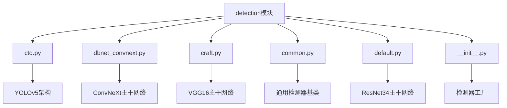
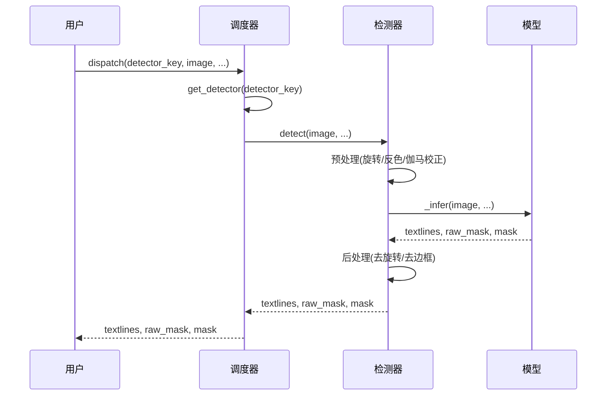
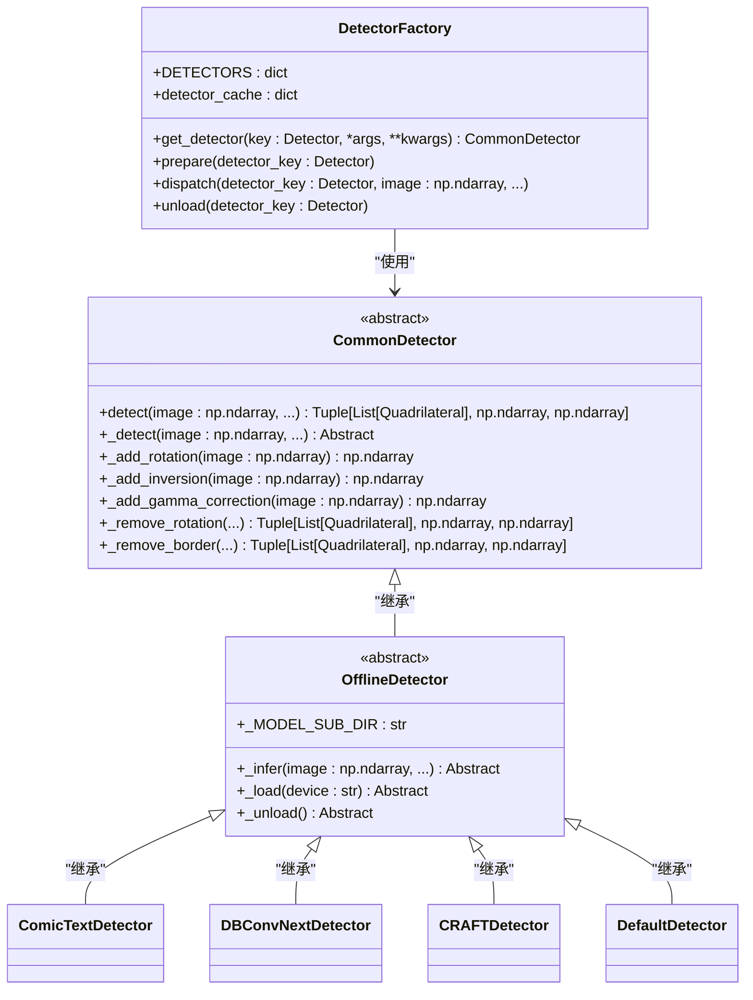
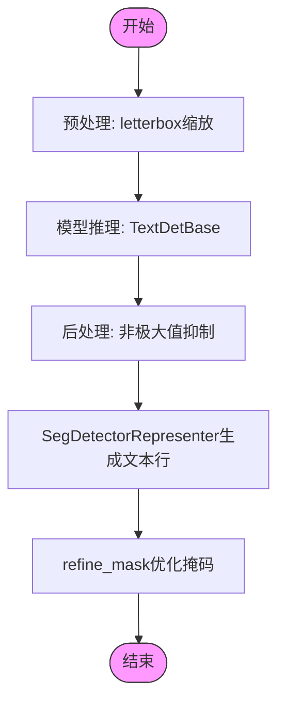
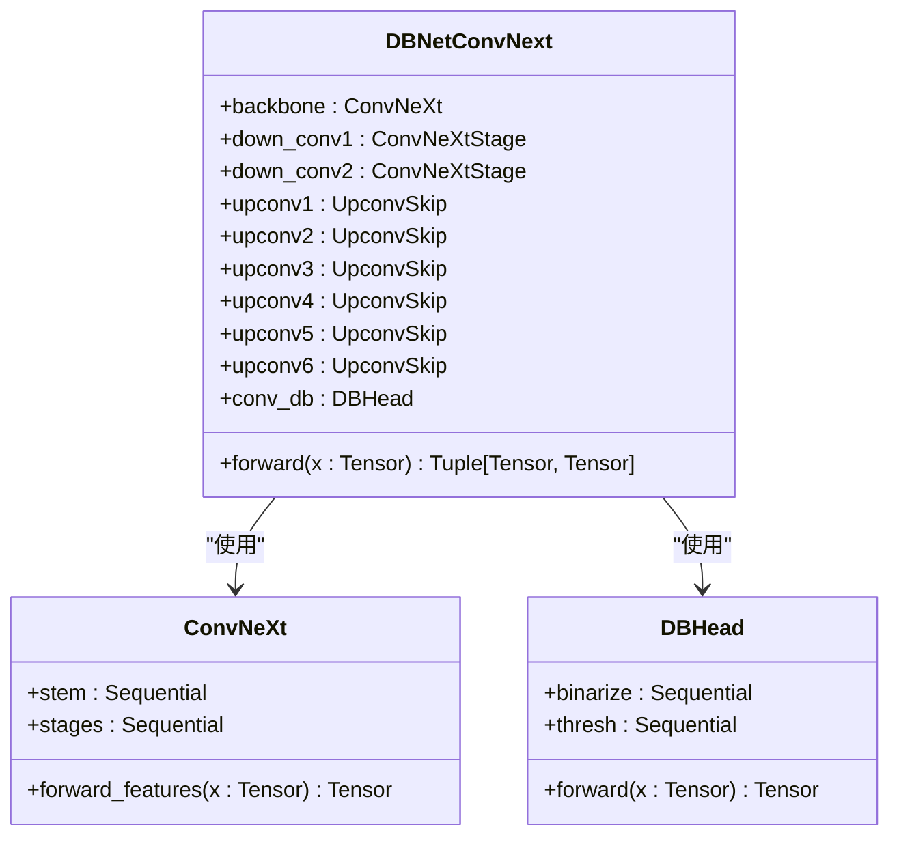
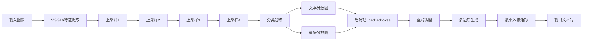
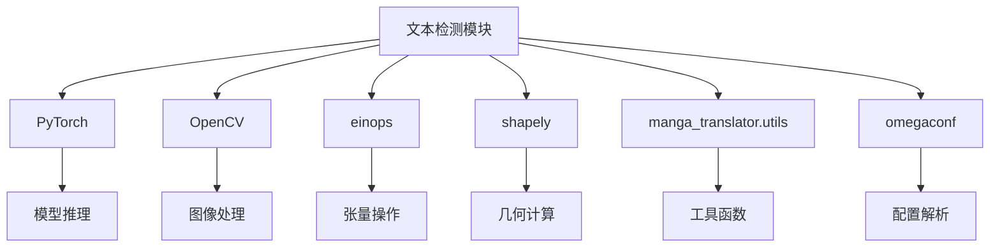

# 文本检测

<cite>
**本文档引用的文件**  
- [ctd.py](file://manga_translator/detection/ctd.py#L0-L186)
- [dbnet_convnext.py](file://manga_translator/detection/dbnet_convnext.py#L0-L596)
- [craft.py](file://manga_translator/detection/craft.py#L0-L200)
- [common.py](file://manga_translator/detection/common.py#L0-L146)
- [default.py](file://manga_translator/detection/default.py#L0-L103)
- [__init__.py](file://manga_translator/detection/__init__.py#L0-L43)
- [config.py](file://manga_translator/config.py#L0-L363)
</cite>

## 目录
1. [简介](#简介)
2. [项目结构](#项目结构)
3. [核心组件](#核心组件)
4. [架构概览](#架构概览)
5. [详细组件分析](#详细组件分析)
6. [依赖分析](#依赖分析)
7. [性能考量](#性能考量)
8. [故障排除指南](#故障排除指南)
9. [结论](#结论)

## 简介
文本检测模块是漫画图像翻译流水线中的首要环节，负责从输入图像中识别并定位所有文本区域。该模块支持多种先进的文本检测算法，包括基于YOLOv5架构的CTD、DBNet及其ConvNeXt变体、CRAFT模型等。检测结果以包含边界框和置信度的TextBlock列表形式输出，并与后续的OCR模块无缝衔接。用户可通过配置文件灵活选择和调用不同的检测器，以适应不同类型的漫画图像和翻译需求。

## 项目结构
文本检测模块位于`manga_translator/detection`目录下，采用模块化设计，各检测算法独立实现并通过统一接口调用。主要文件包括：
- `ctd.py`：基于YOLOv5架构的ComicTextDetector实现
- `dbnet_convnext.py`：基于ConvNeXt主干网络的DBNet检测器
- `craft.py`：CRAFT模型的文本区域精确定位实现
- `common.py`：通用检测器基类和公共方法
- `default.py`：默认检测器实现
- `__init__.py`：检测器工厂和调度逻辑

**图示来源**
- [ctd.py](file://manga_translator/detection/ctd.py#L0-L186)
- [dbnet_convnext.py](file://manga_translator/detection/dbnet_convnext.py#L0-L596)
- [craft.py](file://manga_translator/detection/craft.py#L0-L200)
- [common.py](file://manga_translator/detection/common.py#L0-L146)
- [default.py](file://manga_translator/detection/default.py#L0-L103)
- [__init__.py](file://manga_translator/detection/__init__.py#L0-L43)

## 核心组件
文本检测模块的核心组件包括检测器工厂、通用检测器基类和具体检测算法实现。检测器工厂负责根据配置创建和缓存检测器实例，通用检测器基类提供统一的检测接口和预处理/后处理逻辑，具体检测算法则针对不同场景优化实现。

**组件来源**
- [__init__.py](file://manga_translator/detection/__init__.py#L0-L43)
- [common.py](file://manga_translator/detection/common.py#L0-L146)

## 架构概览
文本检测模块采用工厂模式和策略模式，通过`get_detector`函数根据配置创建相应的检测器实例。所有检测器继承自`CommonDetector`基类，实现统一的`detect`接口。检测流程包括图像预处理、模型推理和后处理三个阶段，支持多种图像增强技术如旋转、反色和伽马校正以提高检测准确率。

**图示来源**
- [__init__.py](file://manga_translator/detection/__init__.py#L0-L43)
- [common.py](file://manga_translator/detection/common.py#L0-L146)

## 详细组件分析

### 检测器工厂分析
检测器工厂通过`DETECTORS`字典映射配置项与具体检测器类，并使用`detector_cache`缓存已创建的实例以提高性能。`get_detector`函数负责实例化和缓存管理，`dispatch`函数则封装了检测器的加载和调用逻辑。

**图示来源**
- [__init__.py](file://manga_translator/detection/__init__.py#L0-L43)
- [common.py](file://manga_translator/detection/common.py#L0-L146)

### CTD检测器分析
CTD（ComicTextDetector）基于YOLOv5架构实现，专为漫画文本检测优化。其核心是`TextDetBase`类，结合了YOLOv5的目标检测能力和DBNet的文本分割能力。检测流程包括图像预处理、模型推理和后处理三个阶段，支持CPU和GPU两种后端。

**图示来源**
- [ctd.py](file://manga_translator/detection/ctd.py#L0-L186)

### DBNetConvNext检测器分析
DBNetConvNext检测器采用ConvNeXt作为主干网络，结合DBNet的分割头实现文本检测。其优势在于对复杂背景和艺术字体有较好的鲁棒性。网络结构包括四个ConvNeXt阶段和一个U型上采样路径，最终输出文本区域的概率图和阈值图。

**图示来源**
- [dbnet_convnext.py](file://manga_translator/detection/dbnet_convnext.py#L0-L596)

### CRAFT检测器分析
CRAFT检测器基于VGG16主干网络，通过字符级和单词级的关联预测实现文本区域的精确定位。其优势在于对弯曲文本和小尺寸文本有较好的检测效果。模型包含一个U型网络结构，通过上采样和跳跃连接恢复空间信息。

**图示来源**
- [craft.py](file://manga_translator/detection/craft.py#L0-L200)

## 依赖分析
文本检测模块依赖于多个外部库和内部组件，包括PyTorch用于模型推理，OpenCV用于图像处理，einops用于张量操作，以及manga_translator.utils中的工具类。各检测算法之间相对独立，通过统一接口与上层模块交互。

**图示来源**
- [ctd.py](file://manga_translator/detection/ctd.py#L0-L186)
- [dbnet_convnext.py](file://manga_translator/detection/dbnet_convnext.py#L0-L596)
- [craft.py](file://manga_translator/detection/craft.py#L0-L200)
- [common.py](file://manga_translator/detection/common.py#L0-L146)

## 性能考量
不同检测算法在性能和准确率之间有不同的权衡。CTD在GPU上运行最快，适合实时应用；DBNetConvNext对复杂背景鲁棒性最好，但推理时间较长；CRAFT对小文本和弯曲文本检测效果最佳，但容易产生误检。用户应根据具体需求选择合适的检测器，并通过调整`text_threshold`、`box_threshold`和`unclip_ratio`等参数优化检测效果。

## 故障排除指南
常见问题包括模型下载失败、CUDA内存不足和检测结果不理想。解决方案包括检查网络连接、降低`detection_size`参数、使用CPU模式运行，以及调整检测阈值。对于特定问题，可参考各检测器的文档和示例配置。

**组件来源**
- [config.py](file://manga_translator/config.py#L0-L363)
- [common.py](file://manga_translator/detection/common.py#L0-L146)

## 结论
文本检测模块通过支持多种先进算法和灵活的配置选项，为漫画翻译流水线提供了强大而可靠的文本定位能力。各检测器在不同场景下各有优势，用户可根据具体需求选择最合适的算法。未来可考虑引入更多先进的文本检测模型，并优化现有算法的性能和准确率。