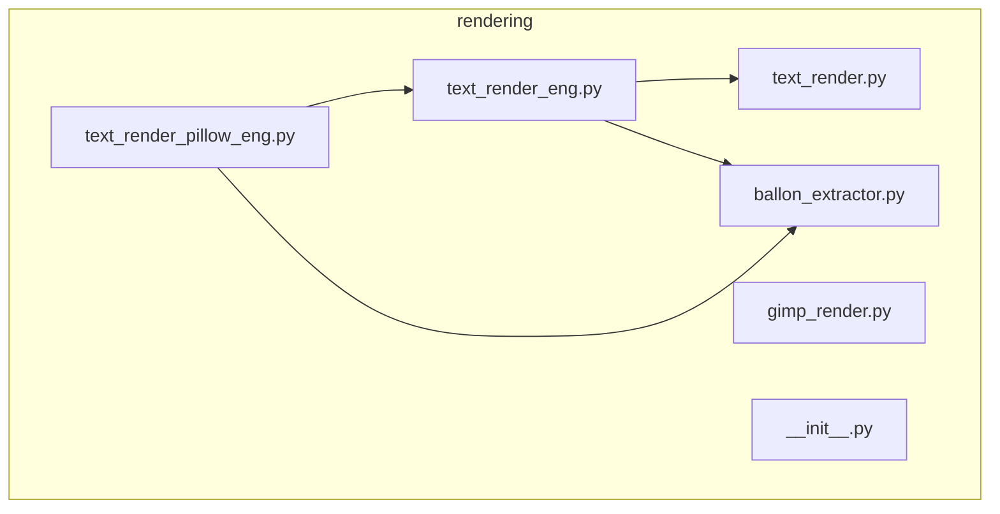
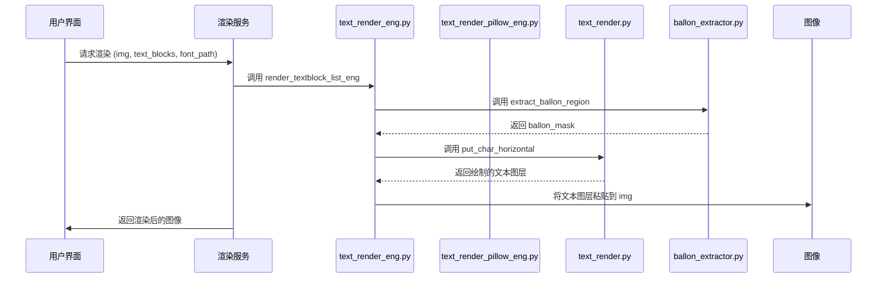
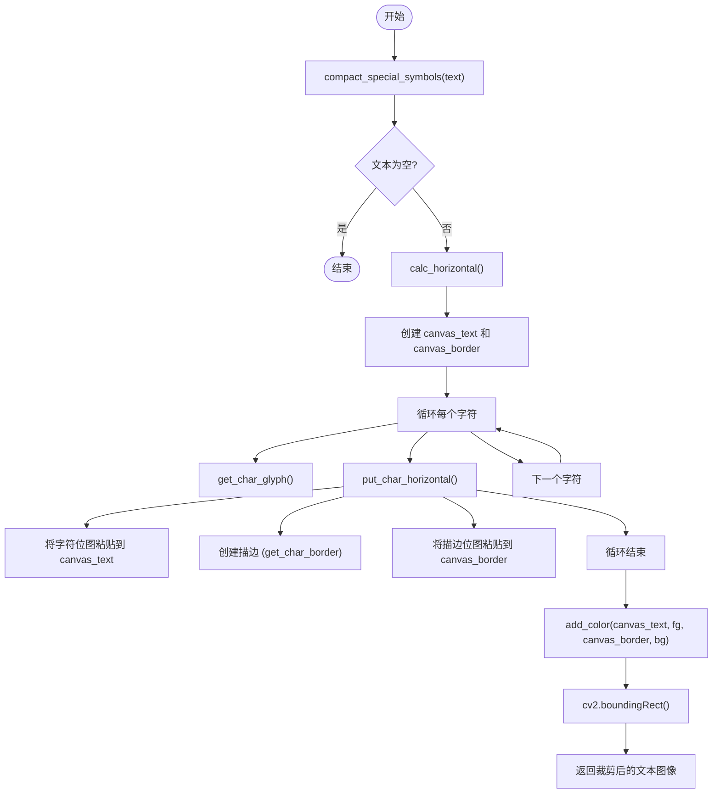
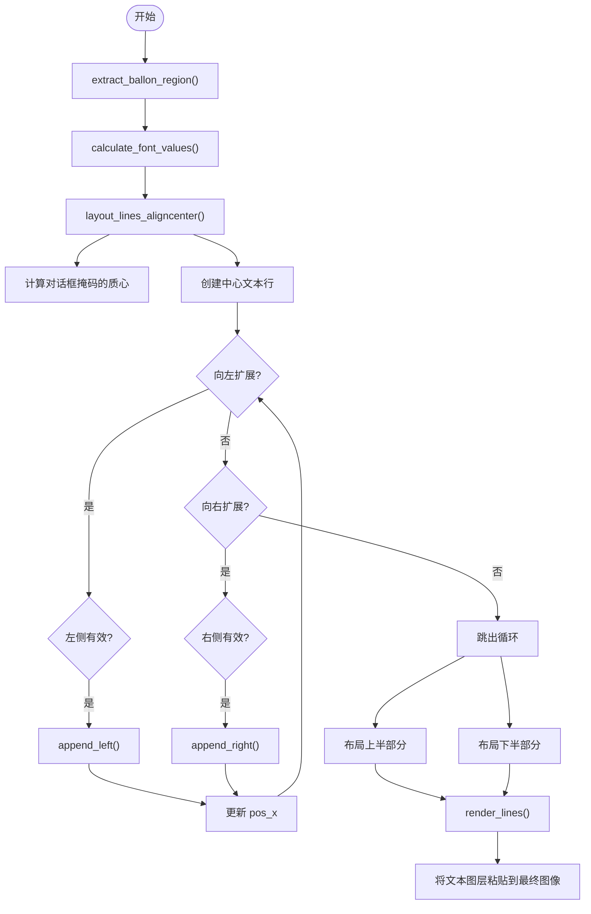
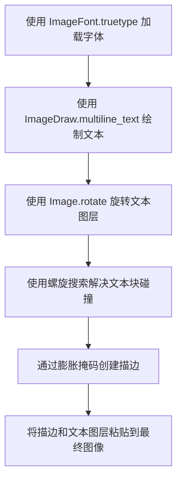
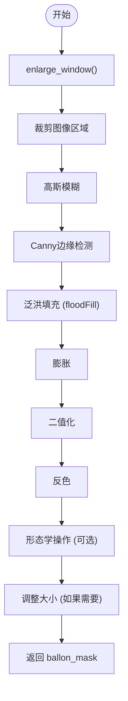
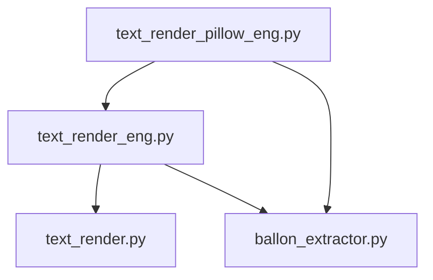

# 文本渲染

<cite>
**本文档引用的文件**  
- [text_render.py](file://manga_translator/rendering/text_render.py)
- [text_render_eng.py](file://manga_translator/rendering/text_render_eng.py)
- [text_render_pillow_eng.py](file://manga_translator/rendering/text_render_pillow_eng.py)
- [ballon_extractor.py](file://manga_translator/rendering/ballon_extractor.py)
</cite>

## 目录
1. [简介](#简介)
2. [项目结构](#项目结构)
3. [核心组件](#核心组件)
4. [架构概述](#架构概述)
5. [详细组件分析](#详细组件分析)
6. [依赖分析](#依赖分析)
7. [性能考虑](#性能考虑)
8. [故障排除指南](#故障排除指南)
9. [结论](#结论)

## 简介
本文档旨在为`manga-image-translator`项目中的文本渲染模块提供一份详尽的技术指南。该模块负责将机器翻译后的文本重新绘制到修复后的漫画图像上，是整个翻译流程的最后一步。文档将深入分析`text_render.py`、`text_render_eng.py`和`text_render_pillow_eng.py`等核心文件的实现机制，对比不同渲染器的差异，并探讨`ballon_extractor.py`在提升渲染自然度方面的作用。目标是为开发者和用户理解文本渲染过程、进行调试和优化提供全面的参考。

## 项目结构
文本渲染功能位于项目的`manga_translator/rendering/`目录下。该目录包含多个Python模块，共同协作完成从文本布局到最终图像合成的全过程。



**图示来源**  
- [text_render.py](file://manga_translator/rendering/text_render.py)
- [text_render_eng.py](file://manga_translator/rendering/text_render_eng.py)
- [text_render_pillow_eng.py](file://manga_translator/rendering/text_render_pillow_eng.py)
- [ballon_extractor.py](file://manga_translator/rendering/ballon_extractor.py)

**本节来源**  
- [text_render.py](file://manga_translator/rendering/text_render.py)
- [text_render_eng.py](file://manga_translator/rendering/text_render_eng.py)
- [text_render_pillow_eng.py](file://manga_translator/rendering/text_render_pillow_eng.py)
- [ballon_extractor.py](file://manga_translator/rendering/ballon_extractor.py)

## 核心组件
文本渲染模块的核心组件包括：
- **`text_render.py`**: 基础渲染引擎，使用FreeType库进行底层的字体光栅化和字符绘制，提供水平和垂直文本渲染的通用功能。
- **`text_render_eng.py`**: 英文专用渲染器，继承自`text_render.py`，实现了基于对话框轮廓的文本布局算法，使英文文本能更自然地填充在气泡内。
- **`text_render_pillow_eng.py`**: 另一个英文渲染器，它利用Pillow库的高级绘图功能，简化了文本绘制流程，并引入了基于螺旋搜索的碰撞检测算法来避免文本块重叠。
- **`ballon_extractor.py`**: 对话框提取器，通过图像处理技术（如Canny边缘检测和泛洪填充）从原始图像中分割出对话框区域，为`text_render_eng.py`和`text_render_pillow_eng.py`提供布局参考。

这些组件共同构成了一个分层的渲染系统，从底层的字符绘制到高层的文本布局和图像合成。

**本节来源**  
- [text_render.py](file://manga_translator/rendering/text_render.py)
- [text_render_eng.py](file://manga_translator/rendering/text_render_eng.py)
- [text_render_pillow_eng.py](file://manga_translator/rendering/text_render_pillow_eng.py)
- [ballon_extractor.py](file://manga_translator/rendering/ballon_extractor.py)

## 架构概述
整个文本渲染流程可以概括为一个数据处理管道。首先，`ballon_extractor.py`处理原始图像以提取对话框掩码。然后，`text_render_eng.py`或`text_render_pillow_eng.py`接收待渲染的文本块（`TextBlock`对象）、修复后的图像和原始图像，利用对话框掩码进行智能布局。最后，渲染器调用`text_render.py`中的底层函数将文本绘制到图像上。



**图示来源**  
- [text_render.py](file://manga_translator/rendering/text_render.py#L0-L811)
- [text_render_eng.py](file://manga_translator/rendering/text_render_eng.py#L0-L541)
- [text_render_pillow_eng.py](file://manga_translator/rendering/text_render_pillow_eng.py#L0-L281)
- [ballon_extractor.py](file://manga_translator/rendering/ballon_extractor.py#L0-L103)

## 详细组件分析

### text_render.py 分析
`text_render.py`是整个渲染系统的基础，它直接与FreeType库交互，提供了最精细的控制。

#### 核心类与函数
```mermaid
classDiagram
class Glyph {
+bitmap
+advance
+bitmap_left
+bitmap_top
+metrics
}
class namespace {
}
class TextBlock {
+xyxy
+font_size
+angle
+translation
+get_font_colors()
}
Glyph --> namespace : "包含"
TextBlock --> namespace : "使用"
```

**图示来源**  
- [text_render.py](file://manga_translator/rendering/text_render.py#L150-L180)

`Glyph`类封装了FreeType库中`FT_GlyphSlot`对象的关键属性，如位图数据（`bitmap`）、前进距离（`advance`）和度量信息（`metrics`）。`namespace`类被用作一个简单的命名空间，用于组织数据。

#### 文本绘制流程


**图示来源**  
- [text_render.py](file://manga_translator/rendering/text_render.py#L400-L500)

`put_char_horizontal`函数是核心。它首先通过`get_char_glyph`获取字符的光栅化位图，然后将其粘贴到主画布`canvas_text`上。如果需要描边（`bg`不为`None`），它会使用`freetype.Stroker`创建描边轮廓，并将其粘贴到`canvas_border`上。最后，`add_color`函数将前景色、描边和透明度通道合并成最终的RGBA图像。

**本节来源**  
- [text_render.py](file://manga_translator/rendering/text_render.py#L0-L811)

### text_render_eng.py 分析
`text_render_eng.py`是为英文文本设计的专用渲染器，其核心优势在于利用对话框轮廓进行文本布局。

#### 文本布局算法


**图示来源**  
- [text_render_eng.py](file://manga_translator/rendering/text_render_eng.py#L200-L400)

`layout_lines_aligncenter`函数是布局算法的核心。它首先计算对话框掩码的质心，然后从中心单词开始，尝试向左右两侧扩展文本行。它会检查扩展后的新位置是否与对话框边界冲突（通过检查掩码边缘的像素值），从而确保文本尽可能地居中且不超出气泡范围。这种算法使得英文文本看起来像是“生长”在气泡内部，非常自然。

#### 与基础渲染器的集成
`text_render_eng.py`通过`from .text_render import get_char_glyph, put_char_horizontal, add_color`直接复用`text_render.py`中的底层绘制函数，这体现了良好的模块化设计。它专注于解决“文本放在哪里”的布局问题，而将“如何绘制字符”的细节留给基础模块。

**本节来源**  
- [text_render_eng.py](file://manga_translator/rendering/text_render_eng.py#L0-L541)

### text_render_pillow_eng.py 分析
`text_render_pillow_eng.py`提供了另一种英文渲染的实现，它更依赖于Pillow库的高级功能。

#### 实现差异
与`text_render_eng.py`相比，`text_render_pillow_eng.py`的主要差异在于：

1.  **绘图库**: 它使用`PIL.ImageDraw.Draw`的`multiline_text`方法进行文本绘制，而不是手动逐个字符绘制。这简化了代码，但牺牲了对每个字符的精细控制。
2.  **碰撞检测**: 它引入了`solve_collisions_spiral_xyxy`函数，使用螺旋搜索算法来解决多个文本块之间的位置冲突。这对于处理密集的、可能重叠的文本块非常有用。
3.  **描边实现**: 它通过`widen_mask_opencv_round`函数对文本的透明度掩码进行膨胀来创建描边，而不是使用FreeType的描边功能。



**图示来源**  
- [text_render_pillow_eng.py](file://manga_translator/rendering/text_render_pillow_eng.py#L0-L281)

这种实现方式更“高级”和“自动化”，代码更简洁，但在处理特殊字体或需要极致性能的场景下，可能不如直接使用FreeType的`text_render.py`灵活。

**本节来源**  
- [text_render_pillow_eng.py](file://manga_translator/rendering/text_render_pillow_eng.py#L0-L281)

### ballon_extractor.py 分析
`ballon_extractor.py`是实现自然渲染的关键。

#### 对话框提取流程


**图示来源**  
- [ballon_extractor.py](file://manga_translator/rendering/ballon_extractor.py#L50-L100)

该模块首先根据文本块的边界框扩大一个区域，然后应用Canny边缘检测来找到对话框的轮廓。接着，它从中心点开始进行泛洪填充，填充的区域即为对话框内部。通过调整填充的容差（`loDiff`和`upDiff`），算法可以适应不同颜色和复杂度的背景。最终生成的`ballon_mask`是一个二值掩码，`text_render_eng.py`和`text_render_pillow_eng.py`利用这个掩码来指导文本布局。

**本节来源**  
- [ballon_extractor.py](file://manga_translator/rendering/ballon_extractor.py#L0-L103)

## 依赖分析
各渲染模块之间存在清晰的依赖关系。



**图示来源**  
- [text_render_eng.py](file://manga_translator/rendering/text_render_eng.py#L1-L10)
- [text_render_pillow_eng.py](file://manga_translator/rendering/text_render_pillow_eng.py#L1-L10)

`text_render_eng.py`和`text_render_pillow_eng.py`都依赖于`ballon_extractor.py`来获取对话框信息。`text_render_eng.py`直接依赖于`text_render.py`的底层绘制功能。而`text_render_pillow_eng.py`则依赖于`text_render_eng.py`中的英文分词函数`seg_eng`，这表明它是在`text_render_eng.py`的基础上构建的，但替换了核心的绘制和布局逻辑。

**本节来源**  
- [text_render.py](file://manga_translator/rendering/text_render.py)
- [text_render_eng.py](file://manga_translator/rendering/text_render_eng.py)
- [text_render_pillow_eng.py](file://manga_translator/rendering/text_render_pillow_eng.py)
- [ballon_extractor.py](file://manga_translator/rendering/ballon_extractor.py)

## 性能考虑
- **`text_render.py`**: 使用FreeType进行逐字符绘制，计算量较大，但提供了最高的灵活性和控制力。`@functools.lru_cache`装饰器被用于缓存字形（`get_char_glyph`），这能显著提升重复字符的渲染速度。
- **`text_render_eng.py`**: 其布局算法（`layout_lines_aligncenter`）的时间复杂度与单词数量和对话框大小相关，在处理复杂气泡时可能成为瓶颈。
- **`text_render_pillow_eng.py`**: `solve_collisions_spiral_xyxy`的螺旋搜索算法在最坏情况下可能需要遍历大量点，对于大量文本块，性能可能较差。

## 故障排除指南
- **文本未显示**: 检查字体文件路径是否正确，`set_font`函数是否成功加载了字体。查看日志中是否有“Could not load font”或“Default font could not be loaded”的错误。
- **文本超出气泡**: 这可能是`ballon_extractor.py`未能正确提取对话框，或者`text_render_eng.py`的布局算法在复杂形状下失效。可以尝试调整`enlarge_ratio`参数。
- **描边不显示**: 确保在调用渲染函数时指定了`stroke_color`（或`bg`）参数。检查`stroke_width`是否设置得过小。
- **中文字符显示为方块**: 这通常是因为使用的字体不包含中文字符。`get_char_glyph`函数会尝试从`FALLBACK_FONTS`列表中加载备用字体（如`msyh.ttc`），请确保这些字体文件存在。

**本节来源**  
- [text_render.py](file://manga_translator/rendering/text_render.py#L100-L200)
- [text_render_eng.py](file://manga_translator/rendering/text_render_eng.py#L400-L500)

## 结论
`manga-image-translator`的文本渲染模块是一个设计精巧的分层系统。`text_render.py`提供了坚实的基础，`text_render_eng.py`和`text_render_pillow_eng.py`在其上构建了针对英文的高级布局功能，而`ballon_extractor.py`则通过图像分析为自然渲染提供了关键的上下文信息。开发者可以根据具体需求选择合适的渲染器：追求极致控制和性能时使用`text_render.py`，追求与气泡融合的自然效果时使用`text_render_eng.py`，或在需要处理文本块碰撞时使用`text_render_pillow_eng.py`。理解这些组件的协作方式对于有效使用和进一步开发该系统至关重要。