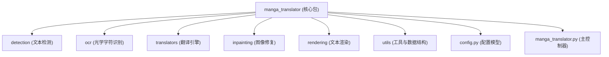
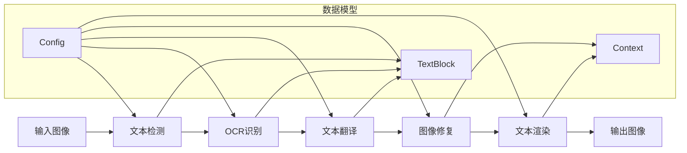
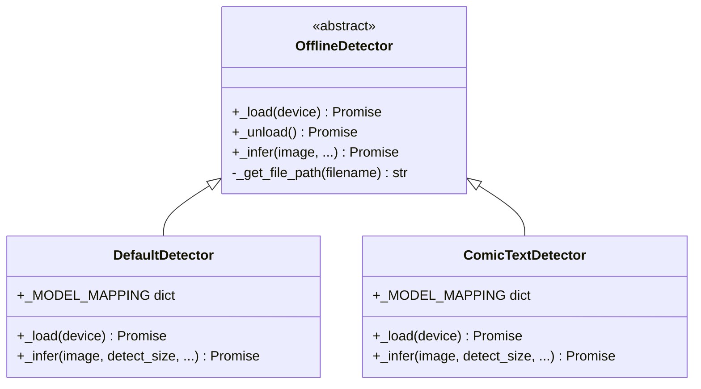
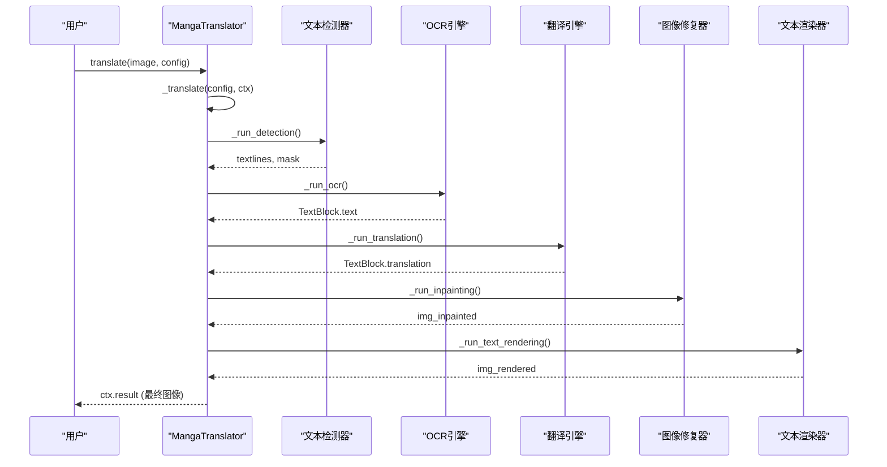

# 核心翻译引擎

<cite>
**本文档中引用的文件**   
- [manga_translator.py](file://manga_translator\manga_translator.py)
- [config.py](file://manga_translator\config.py)
- [textblock.py](file://manga_translator\utils\textblock.py)
- [ctd.py](file://manga_translator\detection\ctd.py)
- [default.py](file://manga_translator\detection\default.py)
</cite>

## 目录
1. [项目结构](#项目结构)
2. [核心组件](#核心组件)
3. [架构概述](#架构概述)
4. [详细组件分析](#详细组件分析)
5. [数据流与工作流](#数据流与工作流)
6. [配置系统](#配置系统)
7. [错误处理与日志](#错误处理与日志)

## 项目结构

项目采用模块化设计，核心翻译逻辑位于 `manga_translator` 目录下，各子模块职责分明。主要结构如下：



**图源**
- [manga_translator.py](file://manga_translator\manga_translator.py)
- 项目结构

**章节源**
- 项目结构

## 核心组件

`MangaTranslator` 类是整个翻译流水线的核心协调者，它通过一系列异步方法 (`_run_detection`, `_run_ocr`, `_run_translation`, `_run_inpainting`, `_run_text_rendering`) 串联起从检测到渲染的完整流程。该类通过 `Config` 对象接收所有配置参数，并利用 `Context` 对象在各阶段间传递数据和状态。

**章节源**
- [manga_translator.py](file://manga_translator\manga_translator.py#L150-L155)
- [config.py](file://manga_translator\config.py#L250-L255)

## 架构概述

系统采用经典的流水线架构，将复杂的漫画翻译任务分解为一系列可独立执行和优化的阶段。每个阶段的输出作为下一阶段的输入，形成清晰的数据流。



**图源**
- [manga_translator.py](file://manga_translator\manga_translator.py#L300-L350)
- [textblock.py](file://manga_translator\utils\textblock.py#L10-L20)

**章节源**
- [manga_translator.py](file://manga_translator\manga_translator.py#L300-L350)

## 详细组件分析

### 文本检测模块 (Detection)

文本检测模块负责定位图像中的所有文本区域。它支持多种算法，由 `Detector` 枚举定义。

#### 支持的算法
- **default**: 基于DBNet的自研模型，是默认选择。
- **ctd**: ComicTextDetector，一个专门针对漫画优化的模型。
- **dbconvnext**: 使用ConvNeXt作为骨干网络的DBNet。
- **craft**: 基于字符级检测的模型。

#### 配置参数
```python
class DetectorConfig(BaseModel):
    detector: Detector = Detector.default
    detection_size: int = 2048
    text_threshold: float = 0.5
    box_threshold: float = 0.7
    unclip_ratio: float = 2.3
```
- `detection_size`: 检测前图像缩放的尺寸，影响精度和速度。
- `text_threshold`: 文本区域置信度阈值。
- `unclip_ratio`: 控制检测框的扩展程度，以覆盖完整文本。

#### 实现分析
`DefaultDetector` 和 `ComicTextDetector` 都继承自 `OfflineDetector` 基类。它们通过 `_infer` 方法执行推理。`det_rearrange_forward` 函数用于处理大尺寸图像的分块检测与结果拼接。



**图源**
- [detection\default.py](file://manga_translator\detection\default.py#L1-L20)
- [detection\ctd.py](file://manga_translator\detection\ctd.py#L1-L20)
- [detection\common.py](file://manga_translator\detection\common.py#L1-L10)

**章节源**
- [detection\default.py](file://manga_translator\detection\default.py#L1-L104)
- [detection\ctd.py](file://manga_translator\detection\ctd.py#L1-L187)

### OCR模块 (OCR)

OCR模块负责从检测到的文本区域中提取文本内容。

#### 模型选择
由 `Ocr` 枚举定义，包括：
- `ocr32px`, `ocr48px`, `ocr48px_ctc`: 不同配置的自研OCR模型。
- `mocr`: MangaOCR，一个流行的开源漫画OCR模型。

#### 配置与优化
```python
class OcrConfig(BaseModel):
    ocr: Ocr = Ocr.ocr48px
    use_hybrid_ocr: bool = False
    secondary_ocr: Ocr = Ocr.ocr48px
    min_text_length: int = 0
    prob: float | None = None
    merge_gamma: float = 0.8
    merge_sigma: float = 2.5
```
- `use_hybrid_ocr`: 启用混合OCR模式，当主OCR失败时使用备选模型。
- `merge_gamma/sigma`: 控制文本行合并算法的容差，优化识别结果。

**章节源**
- [config.py](file://manga_translator\config.py#L180-L195)
- [ocr](file://manga_translator\ocr)

### 翻译模块 (Translators)

翻译模块提供了一个灵活的多引擎调度机制。

#### 多引擎调度
- **单引擎**: 直接使用 `translator` 配置项指定的引擎。
- **链式翻译 (translator_chain)**: 将一个翻译器的输出作为下一个翻译器的输入，例如 `"google:JPN;sugoi:ENG"`。
- **选择性翻译 (selective_translation)**: 根据检测到的源语言自动选择翻译器。

#### 引擎类型
```python
class Translator(str, Enum):
    # 在线API
    chatgpt = "chatgpt"
    gemini = "gemini"
    deepl = "deepl"
    baidu = "baidu"
    # 离线模型
    sugoi = "sugoi"
    nllb = "nllb"
    m2m100 = "m2m100"
    # 本地规则
    none = "none"
```

#### 配置与验证
```python
class TranslatorConfig(BaseModel):
    translator: Translator = Translator.sugoi
    target_lang: str = 'ENG'
    enable_post_translation_check: bool = True
    post_check_max_retry_attempts: int = 3
```
- `enable_post_translation_check`: 启用译后检查，防止重复或无意义的翻译。
- `gpt_config`: 用于配置ChatGPT等大模型的提示词和参数。

**章节源**
- [config.py](file://manga_translator\config.py#L90-L150)
- [translators](file://manga_translator\translators)

### 图像修复模块 (Inpainting)

图像修复模块负责清除原始文本，为新文本的渲染准备干净的背景。

#### 技术方案
由 `Inpainter` 枚举定义：
- **lama_large**: LaMa模型，速度快，效果好，是默认选择。
- **lama_mpe**: LaMa的变体。
- **sd**: 基于Stable Diffusion的修复，效果更佳但速度慢。
- **original**: 原始的简单修复方法。

#### 配置
```python
class InpainterConfig(BaseModel):
    inpainter: Inpainter = Inpainter.lama_large
    inpainting_size: int = 2048
    inpainting_precision: InpaintPrecision = InpaintPrecision.bf16
```
- `inpainting_size`: 修复时的图像尺寸。
- `inpainting_precision`: 计算精度，影响速度和显存占用。

**章节源**
- [config.py](file://manga_translator\config.py#L160-L170)
- [inpainting](file://manga_translator\inpainting)

### 文本渲染模块 (Rendering)

文本渲染模块负责将翻译后的文本以美观的方式绘制回图像。

#### 渲染器
由 `Renderer` 枚举定义：
- **default**: 默认渲染器。
- **manga2Eng**: 专为日译英设计的渲染器。
- **gimp**: 使用GIMP进行渲染。

#### 字体与布局
```python
class RenderConfig(BaseModel):
    font_size_offset: int = 0
    font_size_minimum: int = -1
    alignment: Alignment = Alignment.auto
    direction: Direction = Direction.auto
    disable_font_border: bool = False
    font_color: Optional[str] = None
    no_hyphenation: bool = False
```
- `direction`: 文本方向，可自动根据语言（如日语、阿拉伯语）判断。
- `alignment`: 文本对齐方式。
- `font_color`: 可强制指定文本颜色。

**章节源**
- [config.py](file://manga_translator\config.py#L50-L85)
- [rendering](file://manga_translator\rendering)

## 数据流与工作流

`MangaTranslator` 类的 `translate` 方法定义了核心工作流。以下是关键步骤的序列图：



**图源**
- [manga_translator.py](file://manga_translator\manga_translator.py#L300-L350)

**章节源**
- [manga_translator.py](file://manga_translator\manga_translator.py#L300-L350)

## 配置系统

系统使用Pydantic模型 (`BaseModel`) 来定义和验证配置，确保了类型安全和配置的清晰性。

#### 核心配置模型
```python
class Config(BaseModel):
    render: RenderConfig
    upscale: UpscaleConfig
    translator: TranslatorConfig
    detector: DetectorConfig
    inpainter: InpainterConfig
    ocr: OcrConfig
    ...
```
`Config` 类是一个聚合根，它包含了所有子模块的配置对象。`manga_translator.py` 中的 `MangaTranslator` 类通过 `parse_init_params` 方法将命令行参数或UI输入映射到这个 `Config` 对象，从而驱动整个翻译流程。

**章节源**
- [config.py](file://manga_translator\config.py#L250-L280)

## 错误处理与日志

系统具备完善的错误处理和日志记录机制。

#### 错误处理
- **TranslationInterrupt**: 一个自定义异常，用于在进度钩子中中断翻译流程。
- **ignore_errors**: 当此标志为 `True` 时，单个模块的错误不会导致整个流程终止，系统会使用原始图像作为该步骤的输出并继续执行。

#### 日志记录
- **文件日志**: `_setup_log_file` 方法会创建一个带时间戳的日志文件，并将所有输出重定向到其中。
- **控制台日志**: 使用 `rich` 库提供美观的控制台输出。
- **调试图片**: 在 `verbose` 模式下，系统会将每个阶段的中间结果（如 `detection_raw_boxes.png`, `inpainted.png`）保存到 `result` 目录下的子文件夹中，便于调试。

**章节源**
- [manga_translator.py](file://manga_translator\manga_translator.py#L150-L180)
- [manga_translator.py](file://manga_translator\manga_translator.py#L200-L250)