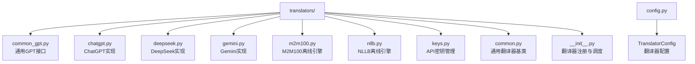
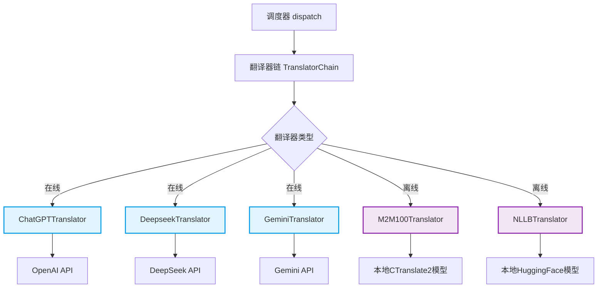
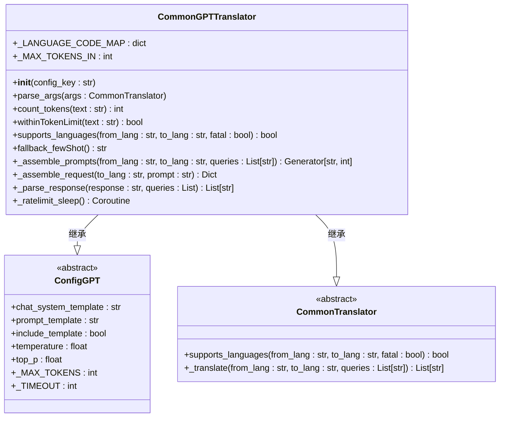
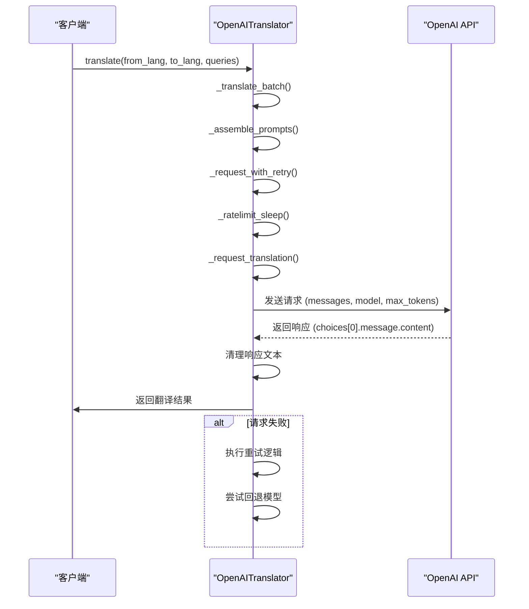
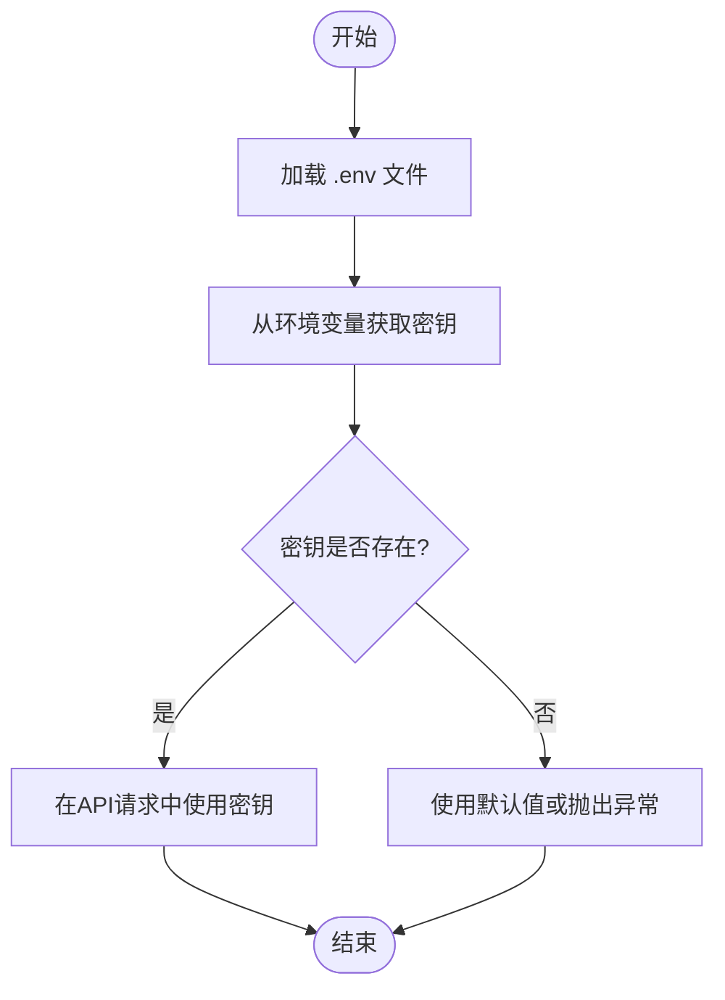
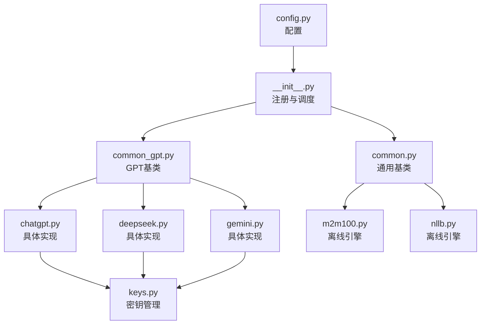

# 翻译处理

<cite>
**本文档中引用的文件**   
- [common_gpt.py](file://manga_translator/translators/common_gpt.py)
- [chatgpt.py](file://manga_translator/translators/chatgpt.py)
- [keys.py](file://manga_translator/translators/keys.py)
- [config.py](file://manga_translator/config.py)
- [m2m100.py](file://manga_translator/translators/m2m100.py)
- [nllb.py](file://manga_translator/translators/nllb.py)
- [common.py](file://manga_translator/translators/common.py)
- [__init__.py](file://manga_translator/translators/__init__.py)
</cite>

## 目录
1. [简介](#简介)
2. [项目结构](#项目结构)
3. [核心组件](#核心组件)
4. [架构概述](#架构概述)
5. [详细组件分析](#详细组件分析)
6. [依赖分析](#依赖分析)
7. [性能考量](#性能考量)
8. [故障排除指南](#故障排除指南)
9. [结论](#结论)

## 简介
本文档全面介绍了“漫画图像翻译器”项目中的翻译处理模块，该模块作为整个系统的核心调度引擎，负责协调多种在线和离线翻译服务。文档将系统性地阐述其架构设计、核心功能以及关键实现细节，旨在为开发者和用户提供一个清晰、深入的理解。

## 项目结构
项目结构清晰地划分了功能模块，翻译处理的核心逻辑位于 `manga_translator/translators/` 目录下。该目录包含了所有具体的翻译器实现、通用基类和配置文件。

**图示来源**
- [manga_translator/translators/](file://manga_translator/translators/)
- [manga_translator/config.py](file://manga_translator/config.py)

## 核心组件
翻译处理模块的核心由几个关键组件构成：`CommonTranslator` 提供了所有翻译器的通用接口和基础功能；`CommonGPTTranslator` 为所有基于GPT的在线服务定义了统一的交互模式；而 `keys.py` 则安全地管理着所有外部API所需的认证密钥。

**组件来源**
- [common.py](file://manga_translator/translators/common.py#L1-L329)
- [common_gpt.py](file://manga_translator/translators/common_gpt.py#L1-L507)
- [keys.py](file://manga_translator/translators/keys.py#L1-L50)

## 架构概述
整个翻译处理模块采用分层和插件化的架构。顶层是调度器 `dispatch` 函数，它根据配置选择并加载具体的翻译器。翻译器分为两大类：基于API的在线服务（如ChatGPT）和基于本地模型的离线引擎（如M2M100）。所有翻译器都继承自 `CommonTranslator` 基类，确保了统一的调用接口。

**图示来源**
- [__init__.py](file://manga_translator/translators/__init__.py#L1-L195)
- [common.py](file://manga_translator/translators/common.py#L1-L329)

## 详细组件分析

### 通用GPT接口分析
`common_gpt.py` 文件定义了 `CommonGPTTranslator` 类，它为所有基于GPT的翻译器（如ChatGPT, DeepSeek, Gemini）提供了一个通用的接口。该类处理了提示词组装、响应解析和速率限制等公共逻辑。

#### 类图

**图示来源**
- [common_gpt.py](file://manga_translator/translators/common_gpt.py#L1-L507)

### ChatGPT具体实现分析
`chatgpt.py` 文件中的 `OpenAITranslator` 类是 `CommonGPTTranslator` 的一个具体实现，专门用于与OpenAI的API进行交互。它处理了API密钥验证、HTTP代理设置、请求重试和术语表功能。

#### 序列图

**图示来源**
- [chatgpt.py](file://manga_translator/translators/chatgpt.py#L1-L799)

### API密钥管理分析
`keys.py` 文件是所有外部API密钥的集中管理点。它使用 `dotenv` 库从环境变量中读取密钥，确保了敏感信息不会硬编码在源代码中。

#### 流程图

**图示来源**
- [keys.py](file://manga_translator/translators/keys.py#L1-L50)

## 依赖分析
翻译处理模块的依赖关系清晰，体现了高内聚、低耦合的设计原则。`__init__.py` 文件通过字典注册了所有翻译器，实现了插件化加载。`common.py` 和 `common_gpt.py` 提供了抽象基类，而具体的翻译器（如 `chatgpt.py`）则负责实现细节。

**图示来源**
- [__init__.py](file://manga_translator/translators/__init__.py#L1-L195)
- [common.py](file://manga_translator/translators/common.py#L1-L329)
- [common_gpt.py](file://manga_translator/translators/common_gpt.py#L1-L507)

## 性能考量
在线和离线翻译模式在性能、成本和网络依赖性上存在显著权衡。

- **在线模式 (ChatGPT, DeepSeek, Gemini)**:
  - **优点**: 通常提供最高的翻译质量，模型持续更新。
  - **缺点**: 需要稳定的网络连接，可能产生API调用费用，存在速率限制。
  - **成本**: 按使用量计费，成本随翻译量线性增长。

- **离线模式 (M2M100, NLLB)**:
  - **优点**: 无需网络连接，无API费用，响应速度快。
  - **缺点**: 需要预先下载大型模型文件（占用数GB磁盘空间），翻译质量可能略低于顶级在线模型，模型更新需手动操作。
  - **成本**: 一次性下载成本，后续使用免费。

用户应根据自身需求（如网络环境、预算、对翻译质量的要求）在 `config.json` 中通过 `translator` 字段进行配置。

## 故障排除指南
当翻译功能出现问题时，可参考以下步骤进行排查：

1.  **检查API密钥**: 确保 `OPENAI_API_KEY`、`DEEPSEEK_API_KEY` 或 `GEMINI_API_KEY` 等环境变量已正确设置。
2.  **验证网络连接**: 对于在线翻译器，确认网络通畅，且代理设置（如 `OPENAI_HTTP_PROXY`）正确。
3.  **查看日志**: 启用详细日志（`verbose_logging`）以获取更详细的错误信息，如请求超时或速率限制。
4.  **检查模型下载**: 对于离线翻译器，确认模型文件已成功下载至 `models/` 目录。
5.  **调整配置**: 尝试降低 `max_tokens` 或 `temperature` 等参数，或使用回退模型。

**组件来源**
- [chatgpt.py](file://manga_translator/translators/chatgpt.py#L1-L799)
- [keys.py](file://manga_translator/translators/keys.py#L1-L50)
- [m2m100.py](file://manga_translator/translators/m2m100.py#L1-L114)

## 结论
翻译处理模块作为“漫画图像翻译器”的核心，通过精心设计的分层架构和插件化系统，成功整合了多种先进的翻译技术。它不仅提供了高质量的在线API服务，也支持了无需网络的离线解决方案，为用户提供了极大的灵活性。其清晰的代码结构和模块化设计，使得添加新的翻译引擎变得简单高效，为项目的长期发展和维护奠定了坚实的基础。