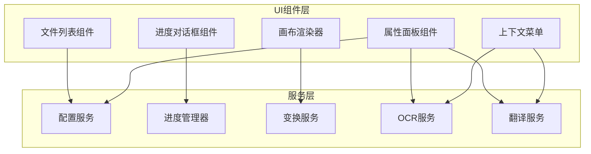
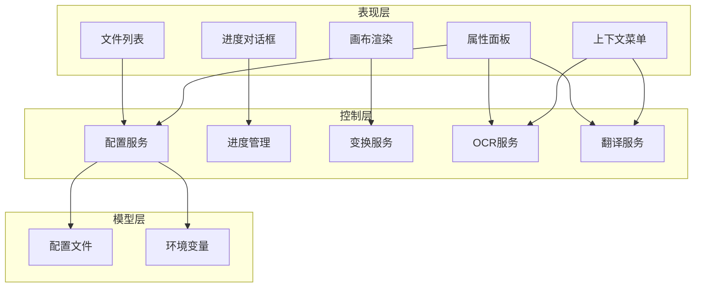
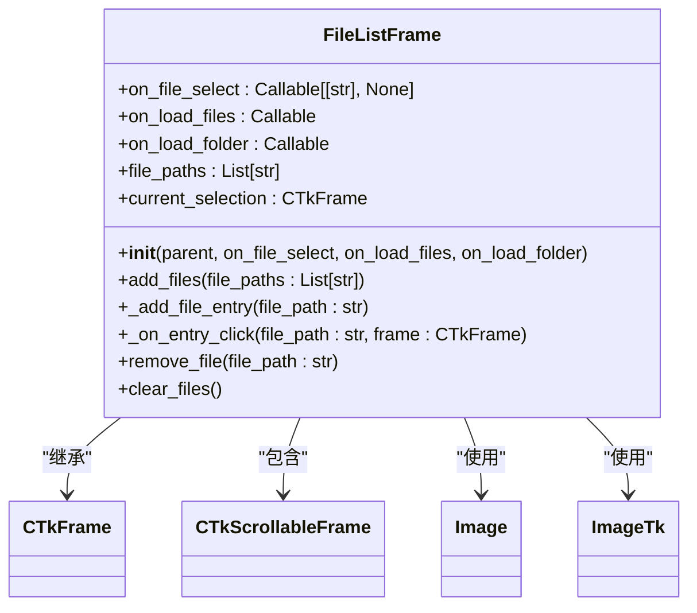
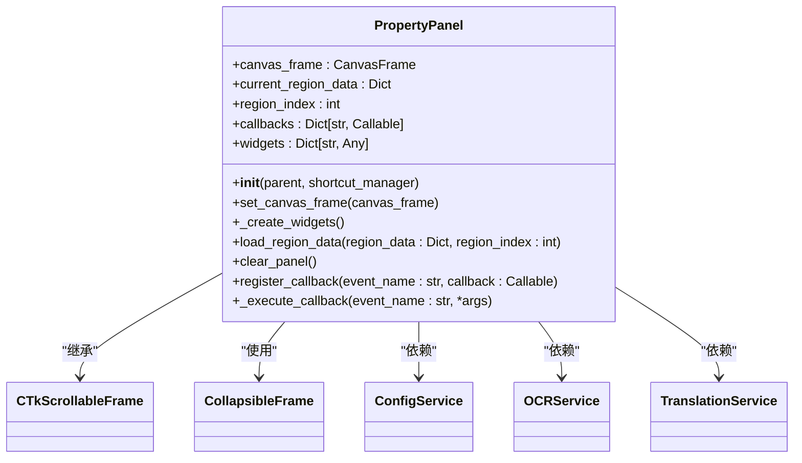
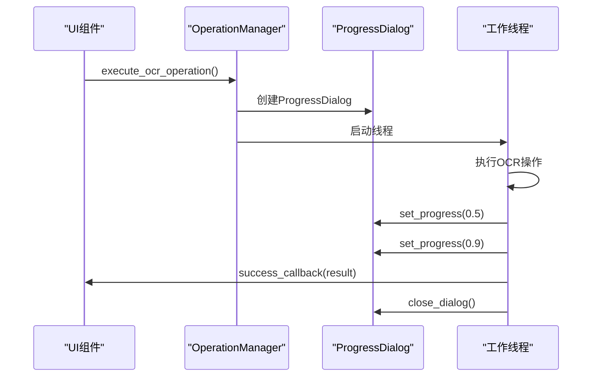
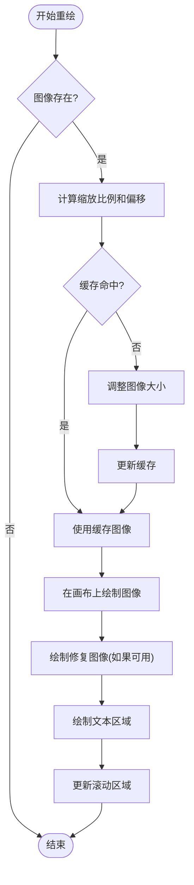
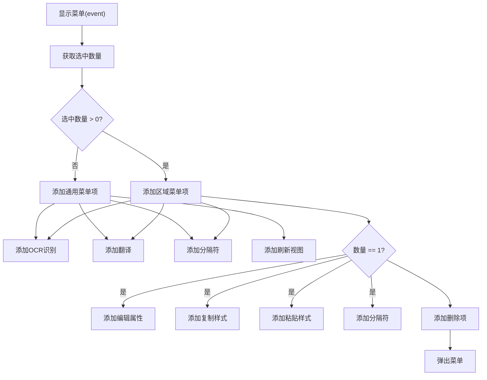
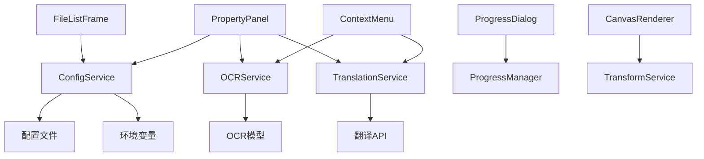

# UI组件库

<cite>
**本文档中引用的文件**   
- [file_list_frame.py](file://desktop-ui/components/file_list_frame.py)
- [property_panel.py](file://desktop-ui/components/property_panel.py)
- [progress_dialog.py](file://desktop-ui/components/progress_dialog.py)
- [canvas_renderer_new.py](file://desktop-ui/components/canvas_renderer_new.py)
- [context_menu.py](file://desktop-ui/components/context_menu.py)
- [config_service.py](file://desktop-ui/services/config_service.py)
</cite>

## 目录
1. [项目结构](#项目结构)
2. [核心组件](#核心组件)
3. [架构概述](#架构概述)
4. [详细组件分析](#详细组件分析)
5. [依赖关系分析](#依赖关系分析)

## 项目结构

该桌面UI项目采用模块化设计，主要分为`components`（UI组件）、`services`（服务层）和`utils`（工具类）三大模块。UI组件基于`customtkinter`构建，实现了现代化的视觉风格和交互逻辑。服务层通过依赖注入模式为UI组件提供配置管理、进度控制、文件操作等核心功能。整体结构清晰，职责分离明确，便于维护和扩展。

**图示来源**
- [file_list_frame.py](file://desktop-ui/components/file_list_frame.py#L1-L115)
- [property_panel.py](file://desktop-ui/components/property_panel.py#L1-L641)
- [progress_dialog.py](file://desktop-ui/components/progress_dialog.py#L1-L317)
- [canvas_renderer_new.py](file://desktop-ui/components/canvas_renderer_new.py#L1-L350)
- [context_menu.py](file://desktop-ui/components/context_menu.py#L1-L87)
- [config_service.py](file://desktop-ui/services/config_service.py#L1-L303)

## 核心组件

本文档详细分析了桌面UI中的五个核心可视化组件：`FileListFrame`实现可扩展的文件树结构与拖放支持，`PropertyPanel`动态渲染配置属性并绑定到`ConfigService`，`ProgressDialog`与`ProgressManager`服务集成以显示实时任务进度，`CanvasRenderer`采用双缓冲机制进行图像渲染，`ContextMenu`实现基于选中状态的条件显示策略。

**组件来源**
- [file_list_frame.py](file://desktop-ui/components/file_list_frame.py#L1-L115)
- [property_panel.py](file://desktop-ui/components/property_panel.py#L1-L641)
- [progress_dialog.py](file://desktop-ui/components/progress_dialog.py#L1-L317)
- [canvas_renderer_new.py](file://desktop-ui/components/canvas_renderer_new.py#L1-L350)
- [context_menu.py](file://desktop-ui/components/context_menu.py#L1-L87)

## 架构概述

系统采用分层架构，UI组件层负责用户交互和视觉呈现，服务层提供业务逻辑和数据管理。组件间通过回调函数和事件机制进行通信，实现了松耦合的设计。配置服务`ConfigService`作为中心枢纽，管理应用的全局设置和环境变量，确保了配置的一致性和可维护性。

**图示来源**
- [config_service.py](file://desktop-ui/services/config_service.py#L1-L303)
- [property_panel.py](file://desktop-ui/components/property_panel.py#L1-L641)

## 详细组件分析

### 文件列表组件分析

`FileListFrame`组件实现了可扩展的文件树结构，支持添加单个文件、整个文件夹以及清空列表等操作。通过`customtkinter.CTkScrollableFrame`实现滚动功能，每个文件条目包含缩略图、文件名和卸载按钮。组件采用回调机制与主应用通信，实现了关注点分离。

**图示来源**
- [file_list_frame.py](file://desktop-ui/components/file_list_frame.py#L1-L115)

**组件来源**
- [file_list_frame.py](file://desktop-ui/components/file_list_frame.py#L1-L115)

### 属性面板组件分析

`PropertyPanel`组件动态渲染文本区域的配置属性，并与`ConfigService`服务绑定。面板分为区域信息、文本内容、样式设置、蒙版编辑和操作按钮五个部分。通过`register_callback`方法注册事件回调，实现与主应用的双向数据绑定。组件支持实时更新文本统计信息，并提供颜色选择器等高级交互功能。

**图示来源**
- [property_panel.py](file://desktop-ui/components/property_panel.py#L1-L641)

**组件来源**
- [property_panel.py](file://desktop-ui/components/property_panel.py#L1-L641)

### 进度对话框组件分析

`ProgressDialog`组件与`ProgressManager`服务集成，用于显示OCR识别和翻译等耗时任务的实时进度。对话框采用模态设计，包含进度条、状态标签和取消按钮。`OperationManager`类封装了异步操作的执行逻辑，通过工作线程避免阻塞UI主线程，确保了应用的响应性。

**图示来源**
- [progress_dialog.py](file://desktop-ui/components/progress_dialog.py#L1-L317)

**组件来源**
- [progress_dialog.py](file://desktop-ui/components/progress_dialog.py#L1-L317)

### 画布渲染器组件分析

`CanvasRenderer`组件实现了图像渲染的双缓冲机制与缩放适配逻辑。通过`_resized_image_cache`缓存不同尺寸的图像，避免重复的缩放计算，显著提升了性能。`fit_to_window`方法自动计算最佳缩放比例，使图像适应窗口大小。渲染过程采用防抖技术，防止频繁重绘导致的性能问题。

**图示来源**
- [canvas_renderer_new.py](file://desktop-ui/components/canvas_renderer_new.py#L1-L350)

**组件来源**
- [canvas_renderer_new.py](file://desktop-ui/components/canvas_renderer_new.py#L1-L350)

### 上下文菜单组件分析

`ContextMenu`组件实现了右键菜单的条件显示策略。`EditorContextMenu`子类根据选中区域的数量动态调整菜单项：当未选中任何区域时，显示"新建文本框"等通用操作；当选中一个区域时，额外显示"编辑属性"、"复制样式"等操作；当选中多个区域时，则显示"删除选中的N个项目"等批量操作。这种基于上下文的动态菜单提升了用户体验。

**图示来源**
- [context_menu.py](file://desktop-ui/components/context_menu.py#L1-L87)

**组件来源**
- [context_menu.py](file://desktop-ui/components/context_menu.py#L1-L87)

## 依赖关系分析

各组件之间通过明确的接口进行交互，形成了清晰的依赖关系网络。`PropertyPanel`和`ContextMenu`等UI组件依赖`ConfigService`、`OCRService`等服务层组件获取配置和执行业务逻辑。服务层组件又依赖底层的数据模型（如配置文件、环境变量）。这种分层依赖结构确保了系统的可维护性和可测试性。

**图示来源**
- [config_service.py](file://desktop-ui/services/config_service.py#L1-L303)
- [property_panel.py](file://desktop-ui/components/property_panel.py#L1-L641)
- [context_menu.py](file://desktop-ui/components/context_menu.py#L1-L87)

**组件来源**
- [config_service.py](file://desktop-ui/services/config_service.py#L1-L303)
- [property_panel.py](file://desktop-ui/components/property_panel.py#L1-L641)
- [context_menu.py](file://desktop-ui/components/context_menu.py#L1-L87)