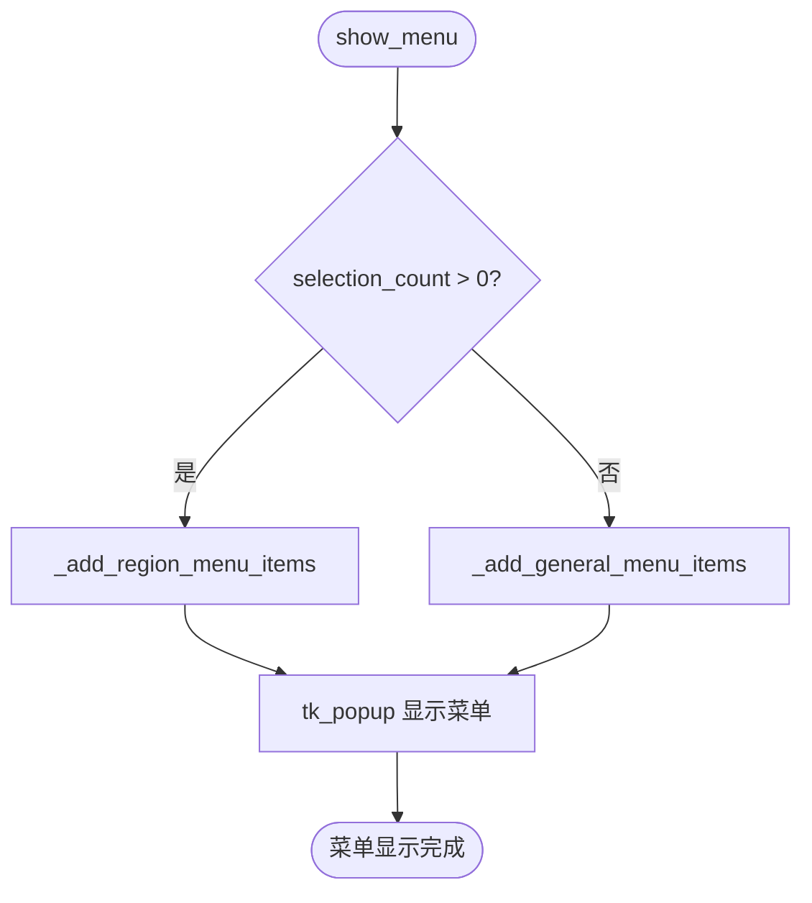
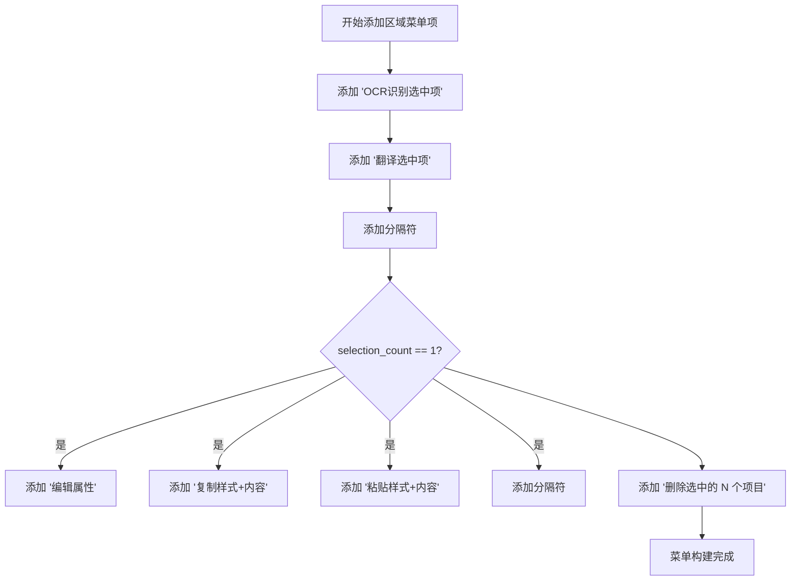
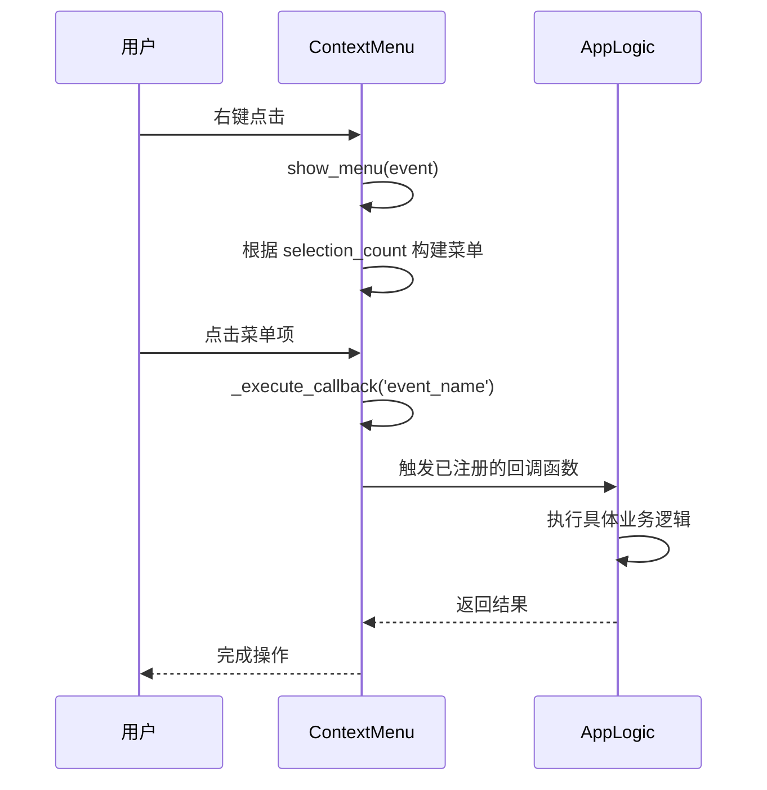
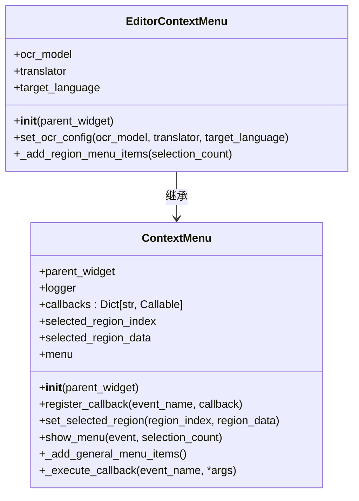
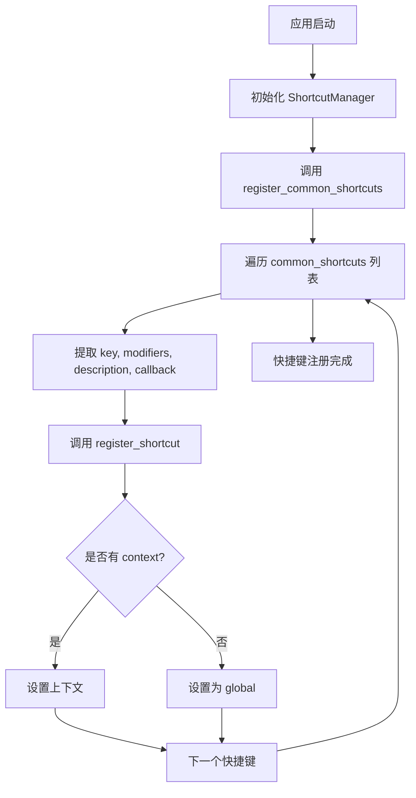
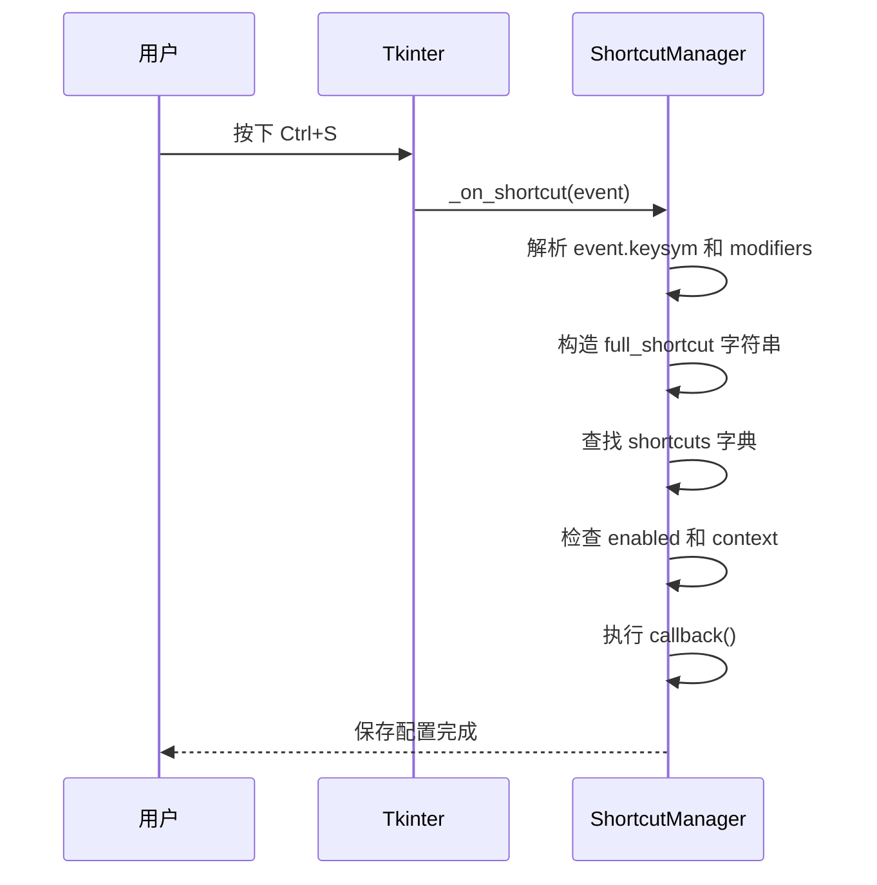
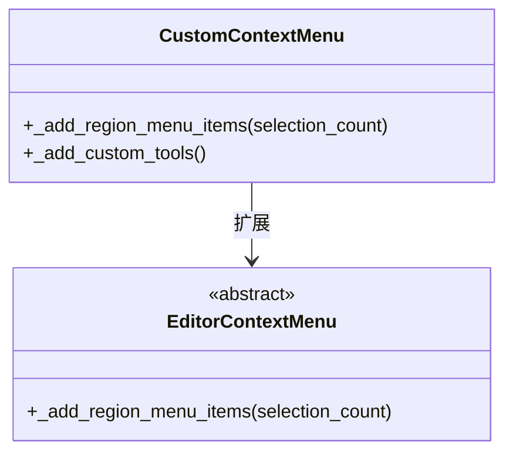

# 上下文菜单

<cite>
**本文档中引用的文件**  
- [context_menu.py](file://desktop-ui/components/context_menu.py)
- [app_logic.py](file://desktop-ui/app_logic.py)
- [shortcut_manager.py](file://desktop-ui/services/shortcut_manager.py)
</cite>

## 目录
1. [简介](#简介)
2. [核心组件](#核心组件)
3. [条件化菜单项生成逻辑](#条件化菜单项生成逻辑)
4. [菜单项启用/禁用策略](#菜单项启用/禁用策略)
5. [命令分发机制](#命令分发机制)
6. [菜单层级结构设计](#菜单层级结构设计)
7. [快捷键绑定集成](#快捷键绑定集成)
8. [可访问性支持](#可访问性支持)
9. [插件化扩展机制](#插件化扩展机制)
10. [实际案例](#实际案例)

## 简介
本文件详细解析 `context_menu.py` 中上下文菜单的实现机制，重点阐述如何根据当前选中图像、编辑模式或任务状态动态构建右键菜单。文档涵盖菜单项的条件化生成、启用/禁用策略、命令分发、快捷键集成以及可访问性支持等核心功能。

## 核心组件

`context_menu.py` 文件定义了两个核心类：`ContextMenu` 和 `EditorContextMenu`。前者是基础菜单类，后者继承前者并实现了编辑器专用的上下文菜单功能。菜单项的生成逻辑、回调注册和显示控制均在此模块中实现。

**Section sources**
- [context_menu.py](file://desktop-ui/components/context_menu.py#L1-L87)

## 条件化菜单项生成逻辑

上下文菜单的生成逻辑由 `show_menu` 方法驱动，该方法根据传入的 `selection_count` 参数决定显示通用菜单项还是区域相关的菜单项。

当存在选中区域时，调用 `_add_region_menu_items` 方法；否则调用 `_add_general_menu_items` 方法。`EditorContextMenu` 类重写了 `_add_region_menu_items` 方法，以提供针对文本区域的特定操作。

**Diagram sources**
- [context_menu.py](file://desktop-ui/components/context_menu.py#L40-L57)

**Section sources**
- [context_menu.py](file://desktop-ui/components/context_menu.py#L40-L57)

## 菜单项启用/禁用策略

菜单项的可见性和可用性通过条件判断动态控制。例如，在 `EditorContextMenu._add_region_menu_items` 中，复制、粘贴和编辑属性等操作仅在单选时可用。

此策略确保了用户界面的直观性和操作的安全性，避免了在多选状态下执行仅适用于单个对象的操作。

**Diagram sources**
- [context_menu.py](file://desktop-ui/components/context_menu.py#L68-L87)

**Section sources**
- [context_menu.py](file://desktop-ui/components/context_menu.py#L68-L87)

## 命令分发机制

上下文菜单通过回调机制将用户操作分发至 `AppLogic` 中的处理函数。`ContextMenu` 类通过 `register_callback` 方法注册事件回调，并在 `_execute_callback` 中执行。

`AppLogic` 类通过 `register_ui_callback` 接收来自UI层的回调注册，并在 `notify_ui` 中触发相应的UI更新。

**Diagram sources**
- [context_menu.py](file://desktop-ui/components/context_menu.py#L25-L38)
- [app_logic.py](file://desktop-ui/app_logic.py#L33-L38)

**Section sources**
- [context_menu.py](file://desktop-ui/components/context_menu.py#L25-L38)
- [app_logic.py](file://desktop-ui/app_logic.py#L33-L38)

## 菜单层级结构设计

上下文菜单采用继承式设计，`EditorContextMenu` 继承自 `ContextMenu`，实现了功能的扩展和复用。

这种设计模式使得基础菜单功能与特定场景功能分离，提高了代码的可维护性和可扩展性。

**Diagram sources**
- [context_menu.py](file://desktop-ui/components/context_menu.py#L9-L87)

**Section sources**
- [context_menu.py](file://desktop-ui/components/context_menu.py#L9-L87)

## 快捷键绑定集成

上下文菜单与 `ShortcutManager` 集成，通过 `register_common_shortcuts` 方法注册常用快捷键。快捷键管理器支持上下文感知，确保在不同界面状态下快捷键行为正确。

快捷键的上下文（context）机制允许在编辑器、主视图等不同模式下启用不同的快捷键集。

**Diagram sources**
- [shortcut_manager.py](file://desktop-ui/services/shortcut_manager.py#L334-L389)

**Section sources**
- [shortcut_manager.py](file://desktop-ui/services/shortcut_manager.py#L334-L389)

## 可访问性支持

系统通过键盘事件监听和快捷键支持实现了良好的键盘导航能力。`ShortcutManager` 通过 `bind_all` 监听全局键盘事件，并根据当前上下文决定是否执行快捷键操作。

这种设计确保了即使不使用鼠标，用户也能高效地完成所有核心操作。

**Diagram sources**
- [shortcut_manager.py](file://desktop-ui/services/shortcut_manager.py#L235-L287)

**Section sources**
- [shortcut_manager.py](file://desktop-ui/services/shortcut_manager.py#L235-L287)

## 插件化扩展机制

虽然当前代码未直接实现插件系统，但其设计为扩展自定义菜单项提供了良好基础。通过继承 `EditorContextMenu` 并重写 `_add_region_menu_items` 方法，可以轻松添加新的菜单项。

开发者可以创建自定义上下文菜单类，注册新的回调事件，并将其集成到主应用中，从而实现功能插件化。

**Diagram sources**
- [context_menu.py](file://desktop-ui/components/context_menu.py#L59-L87)

**Section sources**
- [context_menu.py](file://desktop-ui/components/context_menu.py#L59-L87)

## 实际案例

假设需要添加一个“批量导出选区”功能，可通过以下步骤实现：

1. 在 `AppLogic` 中添加 `export_selected_regions` 方法
2. 在 `EditorContextMenu` 子类中重写 `_add_region_menu_items`，添加新菜单项
3. 通过 `register_callback` 将菜单项与 `AppLogic` 中的方法关联

此模式确保了UI与业务逻辑的分离，同时保持了系统的可扩展性。

**Section sources**
- [app_logic.py](file://desktop-ui/app_logic.py#L29-L316)
- [context_menu.py](file://desktop-ui/components/context_menu.py#L59-L87)