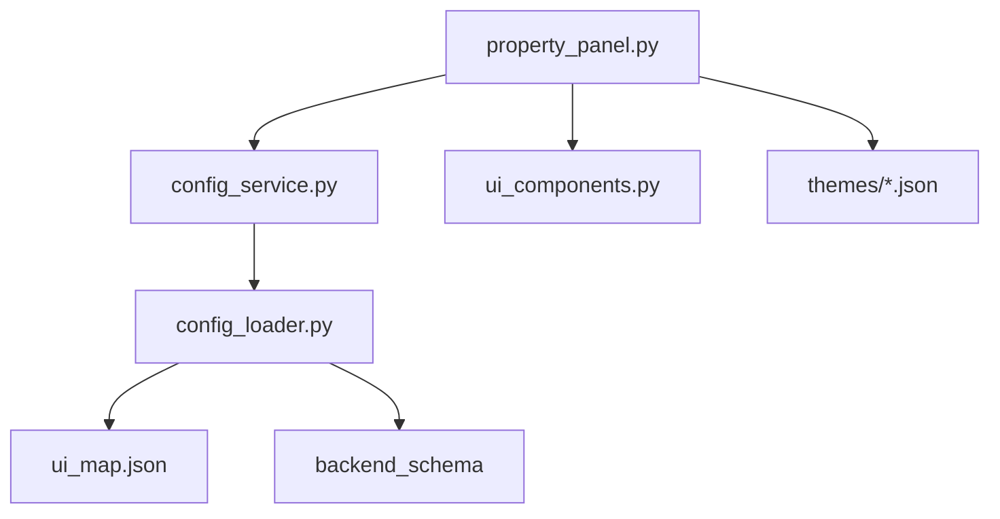
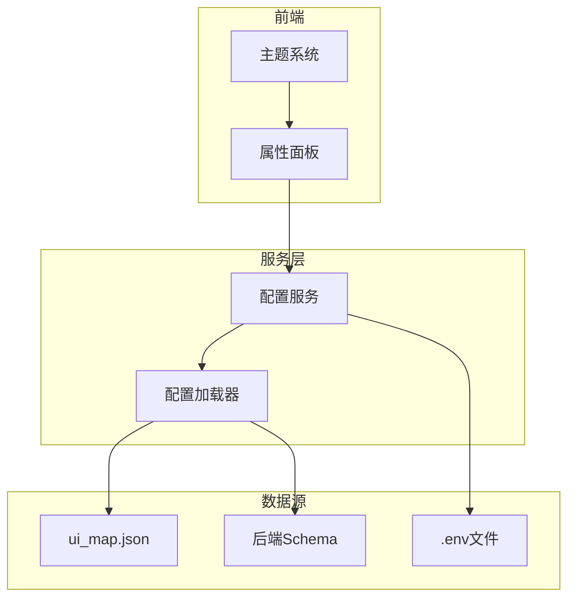
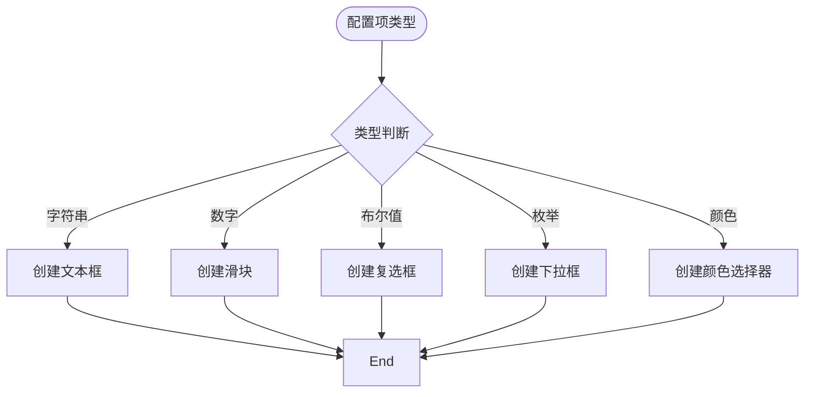
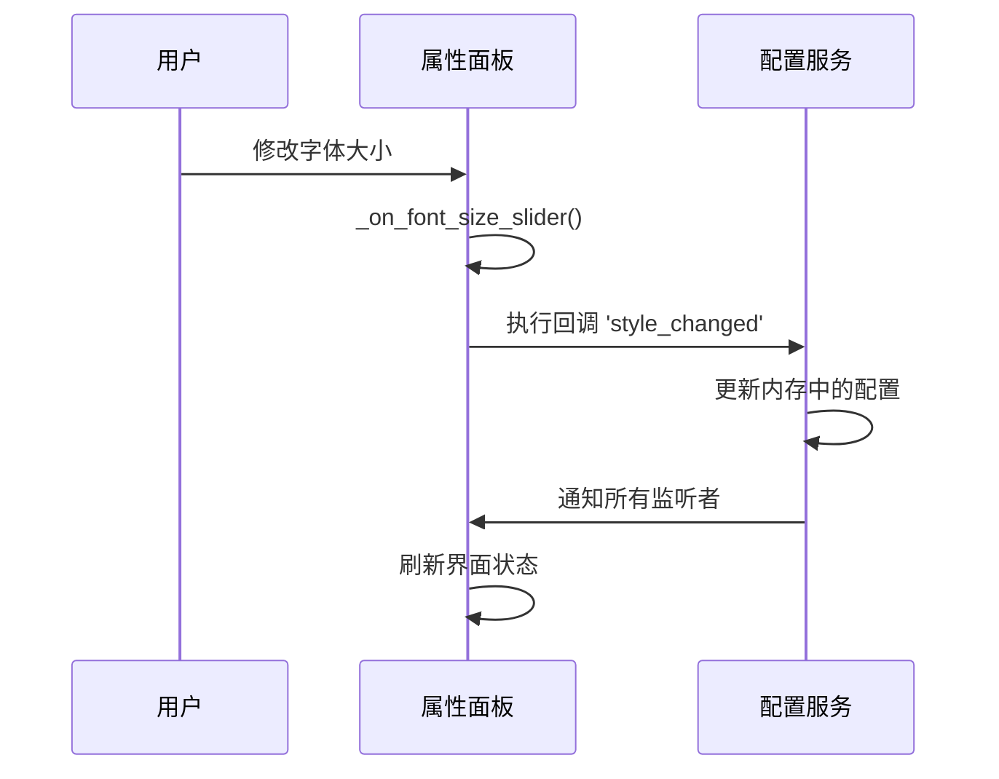
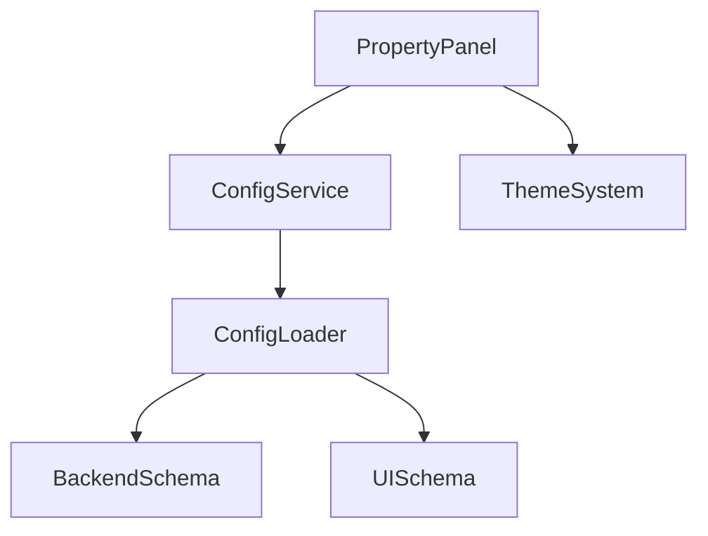

# 属性面板

<cite>
**本文档中引用的文件**  
- [property_panel.py](file://desktop-ui/components/property_panel.py)
- [config_service.py](file://desktop-ui/services/config_service.py)
- [config_loader.py](file://MangaStudio_Data/app/core/config_loader.py)
- [default_dark.json](file://MangaStudio_Data/themes/default_dark.json)
</cite>

## 目录
1. [简介](#简介)
2. [项目结构](#项目结构)
3. [核心组件](#核心组件)
4. [架构概述](#架构概述)
5. [详细组件分析](#详细组件分析)
6. [依赖分析](#依赖分析)
7. [性能考虑](#性能考虑)
8. [故障排除指南](#故障排除指南)
9. [结论](#结论)

## 简介
本技术文档详细说明了`property_panel.py`模块如何基于反射机制动态生成用户界面控件，并与`ConfigService`中的配置项进行绑定。文档描述了该模块如何监听配置变更事件并实时更新界面状态，支持多种输入类型（如下拉框、复选框、文本框、滑块）的自动映射。结合实例，展示了如何将JSON Schema格式的配置模型转换为可视化控件布局，并处理嵌套配置（如OCR参数组、翻译器选项）。此外，还解释了其响应式设计在不同分辨率下的适配行为，以及如何通过主题系统（`themes/*.json`）实现样式一致性。

## 项目结构
`property_panel.py`位于`desktop-ui/components/`目录下，是桌面UI的核心组件之一，负责提供文本区域的详细编辑功能。它依赖于`config_service.py`进行配置管理，并通过`ui_map.json`和JSON Schema定义的结构动态生成UI。主题文件（如`default_dark.json`）存储在`MangaStudio_Data/themes/`目录中，用于统一视觉风格。



**图示来源**  
- [property_panel.py](file://desktop-ui/components/property_panel.py)
- [config_service.py](file://desktop-ui/services/config_service.py)
- [config_loader.py](file://MangaStudio_Data/app/core/config_loader.py)

**本节来源**  
- [property_panel.py](file://desktop-ui/components/property_panel.py)
- [config_service.py](file://desktop-ui/services/config_service.py)

## 核心组件
`PropertyPanel`类继承自`CTkScrollableFrame`，是属性面板的主控件。它通过`_create_widgets`方法初始化各个功能区域，包括区域信息、文本内容、样式设置、蒙版编辑和操作按钮。面板通过`ConfigService`获取当前配置，并利用`config_loader.py`解析的`ui_map.json`和后端Schema来动态构建UI。

**本节来源**  
- [property_panel.py](file://desktop-ui/components/property_panel.py#L20-L35)
- [config_service.py](file://desktop-ui/services/config_service.py#L10-L25)

## 架构概述
系统采用分层架构，前端UI组件（`PropertyPanel`）通过服务层（`ConfigService`）与配置数据交互。`ConfigLoader`负责从后端获取JSON Schema并结合`ui_map.json`生成完整的UI配置数据。当配置变更时，`ConfigService`通过回调机制通知`PropertyPanel`更新界面。



**图示来源**  
- [property_panel.py](file://desktop-ui/components/property_panel.py)
- [config_service.py](file://desktop-ui/services/config_service.py)
- [config_loader.py](file://MangaStudio_Data/app/core/config_loader.py)

## 详细组件分析

### 属性面板分析
`PropertyPanel`通过反射机制动态生成UI控件。它首先从`ConfigService`获取当前配置，然后根据配置项的类型（字符串、数字、布尔值、枚举等）自动映射到相应的UI控件。

#### 控件类型自动映射


**图示来源**  
- [property_panel.py](file://desktop-ui/components/property_panel.py#L100-L200)

#### 配置变更监听与响应
`PropertyPanel`通过`register_callback`方法注册回调函数，监听来自`ConfigService`的配置变更事件。当用户在UI上修改配置时，`_execute_callback`会触发相应的事件，通知`ConfigService`更新配置，并实时反映在界面上。



**图示来源**  
- [property_panel.py](file://desktop-ui/components/property_panel.py#L300-L350)
- [config_service.py](file://desktop-ui/services/config_service.py#L100-L120)

### JSON Schema到UI的转换
`config_loader.py`负责将JSON Schema转换为UI可读的配置。它首先加载后端Schema和`ui_map.json`，然后解析所有属性，包括嵌套的复杂类型（如OCR配置、翻译器配置），并提取默认值和枚举选项。

```python
# config_loader.py 中的关键逻辑
def _build_full_config_data(self):
    # 1. 收集根级属性
    root_props = self.backend_schema.get("properties", {})
    all_properties.update(root_props)
    
    # 2. 收集嵌套属性
    for prop in root_props.values():
        ref_path = prop.get("allOf", [{}])[0].get('$ref')
        if ref_path:
            config_def = self._get_definition_from_ref(ref_path)
            if config_def and "properties" in config_def:
                all_properties.update(config_def["properties"])
    
    # 3. 构建最终数据结构
    for key, ui_info in self.ui_map.items():
        merged_info = ui_info.copy()
        merged_info['default'] = self.factory_defaults.get(key)
        # 添加枚举值
        if prop_def and "enum" in enum_def:
            merged_info['values'] = enum_def["enum"]
```

**本节来源**  
- [config_loader.py](file://MangaStudio_Data/app/core/config_loader.py#L90-L150)

### 嵌套配置处理
对于OCR参数组和翻译器选项等嵌套配置，系统通过`$ref`引用机制解析。例如，`ocr`配置项引用`#/definitions/OCRConfig`，`config_loader`会递归解析该定义下的所有属性，并将其扁平化到UI配置数据中，使得`PropertyPanel`可以像处理普通属性一样处理这些嵌套项。

**本节来源**  
- [config_loader.py](file://MangaStudio_Data/app/core/config_loader.py#L100-L110)

### 响应式设计与主题系统
`PropertyPanel`采用`customtkinter`框架，其布局使用`grid`系统，能够自适应不同分辨率。主题系统通过加载`themes/*.json`文件实现样式一致性。每个主题文件包含颜色、字体等样式定义，`PropertyPanel`在初始化时应用当前主题。

```json
// themes/default_dark.json 示例
{
  "name": "Default Dark",
  "author": "MangaStudio",
  "style": {
    "colors": {
      "background_main": "#242424",
      "background_frame": "#323232",
      "primary_button": "#3a7ebf",
      "text_main": "#dce4ee"
    }
  }
}
```

**本节来源**  
- [property_panel.py](file://desktop-ui/components/property_panel.py)
- [default_dark.json](file://MangaStudio_Data/themes/default_dark.json)

## 依赖分析
`PropertyPanel`高度依赖`ConfigService`和`ConfigLoader`提供的配置数据。`ConfigService`管理配置的加载、保存和变更通知，而`ConfigLoader`负责从后端获取Schema并生成UI配置。这种设计实现了UI与配置逻辑的解耦。



**图示来源**  
- [property_panel.py](file://desktop-ui/components/property_panel.py)
- [config_service.py](file://desktop-ui/services/config_service.py)
- [config_loader.py](file://MangaStudio_Data/app/core/config_loader.py)

**本节来源**  
- [property_panel.py](file://desktop-ui/components/property_panel.py)
- [config_service.py](file://desktop-ui/services/config_service.py)

## 性能考虑
- **缓存机制**：`ConfigLoader`将后端Schema缓存到本地文件，避免每次启动都调用Python后端获取，显著提升启动速度。
- **延迟加载**：`ConfigService`对翻译器配置等大型数据结构采用延迟加载，减少初始化开销。
- **事件驱动**：采用回调机制而非轮询，确保配置变更时UI能高效响应。

## 故障排除指南
- **UI未更新**：检查`ConfigService`的`callbacks`列表，确保`PropertyPanel`已正确注册回调。
- **控件未生成**：确认`ui_map.json`中对应键存在，且`config_loader`能正确解析Schema。
- **主题不生效**：检查主题文件路径是否正确，以及`customtkinter`是否成功加载主题。

**本节来源**  
- [property_panel.py](file://desktop-ui/components/property_panel.py#L500-L550)
- [config_service.py](file://desktop-ui/services/config_service.py#L200-L250)

## 结论
`property_panel.py`通过与`ConfigService`和`ConfigLoader`的紧密协作，实现了基于JSON Schema的动态UI生成和实时配置绑定。其设计充分利用了反射和事件驱动机制，支持复杂的嵌套配置和多种输入类型。结合主题系统，确保了跨平台的视觉一致性和良好的用户体验。该架构具有高内聚、低耦合的特点，便于维护和扩展。