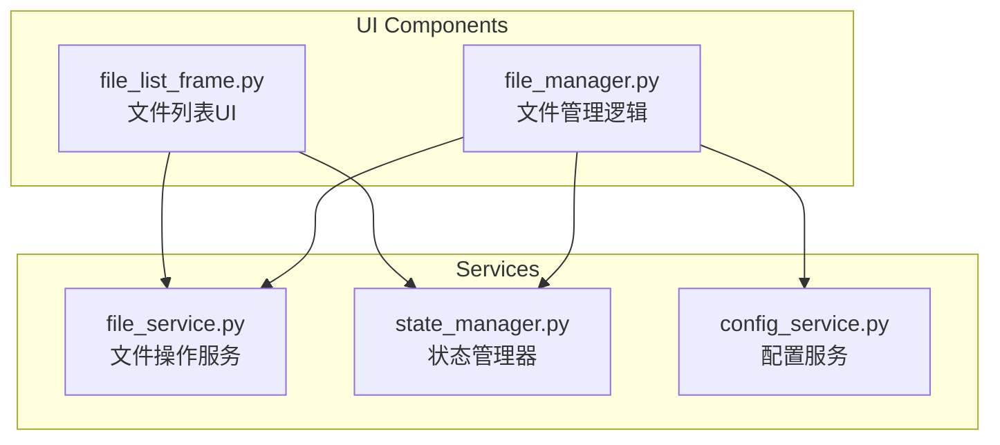
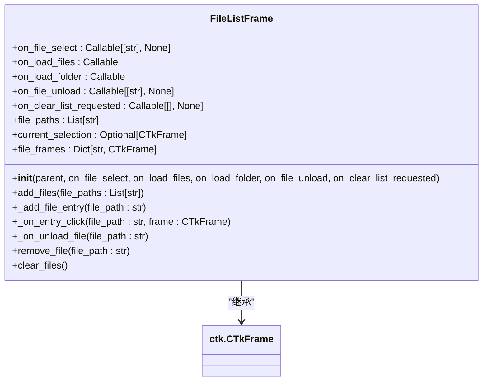
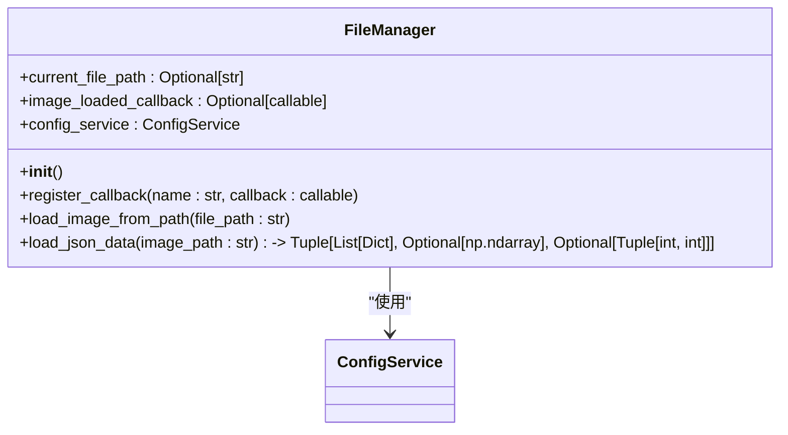
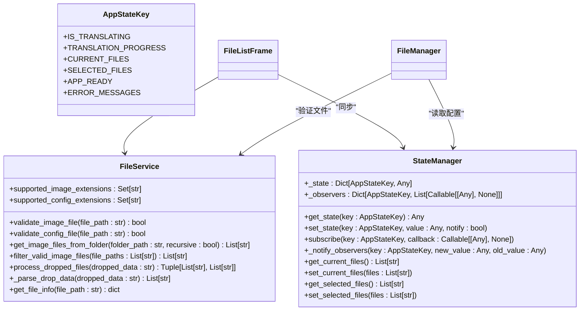
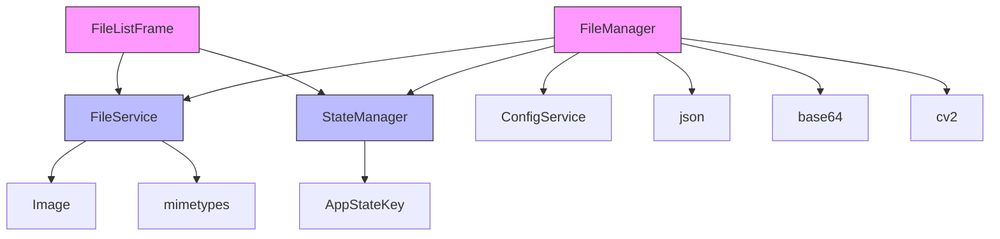

# 文件管理组件

<cite>
**本文档引用的文件**   
- [file_list_frame.py](file://desktop-ui/components/file_list_frame.py)
- [file_manager.py](file://desktop-ui/components/file_manager.py)
- [file_service.py](file://desktop-ui/services/file_service.py)
- [state_manager.py](file://desktop-ui/services/state_manager.py)
</cite>

## 目录
1. [项目结构](#项目结构)
2. [核心组件](#核心组件)
3. [文件列表框架分析](#文件列表框架分析)
4. [文件管理器分析](#文件管理器分析)
5. [文件服务与状态管理](#文件服务与状态管理)
6. [依赖关系分析](#依赖关系分析)

## 项目结构
本项目为一个漫画图像翻译工具的桌面UI组件集合，主要包含核心功能模块、用户界面组件、服务层和工具类。其中，`desktop-ui/components/`目录下包含了文件管理相关的UI组件，如`file_list_frame.py`和`file_manager.py`；`desktop-ui/services/`目录则提供了文件操作、状态管理等底层服务。

**图示来源**
- [file_list_frame.py](file://desktop-ui/components/file_list_frame.py)
- [file_manager.py](file://desktop-ui/components/file_manager.py)
- [file_service.py](file://desktop-ui/services/file_service.py)
- [state_manager.py](file://desktop-ui/services/state_manager.py)

**本节来源**
- [file_list_frame.py](file://desktop-ui/components/file_list_frame.py)
- [file_manager.py](file://desktop-ui/components/file_manager.py)

## 核心组件
系统的核心文件管理功能由两个主要类构成：`FileListFrame`负责用户界面展示与交互，`FileManager`负责实际的文件加载与数据读取。两者通过回调函数和全局状态管理器进行通信，实现了UI与业务逻辑的分离。

**本节来源**
- [file_list_frame.py](file://desktop-ui/components/file_list_frame.py#L1-L115)
- [file_manager.py](file://desktop-ui/components/file_manager.py#L1-L121)

## 文件列表框架分析
`FileListFrame`类实现了可滚动的文件列表界面，支持添加单个文件或整个文件夹，并允许用户选择和移除文件。

### 功能特性
- **文件添加**：通过“添加图片”和“添加文件夹”按钮触发外部回调函数
- **缩略图显示**：使用PIL库生成40x40像素的缩略图
- **条目选择**：点击文件条目时高亮显示并通知父组件
- **文件移除**：每个条目右侧有“✕”按钮用于移除文件
- **列表清空**：提供“清空列表”按钮批量移除所有文件

**图示来源**
- [file_list_frame.py](file://desktop-ui/components/file_list_frame.py#L1-L115)

**本节来源**
- [file_list_frame.py](file://desktop-ui/components/file_list_frame.py#L1-L115)

## 文件管理器分析
`FileManager`类负责处理图像文件和关联JSON数据的加载，是连接UI与数据存储的关键组件。

### 主要功能
- **图像加载**：安全地打开图像文件并触发回调
- **JSON数据读取**：加载与图像同名的`_translations.json`文件
- **配置回退**：当JSON中缺少目标语言时，使用全局配置作为默认值
- **蒙版解码**：支持Base64编码和旧版数组格式的蒙版数据

**图示来源**
- [file_manager.py](file://desktop-ui/components/file_manager.py#L1-L121)

**本节来源**
- [file_manager.py](file://desktop-ui/components/file_manager.py#L1-L121)

## 文件服务与状态管理
文件操作和应用状态由专门的服务类统一管理，确保了系统的可维护性和扩展性。

### 文件服务（FileService）
提供文件验证、批量处理、拖拽支持等基础功能：
- 验证图片和配置文件的有效性
- 从文件夹递归获取所有支持的图片文件
- 处理拖拽操作中的文件路径解析
- 支持多种图片格式（PNG, JPG, WEBP等）

### 状态管理器（StateManager）
实现响应式状态管理，支持状态订阅机制：
- 使用枚举`AppStateKey`定义所有状态键
- 提供线程安全的状态读写操作
- 支持状态变化的观察者模式
- 维护当前文件列表、选中文件、翻译进度等关键状态

**图示来源**
- [file_service.py](file://desktop-ui/services/file_service.py#L1-L274)
- [state_manager.py](file://desktop-ui/services/state_manager.py#L1-L251)

**本节来源**
- [file_service.py](file://desktop-ui/services/file_service.py#L1-L274)
- [state_manager.py](file://desktop-ui/services/state_manager.py#L1-L251)

## 依赖关系分析
系统各组件之间通过清晰的接口进行交互，形成了松耦合的架构。

**图示来源**
- [file_list_frame.py](file://desktop-ui/components/file_list_frame.py)
- [file_manager.py](file://desktop-ui/components/file_manager.py)
- [file_service.py](file://desktop-ui/services/file_service.py)
- [state_manager.py](file://desktop-ui/services/state_manager.py)

**本节来源**
- [file_list_frame.py](file://desktop-ui/components/file_list_frame.py)
- [file_manager.py](file://desktop-ui/components/file_manager.py)
- [file_service.py](file://desktop-ui/services/file_service.py)
- [state_manager.py](file://desktop-ui/services/state_manager.py)