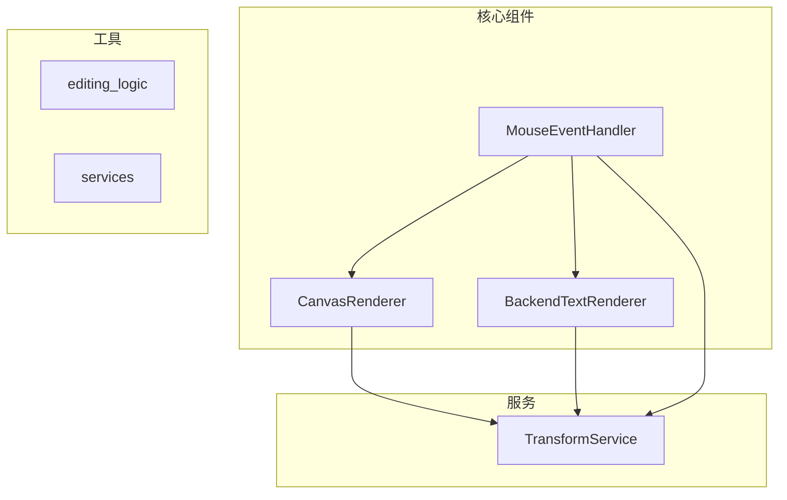
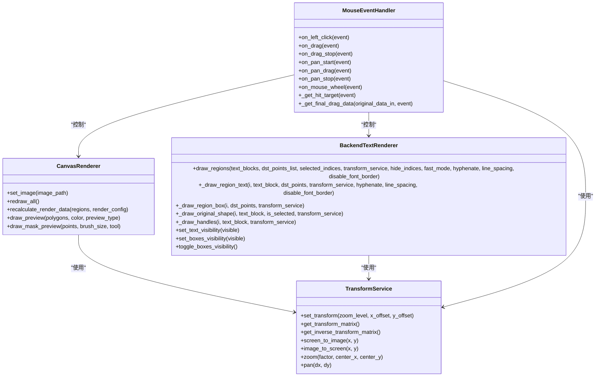
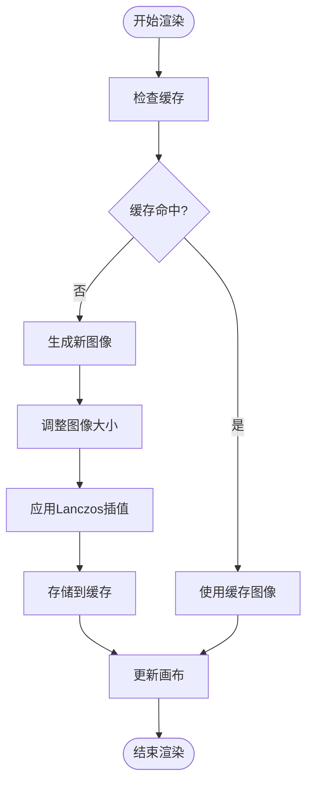
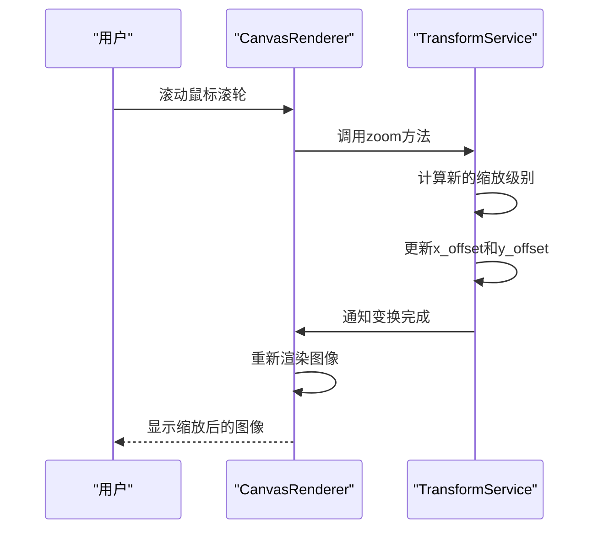
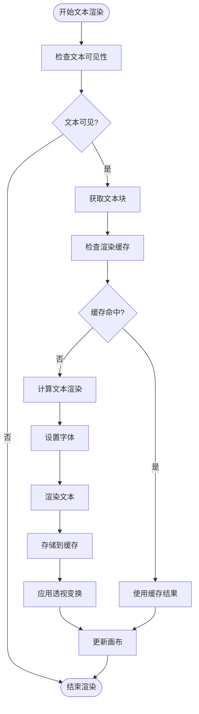
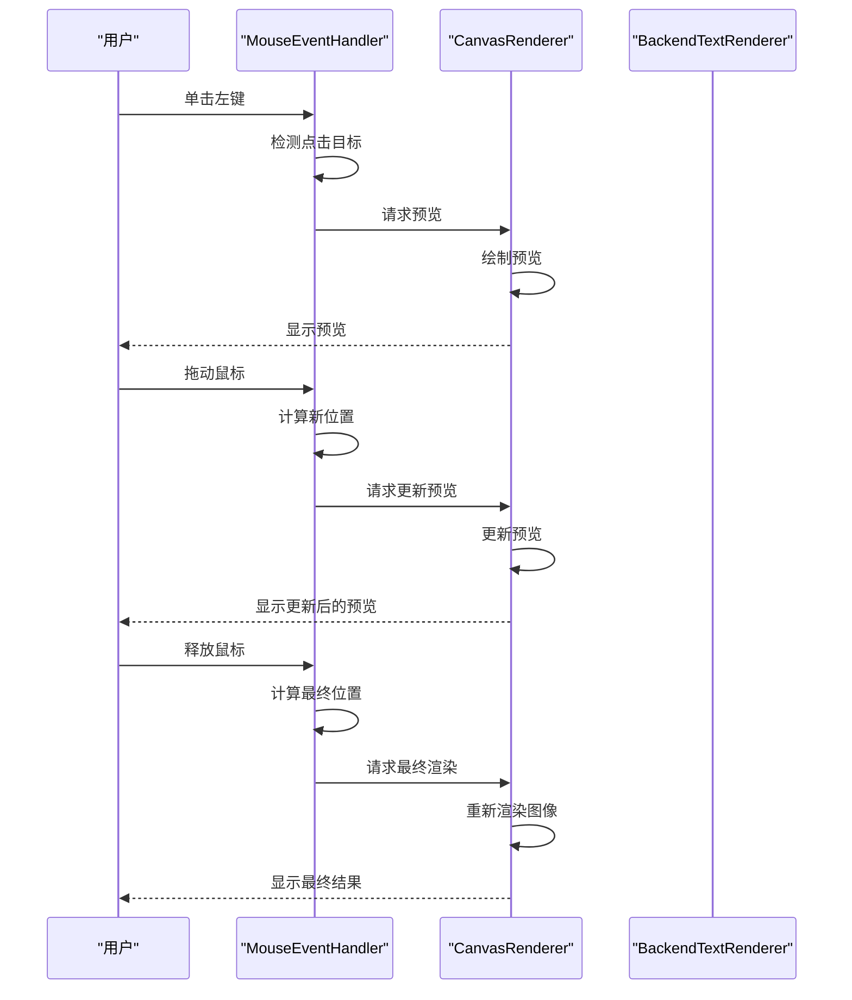
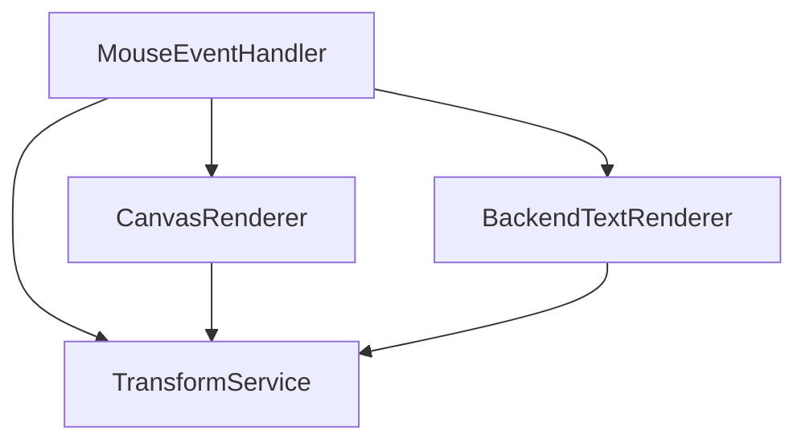

# 画布渲染器

<cite>
**本文档引用的文件**
- [canvas_renderer_new.py](file://desktop-ui/components/canvas_renderer_new.py)
- [text_renderer_backend.py](file://desktop-ui/components/text_renderer_backend.py)
- [mouse_event_handler_new.py](file://desktop-ui/components/mouse_event_handler_new.py)
- [transform_service.py](file://desktop-ui/services/transform_service.py)
</cite>

## 目录
1. [简介](#简介)
2. [项目结构](#项目结构)
3. [核心组件](#核心组件)
4. [架构概述](#架构概述)
5. [详细组件分析](#详细组件分析)
6. [依赖分析](#依赖分析)
7. [性能考虑](#性能考虑)
8. [故障排除指南](#故障排除指南)
9. [结论](#结论)

## 简介
本文档系统性地阐述了`canvas_renderer_new.py`中的图像渲染架构，重点说明了双缓冲绘制机制如何避免闪烁问题，以及基于`QTransform`的缩放和平移适配逻辑。文档还解释了如何集成`text_renderer_backend.py`进行翻译文本的预览渲染，并处理字体、颜色、边框等样式属性的动态应用。此外，文档涵盖了高DPI屏幕支持、图像缩放平滑算法（如Lanczos插值）和内存优化策略（如图像缓存池）。最后，结合代码示例展示了鼠标交互（通过`mouse_event_handler_new.py`）与渲染层的协同工作流程。

## 项目结构
该项目采用模块化设计，主要分为核心组件、服务和工具模块。核心组件包括画布渲染器、鼠标事件处理器和文本渲染后端，这些组件协同工作以实现高效的图像和文本渲染。服务模块提供了变换服务，用于处理缩放和平移操作。工具模块则包含了各种辅助功能，如字体监控和错误处理。

**图源**
- [canvas_renderer_new.py](file://desktop-ui/components/canvas_renderer_new.py)
- [text_renderer_backend.py](file://desktop-ui/components/text_renderer_backend.py)
- [mouse_event_handler_new.py](file://desktop-ui/components/mouse_event_handler_new.py)
- [transform_service.py](file://desktop-ui/services/transform_service.py)

## 核心组件
本节深入分析了画布渲染器、文本渲染后端和鼠标事件处理器的核心功能和实现细节。

**节源**
- [canvas_renderer_new.py](file://desktop-ui/components/canvas_renderer_new.py#L1-L353)
- [text_renderer_backend.py](file://desktop-ui/components/text_renderer_backend.py#L1-L508)
- [mouse_event_handler_new.py](file://desktop-ui/components/mouse_event_handler_new.py#L1-L984)

## 架构概述
系统架构围绕`CanvasRenderer`类展开，该类负责管理图像和文本的渲染。`TransformService`类提供了缩放和平移的变换逻辑，确保用户可以流畅地浏览和编辑图像。`BackendTextRenderer`类则专注于文本的渲染，支持多种字体、颜色和布局选项。`MouseEventHandler`类处理所有鼠标交互，包括选择、移动、旋转和缩放操作。

**图源**
- [canvas_renderer_new.py](file://desktop-ui/components/canvas_renderer_new.py#L1-L353)
- [text_renderer_backend.py](file://desktop-ui/components/text_renderer_backend.py#L1-L508)
- [mouse_event_handler_new.py](file://desktop-ui/components/mouse_event_handler_new.py#L1-L984)
- [transform_service.py](file://desktop-ui/services/transform_service.py#L1-L74)

## 详细组件分析
### 画布渲染器分析
`CanvasRenderer`类是整个系统的核心，负责管理图像和文本的渲染。它通过双缓冲机制避免了渲染过程中的闪烁问题。当图像或文本发生变化时，`CanvasRenderer`会先在内存中生成新的图像，然后一次性更新到屏幕上，从而确保用户界面的流畅性。

#### 双缓冲绘制机制

**图源**
- [canvas_renderer_new.py](file://desktop-ui/components/canvas_renderer_new.py#L1-L353)

#### 缩放和平移适配逻辑

**图源**
- [canvas_renderer_new.py](file://desktop-ui/components/canvas_renderer_new.py#L1-L353)
- [transform_service.py](file://desktop-ui/services/transform_service.py#L1-L74)

### 文本渲染后端分析
`BackendTextRenderer`类负责处理翻译文本的预览渲染。它支持多种字体、颜色和布局选项，并能够动态应用这些样式属性。

#### 文本渲染流程

**图源**
- [text_renderer_backend.py](file://desktop-ui/components/text_renderer_backend.py#L1-L508)

### 鼠标事件处理器分析
`MouseEventHandler`类处理所有鼠标交互，包括选择、移动、旋转和缩放操作。它通过精确的坐标转换和事件处理，确保用户可以流畅地编辑图像和文本。

#### 鼠标交互流程

**图源**
- [mouse_event_handler_new.py](file://desktop-ui/components/mouse_event_handler_new.py#L1-L984)
- [canvas_renderer_new.py](file://desktop-ui/components/canvas_renderer_new.py#L1-L353)
- [text_renderer_backend.py](file://desktop-ui/components/text_renderer_backend.py#L1-L508)

## 依赖分析
系统中的各个组件通过明确的接口进行通信，确保了模块间的低耦合和高内聚。`CanvasRenderer`和`BackendTextRenderer`都依赖于`TransformService`来处理缩放和平移操作。`MouseEventHandler`则通过回调函数与`CanvasRenderer`和`BackendTextRenderer`进行交互，实现了高效的事件处理。

**图源**
- [canvas_renderer_new.py](file://desktop-ui/components/canvas_renderer_new.py#L1-L353)
- [text_renderer_backend.py](file://desktop-ui/components/text_renderer_backend.py#L1-L508)
- [mouse_event_handler_new.py](file://desktop-ui/components/mouse_event_handler_new.py#L1-L984)
- [transform_service.py](file://desktop-ui/services/transform_service.py#L1-L74)

## 性能考虑
为了确保系统的高性能，采用了多种优化策略。首先，通过图像缓存池减少了重复的图像处理操作。其次，使用Lanczos插值算法确保了图像缩放的高质量。最后，通过防抖机制避免了频繁的重绘操作，提高了用户体验。

## 故障排除指南
如果遇到渲染问题，可以检查以下几点：
- 确保`TransformService`的缩放和平移参数正确。
- 检查`CanvasRenderer`的缓存是否正常工作。
- 确认`BackendTextRenderer`的字体和颜色设置是否正确。
- 验证`MouseEventHandler`的事件处理逻辑是否正确。

**节源**
- [canvas_renderer_new.py](file://desktop-ui/components/canvas_renderer_new.py#L1-L353)
- [text_renderer_backend.py](file://desktop-ui/components/text_renderer_backend.py#L1-L508)
- [mouse_event_handler_new.py](file://desktop-ui/components/mouse_event_handler_new.py#L1-L984)

## 结论
本文档详细阐述了`canvas_renderer_new.py`中的图像渲染架构，重点说明了双缓冲绘制机制、基于`QTransform`的缩放和平移适配逻辑、文本渲染后端的集成以及鼠标交互的协同工作流程。通过这些设计，系统能够高效地处理复杂的图像和文本渲染任务，为用户提供流畅的编辑体验。