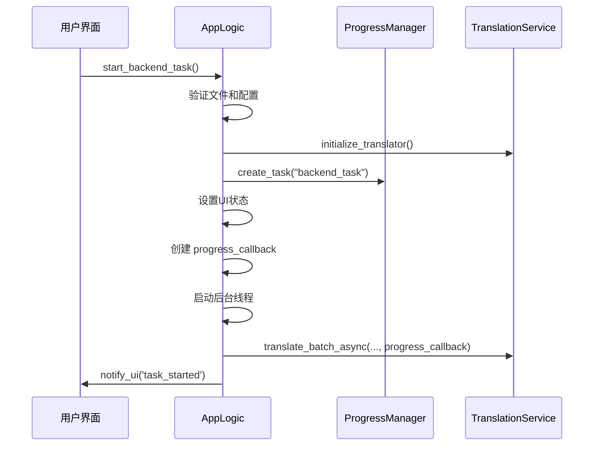
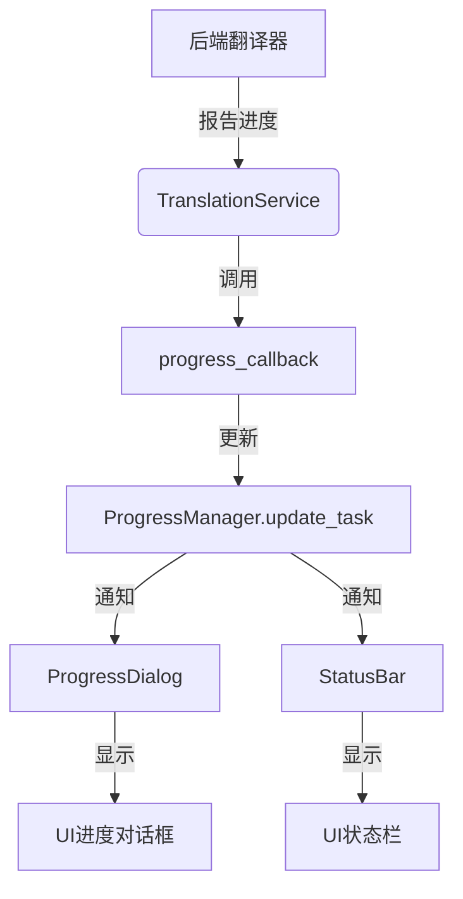
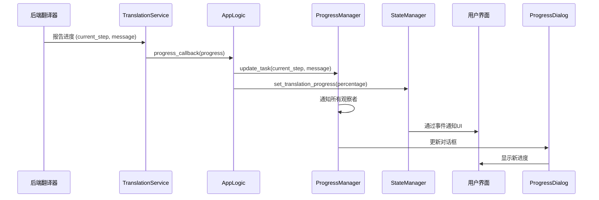
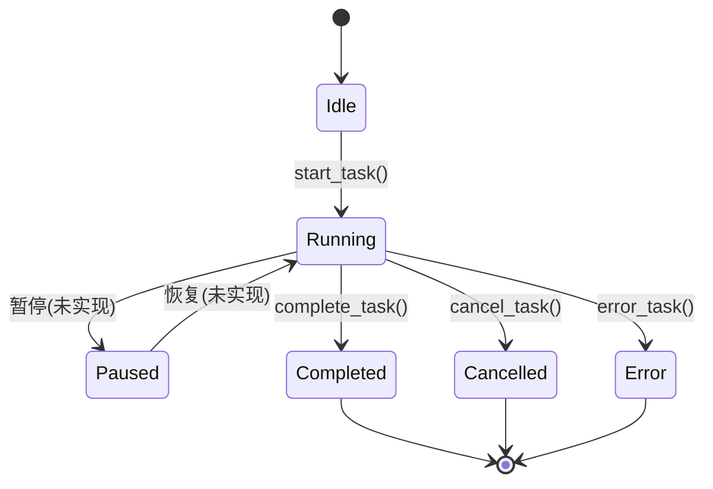

# 工作流控制

<cite>
**本文档中引用的文件**   
- [workflow_service.py](file://desktop-ui/services/workflow_service.py)
- [progress_manager.py](file://desktop-ui/services/progress_manager.py)
- [translation_service.py](file://desktop-ui/services/translation_service.py)
- [app_logic.py](file://desktop-ui/app_logic.py)
</cite>

## 目录
1. [引言](#引言)
2. [核心工作流协调](#核心工作流协调)
3. [进度跟踪与管理](#进度跟踪与管理)
4. [阶段依赖与条件跳过](#阶段依赖与条件跳过)
5. [后端回调与UI事件转换](#后端回调与ui事件转换)
6. [任务控制：暂停、恢复与取消](#任务控制暂停恢复与取消)
7. [状态机图](#状态机图)

## 引言
`WorkflowService` 是 `manga-translator-ui-package` 应用的核心协调器，负责管理从图像加载到最终渲染的整个翻译流水线。它通过将复杂的流程分解为可管理的阶段，并利用 `ProgressManager` 进行精确的进度跟踪，实现了对翻译任务的高效控制。该服务还与 `TranslationService` 紧密协作，处理用户交互（如暂停、取消），并将后端的低级回调转换为UI可理解的高级事件。

## 核心工作流协调
`WorkflowService` 本身并未直接实现工作流的执行，而是通过 `AppLogic` 类作为中介，协调整个翻译流水线的执行。`AppLogic` 类是应用的业务逻辑控制器，它负责整合配置、文件、状态和进度管理等服务。

当用户启动翻译任务时，`AppLogic.start_backend_task` 方法被调用。该方法首先验证文件列表和配置，然后通过 `TranslationService` 初始化后端翻译器。最关键的是，它创建了一个全局的进度任务，并启动一个后台线程来异步执行实际的翻译工作。



**Diagram sources**
- [app_logic.py](file://desktop-ui/app_logic.py#L163-L211)

**Section sources**
- [app_logic.py](file://desktop-ui/app_logic.py#L163-L211)

## 进度跟踪与管理
`ProgressManager` 是整个系统进度跟踪的核心。它提供了一个线程安全的接口来创建、更新和监控任务进度。

`WorkflowService` 通过 `AppLogic` 间接使用 `ProgressManager`。当 `AppLogic` 启动后台任务时，它会创建一个 `progress_callback` 函数。这个回调函数是连接后端翻译器和前端UI的桥梁。每当后端翻译器报告进度时，`TranslationService` 就会调用这个回调函数。

`ProgressManager` 的 `update_task` 方法负责更新任务的当前进度、消息和百分比。它会通知所有订阅了该任务的观察者（例如，UI上的进度条和状态标签），从而实现UI的实时更新。



**Diagram sources**
- [progress_manager.py](file://desktop-ui/services/progress_manager.py#L223-L254)
- [app_logic.py](file://desktop-ui/app_logic.py#L198-L200)

**Section sources**
- [progress_manager.py](file://desktop-ui/services/progress_manager.py#L223-L254)
- [app_logic.py](file://desktop-ui/app_logic.py#L198-L200)

## 阶段依赖与条件跳过
虽然 `WorkflowService` 模块本身主要处理JSON和模板相关的预处理/后处理任务（如 `restore_translation_to_text` 和 `export_with_custom_template`），但整个翻译流水线的阶段依赖和条件跳过逻辑主要在后端 `manga_translator` 模块中实现。

`AppLogic` 通过 `config_service` 获取用户的配置，这些配置决定了工作流的行为。例如，如果用户在配置中禁用了OCR，后端的 `manga_translator` 在执行时会跳过OCR阶段。`AppLogic._build_backend_args` 方法负责将UI的配置（如 `load_text`）转换为后端可以理解的命令行参数，从而实现对流水线的条件控制。

`ProgressManager` 的 `total` 参数通常代表了流水线中所有关键阶段的总数。`update_task` 方法的 `current` 参数则指示当前已完成的阶段数。通过这种方式，即使某些阶段被跳过，进度条也能准确反映整体完成情况。

**Section sources**
- [workflow_service.py](file://desktop-ui/services/workflow_service.py#L0-L910)
- [app_logic.py](file://desktop-ui/app_logic.py#L148-L161)

## 后端回调与UI事件转换
`WorkflowService` 实现了将后端回调转换为UI事件的关键机制。这主要通过 `AppLogic` 中定义的 `progress_callback` 函数来完成。

当 `TranslationService` 执行翻译任务时，它会接收一个 `progress_callback`。在 `AppLogic._run_backend_task_async` 方法中，这个回调被定义为一个闭包，它同时调用 `ProgressManager.update_task` 来更新全局进度，并调用 `StateManager.set_translation_progress` 来更新应用的内部状态。`StateManager` 的状态变化最终会通过 `notify_ui` 机制触发UI的更新。

这种设计模式将后端的低级进度信息（如当前步骤、消息）解耦并转换为UI层的高级事件（如“更新进度条”、“显示状态消息”），确保了UI的响应性和一致性。



**Diagram sources**
- [app_logic.py](file://desktop-ui/app_logic.py#L198-L200)
- [app_logic.py](file://desktop-ui/app_logic.py#L274-L288)

**Section sources**
- [app_logic.py](file://desktop-ui/app_logic.py#L198-L200)
- [app_logic.py](file://desktop-ui/app_logic.py#L274-L288)

## 任务控制：暂停、恢复与取消
`WorkflowService` 支持对翻译任务的取消操作。`AppLogic.stop_task` 方法提供了取消任务的入口。当用户点击“停止”按钮时，UI会调用此方法。

该方法首先调用 `TranslationService.stop_translation()` 来尝试停止后端的翻译过程。然后，它会更新 `StateManager` 的状态，将应用设置为非翻译状态，并通过 `ProgressManager.cancel_task` 方法将当前任务标记为“已取消”。这会触发 `ProgressDialog` 的关闭，并向所有观察者广播取消状态。

需要注意的是，根据代码分析，当前实现主要支持“取消”操作。暂停和恢复功能可能需要更复杂的后端支持（如保存和恢复翻译上下文），在现有代码中并未直接体现。

```mermaid
flowchart TD
A[用户点击停止] --> B(UI)
B --> C[AppLogic.stop_task]
C --> D[TranslationService.stop_translation]
C --> E[StateManager.set_translating(False)]
C --> F[ProgressManager.cancel_task]
D --> G[后端终止处理]
E --> H[UI更新状态]
F --> I[关闭进度对话框]
F --> J[通知所有观察者]
```

**Diagram sources**
- [app_logic.py](file://desktop-ui/app_logic.py#L290-L303)

**Section sources**
- [app_logic.py](file://desktop-ui/app_logic.py#L290-L303)

## 状态机图
下图描述了 `ProgressManager` 中一个任务的完整生命周期状态转换。



**Diagram sources**
- [progress_manager.py](file://desktop-ui/services/progress_manager.py#L190-L254)
- [progress_manager.py](file://desktop-ui/services/progress_manager.py#L253-L284)
- [progress_manager.py](file://desktop-ui/services/progress_manager.py#L281-L317)