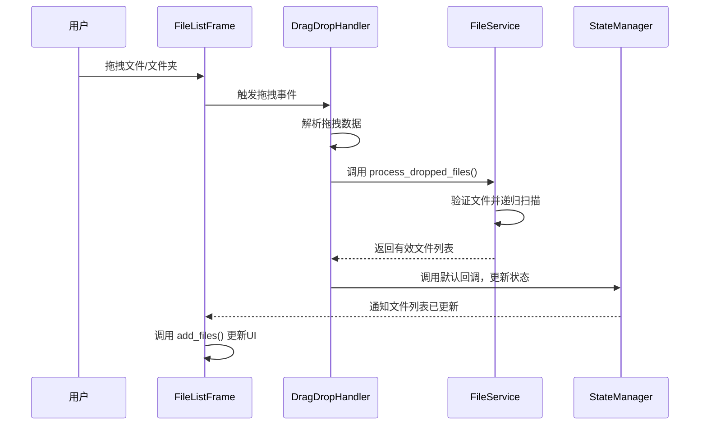
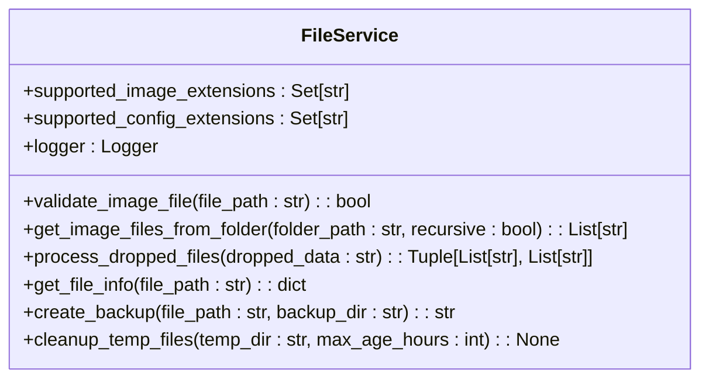
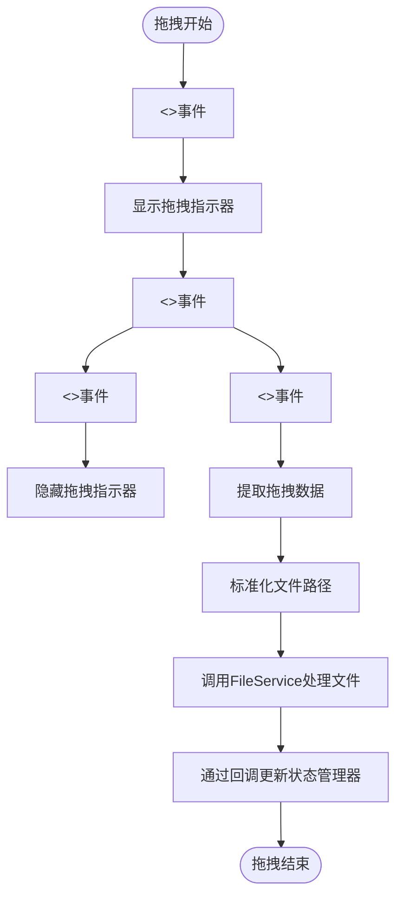
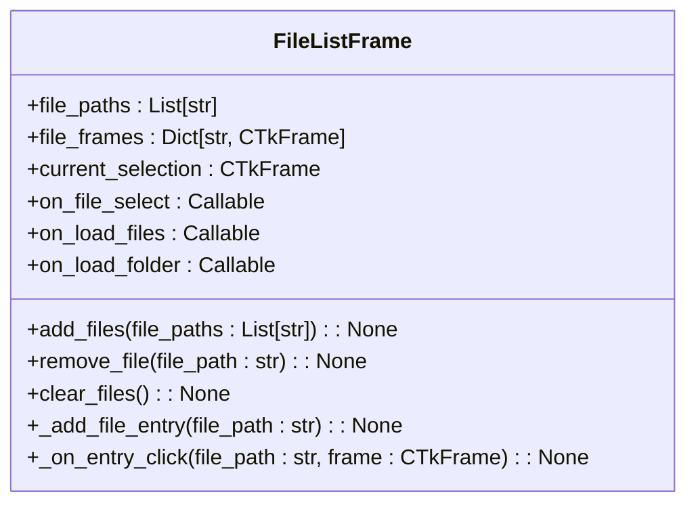
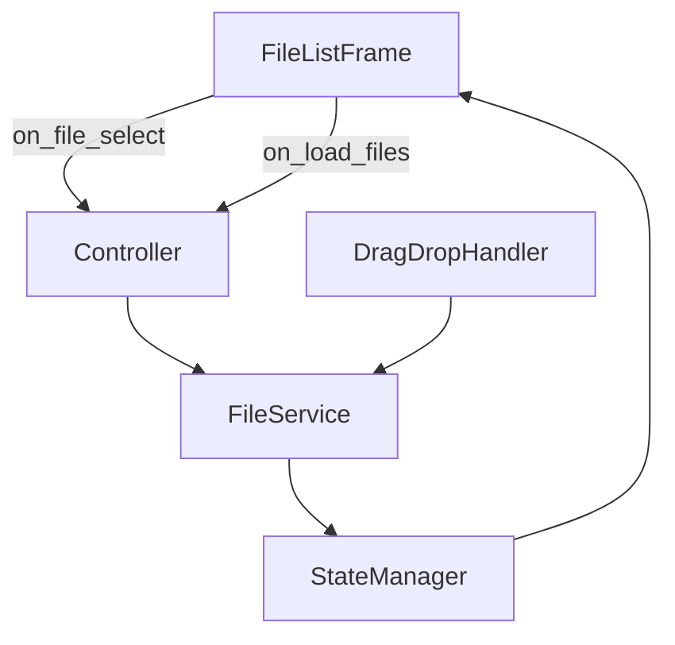

# 文件服务接口

<cite>
**本文档中引用的文件**  
- [file_service.py](file://desktop-ui/services/file_service.py)
- [drag_drop_service.py](file://desktop-ui/services/drag_drop_service.py)
- [file_list_frame.py](file://desktop-ui/components/file_list_frame.py)
- [__init__.py](file://desktop-ui/services/__init__.py)
</cite>

## 目录
1. [项目结构](#项目结构)  
2. [核心组件](#核心组件)  
3. [架构概览](#架构概览)  
4. [详细组件分析](#详细组件分析)  
5. [依赖关系分析](#依赖关系分析)  
6. [性能考量](#性能考量)  
7. [故障排除指南](#故障排除指南)  
8. [结论](#结论)

## 项目结构

`manga-translator-ui-package` 项目是一个用于漫画图像翻译的桌面应用程序，其核心功能围绕文件管理、OCR识别、翻译和渲染展开。文件服务（FileService）位于 `desktop-ui/services/` 目录下，是处理文件导入、验证和状态跟踪的核心模块。

**图示来源**  
- [file_service.py](file://desktop-ui/services/file_service.py)
- [drag_drop_service.py](file://desktop-ui/services/drag_drop_service.py)
- [file_list_frame.py](file://desktop-ui/components/file_list_frame.py)

**本节来源**  
- [file_service.py](file://desktop-ui/services/file_service.py)
- [drag_drop_service.py](file://desktop-ui/services/drag_drop_service.py)

## 核心组件

`FileService` 类是文件操作的核心，负责处理所有与文件相关的任务，包括验证、扫描、元数据提取和备份。它与 `DragDropService` 和 `FileListFrame` 紧密协作，实现从用户拖拽到文件列表更新的完整流程。

**本节来源**  
- [file_service.py](file://desktop-ui/services/file_service.py#L11-L274)

## 架构概览

系统采用分层架构，`FileService` 作为服务层，为上层UI组件提供统一的文件操作接口。`DragDropService` 作为事件处理器，捕获用户的拖拽动作，并将数据传递给 `FileService` 进行处理。最终，文件列表的更新通过回调函数通知 `FileListFrame` 组件。

**图示来源**  
- [file_service.py](file://desktop-ui/services/file_service.py#L130-L168)
- [drag_drop_service.py](file://desktop-ui/services/drag_drop_service.py#L173-L209)
- [__init__.py](file://desktop-ui/services/__init__.py#L115-L129)

## 详细组件分析

### FileService 分析

`FileService` 是一个无状态的服务类，其主要职责是封装文件操作的复杂性。

#### 核心方法与功能

**图示来源**  
- [file_service.py](file://desktop-ui/services/file_service.py#L11-L274)

**本节来源**  
- [file_service.py](file://desktop-ui/services/file_service.py#L11-L274)

- **文件验证 (`validate_image_file`)**：该方法通过检查文件扩展名、MIME类型和读取权限来确保文件的有效性。这为后续处理提供了安全保障。
- **递归扫描 (`get_image_files_from_folder`)**：当 `recursive` 参数为 `True` 时，使用 `os.walk()` 递归遍历目录，对每个文件调用 `validate_image_file` 进行验证，确保只返回有效的图片文件。
- **拖拽处理 (`process_dropped_files`)**：这是与 `DragDropService` 的主要交互点。它接收一个包含文件路径的字符串（由换行符分隔），解析后分别处理文件和文件夹。对于文件夹，会调用 `get_image_files_from_folder` 进行扫描。
- **元数据提取 (`get_file_info`)**：该方法返回一个包含文件名、路径、大小、修改时间以及图片尺寸（如果适用）的字典。这为UI显示提供了丰富的信息。

### DragDropService 分析

`DragDropService` 负责处理用户界面的拖拽事件。

#### 事件处理流程

**图示来源**  
- [drag_drop_service.py](file://desktop-ui/services/drag_drop_service.py#L173-L209)

**本节来源**  
- [drag_drop_service.py](file://desktop-ui/services/drag_drop_service.py#L173-L209)

- **事件绑定**：`_setup_drag_drop` 方法注册了 `<<Drop>>`、`<<DragEnter>>`、`<<DragLeave>>` 和 `<<DragOver>>` 等事件，实现了完整的拖拽体验。
- **数据解析**：`_extract_file_paths` 方法处理来自不同操作系统的拖拽数据，移除 `file://` 前缀并进行URL解码。
- **服务集成**：`_process_dropped_files` 方法是关键，它调用 `FileService` 的 `process_dropped_files` 方法来验证和处理文件，体现了服务间的协作。

### FileListFrame 分析

`FileListFrame` 是负责显示文件列表的UI组件。

#### UI更新机制

**图示来源**  
- [file_list_frame.py](file://desktop-ui/components/file_list_frame.py#L8-L115)

**本节来源**  
- [file_list_frame.py](file://desktop-ui/components/file_list_frame.py#L8-L115)

- **文件添加 (`add_files`)**：该方法接收一个文件路径列表，为每个新文件调用 `_add_file_entry` 创建UI条目。
- **条目创建 (`_add_file_entry`)**：为每个文件创建一个包含缩略图、文件名和删除按钮的框架，并将其添加到滚动区域。
- **状态同步**：当用户点击文件条目时，`_on_entry_click` 会高亮选中项，并通过 `on_file_select` 回调通知上层控制器，实现了文件选择状态的同步。

## 依赖关系分析

系统中的组件通过清晰的依赖关系进行交互。`FileListFrame` 依赖于 `FileService` 来获取文件信息，但这种依赖是间接的，通过控制器或服务管理器实现。`DragDropService` 直接依赖于 `FileService` 来处理文件，而 `FileService` 本身是独立的，不依赖于UI组件。

**图示来源**  
- [file_service.py](file://desktop-ui/services/file_service.py)
- [drag_drop_service.py](file://desktop-ui/services/drag_drop_service.py)
- [file_list_frame.py](file://desktop-ui/components/file_list_frame.py)

**本节来源**  
- [__init__.py](file://desktop-ui/services/__init__.py#L115-L129)

## 性能考量

- **大文件夹处理**：`get_image_files_from_folder` 的递归扫描在处理包含数千个文件的大型文件夹时可能会阻塞UI线程。最佳实践是将此操作放入后台线程执行，并提供进度指示。
- **异常处理**：`FileService` 中的每个方法都使用了 `try-except` 块来捕获异常，如权限不足（`PermissionError`）或路径不存在（`FileNotFoundError`），并记录错误日志，确保单个文件的失败不会导致整个流程崩溃。
- **资源管理**：`create_backup` 和 `cleanup_temp_files` 方法有助于管理磁盘空间，防止临时文件无限增长。

## 故障排除指南

- **问题：拖拽文件后无反应**  
  **检查点**：确认 `DragDropHandler` 已正确初始化并绑定到目标组件。检查日志中是否有“原生拖拽不可用”的警告，这可能意味着需要启用操作系统的DND支持。

- **问题：文件列表中出现“ERR”缩略图**  
  **检查点**：这通常是因为 `PIL.Image.open()` 无法打开该文件。检查文件是否损坏或格式不受支持。`validate_image_file` 方法应已过滤掉大部分无效文件。

- **问题：文件夹扫描速度慢**  
  **解决方案**：考虑实现异步扫描或分批加载。对于非常大的文件夹，可以提供一个“仅扫描当前目录”的选项。

**本节来源**  
- [file_service.py](file://desktop-ui/services/file_service.py#L130-L168)
- [drag_drop_service.py](file://desktop-ui/services/drag_drop_service.py#L173-L209)

## 结论

`FileService` 通过与 `DragDropService` 和 `FileListFrame` 的协同工作，构建了一个健壮的文件管理子系统。它成功地将文件操作的复杂性与UI逻辑分离，通过回调和状态管理器实现了松耦合。该设计易于维护和扩展，例如可以轻松添加新的文件格式支持或优化扫描算法。遵循本文档中的最佳实践，可以确保系统在处理各种文件系统场景时的稳定性和性能。