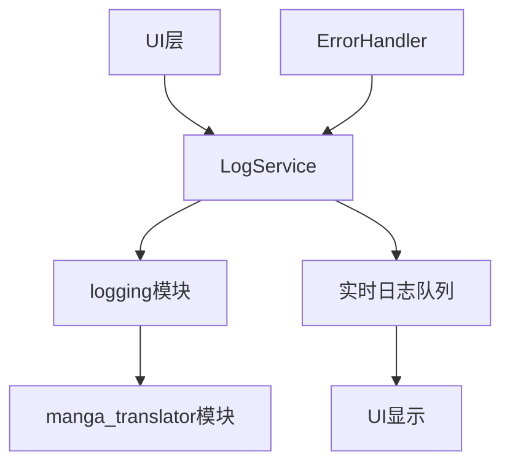
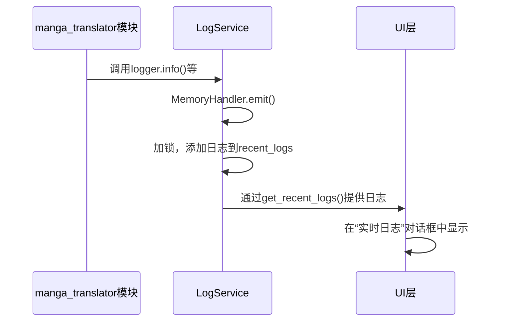
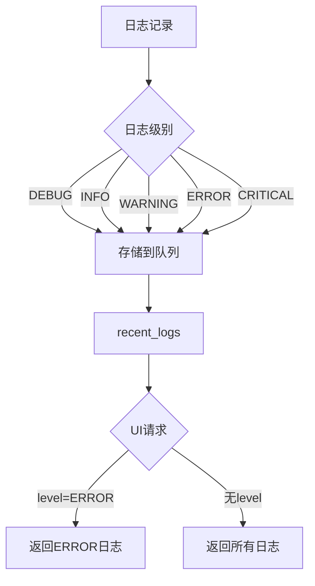
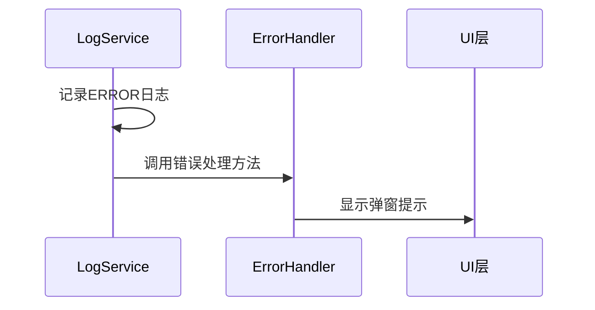

# 日志系统集成

<cite>
**本文档引用的文件**  
- [log_service.py](file://desktop-ui/services/log_service.py)
- [log.py](file://manga_translator/utils/log.py)
- [main_window.py](file://MangaStudio_Data/app/ui/main_window.py)
- [error_handler.py](file://desktop-ui/services/error_handler.py)
- [app.py](file://desktop-ui/app.py)
</cite>

## 目录
1. [项目结构](#项目结构)
2. [核心组件](#核心组件)
3. [日志捕获与推送机制](#日志捕获与推送机制)
4. [日志级别与过滤](#日志级别与过滤)
5. [日志格式化与显示](#日志格式化与显示)
6. [与错误处理集成](#与错误处理集成)
7. [性能优化与持久化](#性能优化与持久化)

## 项目结构

**图示来源**  
- [log_service.py](file://desktop-ui/services/log_service.py)
- [main_window.py](file://MangaStudio_Data/app/ui/main_window.py)

## 核心组件

日志系统主要由`LogService`、`manga_translator`模块的`log.py`以及UI层的`main_window.py`中的日志信号处理构成。`LogService`负责日志的收集、存储和管理，`manga_translator`模块负责生成日志，而UI层负责接收和显示日志。

**本节来源**  
- [log_service.py](file://desktop-ui/services/log_service.py#L20-L332)
- [log.py](file://manga_translator/utils/log.py#L0-L55)
- [main_window.py](file://MangaStudio_Data/app/ui/main_window.py#L2209-L2234)

## 日志捕获与推送机制

`LogService`通过自定义的`MemoryHandler`来捕获来自`manga_translator`模块的日志信息。当`manga_translator`模块调用`get_logger`函数获取日志记录器并记录日志时，日志信息会通过`MemoryHandler`的`emit`方法被添加到`LogService`的`recent_logs`列表中。这个过程是线程安全的，因为`emit`方法使用了`_lock`锁来保护对`recent_logs`的访问。

**图示来源**  
- [log_service.py](file://desktop-ui/services/log_service.py#L100-L130)
- [log.py](file://manga_translator/utils/log.py#L40-L55)

## 日志级别与过滤

日志系统支持多种日志级别，包括DEBUG、INFO、WARNING、ERROR和CRITICAL。`LogService`提供了`get_recent_logs`方法，允许UI层根据指定的日志级别过滤日志。例如，UI层可以只请求ERROR级别的日志来显示错误信息。

**本节来源**  
- [log_service.py](file://desktop-ui/services/log_service.py#L200-L215)

## 日志格式化与显示

`LogService`将日志格式化为包含时间戳、级别、模块、消息、函数和行号的字典。UI层通过`get_recent_logs`方法获取这些格式化的日志，并在“实时日志”对话框中显示。UI层可以根据日志级别对日志进行着色，例如，ERROR级别的日志显示为红色。

**本节来源**  
- [log_service.py](file://desktop-ui/services/log_service.py#L105-L115)
- [main_window.py](file://MangaStudio_Data/app/ui/main_window.py#L2209-L2234)

## 与错误处理集成

`LogService`与`ErrorHandler`紧密集成。当`LogService`检测到ERROR级别的日志时，它可以调用`ErrorHandler`的相关方法，将关键错误提升为用户可见的弹窗提示。这确保了用户能够及时注意到重要的错误信息。

**本节来源**  
- [log_service.py](file://desktop-ui/services/log_service.py#L270-L290)
- [error_handler.py](file://desktop-ui/services/error_handler.py#L0-L98)

## 性能优化与持久化

为了防止高频率日志导致UI卡顿，`LogService`使用了线程安全的队列和锁机制来确保日志处理的高效性。此外，日志被持久化存储在`logs`目录下的`app.log`和`error.log`文件中，以便事后分析。`LogService`还提供了`export_logs`方法，允许用户将日志导出为JSON文件。

**本节来源**  
- [log_service.py](file://desktop-ui/services/log_service.py#L300-L332)
- [log_service.py](file://desktop-ui/services/log_service.py#L250-L269)