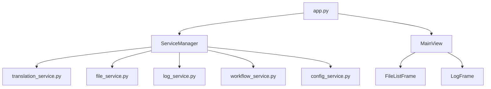
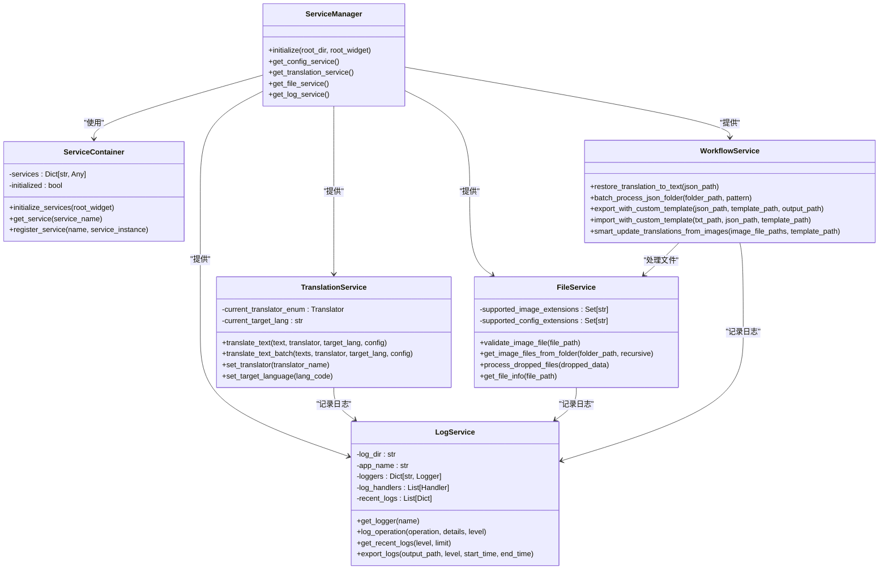
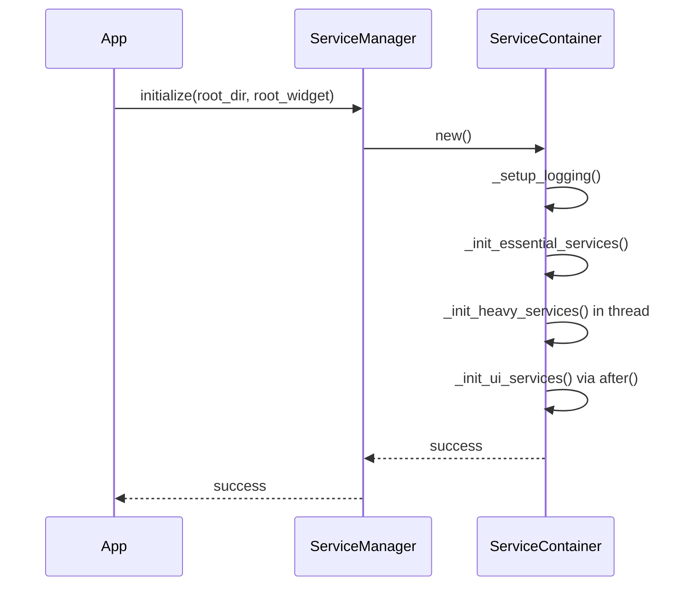
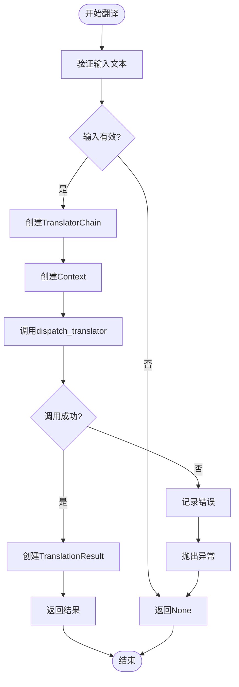
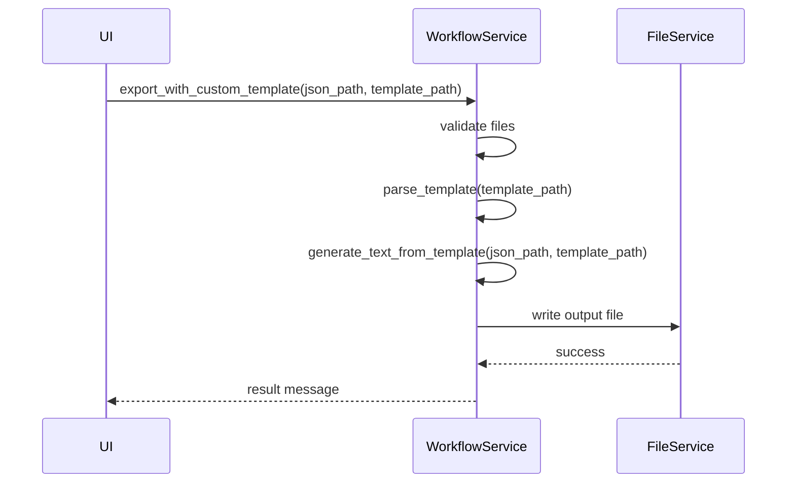
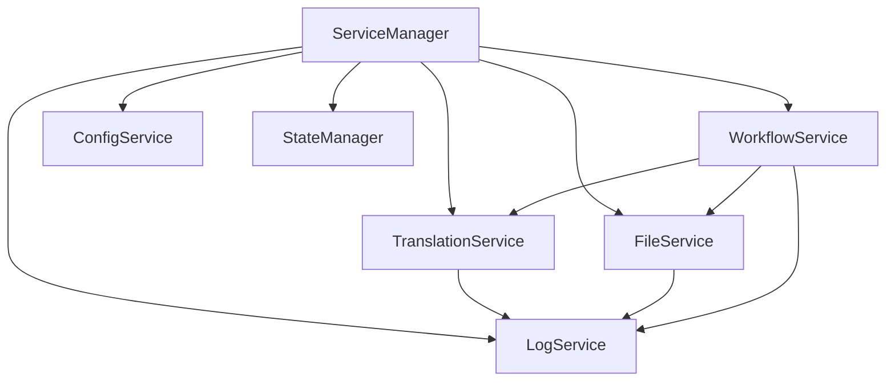

# 服务集成

<cite>
**本文档引用的文件**   
- [app.py](file://desktop-ui/app.py)
- [workflow_service.py](file://desktop-ui/services/workflow_service.py)
- [translation_service.py](file://desktop-ui/services/translation_service.py)
- [file_service.py](file://desktop-ui/services/file_service.py)
- [log_service.py](file://desktop-ui/services/log_service.py)
- [__init__.py](file://desktop-ui/services/__init__.py)
</cite>

## 目录
1. [项目结构](#项目结构)
2. [核心组件](#核心组件)
3. [架构概览](#架构概览)
4. [详细组件分析](#详细组件分析)
5. [依赖分析](#依赖分析)
6. [性能考量](#性能考量)
7. [故障排除指南](#故障排除指南)
8. [结论](#结论)

## 项目结构
项目采用分层架构，将UI、服务、工具和核心功能分离。`desktop-ui`目录包含主要的UI应用和所有服务模块。`services`目录下实现了`translation_service`、`file_service`、`log_service`和`workflow_service`等核心服务，通过`__init__.py`中的`ServiceManager`进行统一管理和注入。`app.py`作为应用入口，负责初始化服务并构建UI。

**图源**
- [app.py](file://desktop-ui/app.py#L1-L2367)
- [__init__.py](file://desktop-ui/services/__init__.py#L1-L313)

## 核心组件
核心组件包括`ServiceManager`、`TranslationService`、`FileService`、`LogService`和`WorkflowService`。`ServiceManager`作为全局服务访问点，负责初始化和管理所有服务。`TranslationService`封装了后端翻译器的调用，`FileService`处理文件操作，`LogService`提供日志记录和监控，`WorkflowService`则协调整个翻译工作流。

**节源**
- [__init__.py](file://desktop-ui/services/__init__.py#L1-L313)
- [translation_service.py](file://desktop-ui/services/translation_service.py#L1-L155)
- [file_service.py](file://desktop-ui/services/file_service.py#L1-L275)
- [log_service.py](file://desktop-ui/services/log_service.py#L1-L349)
- [workflow_service.py](file://desktop-ui/services/workflow_service.py#L1-L883)

## 架构概览
系统采用依赖注入模式，通过`ServiceManager`统一管理服务生命周期。UI层通过便捷函数访问服务，服务间通过定义良好的接口进行通信。这种设计实现了高内聚低耦合，便于维护和扩展。

**图源**
- [__init__.py](file://desktop-ui/services/__init__.py#L1-L313)
- [translation_service.py](file://desktop-ui/services/translation_service.py#L1-L155)
- [file_service.py](file://desktop-ui/services/file_service.py#L1-L275)
- [log_service.py](file://desktop-ui/services/log_service.py#L1-L349)
- [workflow_service.py](file://desktop-ui/services/workflow_service.py#L1-L883)

## 详细组件分析

### 服务管理器分析
`ServiceManager`采用单例模式，确保全局只有一个服务容器实例。它通过`ServiceContainer`分阶段初始化服务：首先同步初始化基础服务（如日志和状态管理），然后在后台线程初始化重量级服务（如翻译和OCR），最后在UI主线程初始化UI相关服务（如快捷键和拖拽）。

**图源**
- [__init__.py](file://desktop-ui/services/__init__.py#L1-L313)

**节源**
- [__init__.py](file://desktop-ui/services/__init__.py#L1-L313)

### 翻译服务分析
`TranslationService`封装了`manga_translator`后端的调用。它支持多种翻译器（如Sugoi、DeepSeek、Gemini等）和目标语言。通过`translate_text`和`translate_text_batch`方法提供异步翻译功能，并使用信号-槽机制向UI反馈任务阶段。

**图源**
- [translation_service.py](file://desktop-ui/services/translation_service.py#L1-L155)

**节源**
- [translation_service.py](file://desktop-ui/services/translation_service.py#L1-L155)

### 工作流服务分析
`WorkflowService`封装了复杂的业务逻辑，如模板导出、翻译导入和批量处理。它通过`export_with_custom_template`和`import_with_custom_template`方法实现自定义模板的导入导出功能。

**图源**
- [workflow_service.py](file://desktop-ui/services/workflow_service.py#L1-L883)

**节源**
- [workflow_service.py](file://desktop-ui/services/workflow_service.py#L1-L883)

## 依赖分析
服务间依赖关系清晰，`ServiceManager`是核心枢纽。`TranslationService`、`FileService`、`LogService`等都依赖`ServiceManager`进行初始化和访问。`WorkflowService`依赖`FileService`进行文件操作，所有服务都依赖`LogService`进行日志记录。

**图源**
- [__init__.py](file://desktop-ui/services/__init__.py#L1-L313)

**节源**
- [__init__.py](file://desktop-ui/services/__init__.py#L1-L313)

## 性能考量
系统采用异步和多线程技术提高性能。重量级服务在后台线程初始化，避免阻塞UI。`LogService`使用内存处理器收集实时日志，通过定时器更新UI，避免频繁的UI更新影响性能。文件操作采用流式处理，减少内存占用。

## 故障排除指南
- **服务初始化失败**：检查`root_dir`路径是否正确，确保所有依赖库已安装。
- **翻译失败**：检查翻译器配置和API密钥是否正确，网络连接是否正常。
- **日志不显示**：检查`LogService`是否已正确初始化，UI组件是否已绑定日志处理器。
- **文件操作失败**：检查文件路径和权限，确保文件格式支持。

**节源**
- [__init__.py](file://desktop-ui/services/__init__.py#L1-L313)
- [translation_service.py](file://desktop-ui/services/translation_service.py#L1-L155)
- [file_service.py](file://desktop-ui/services/file_service.py#L1-L275)
- [log_service.py](file://desktop-ui/services/log_service.py#L1-L349)

## 结论
该系统通过`ServiceManager`实现了服务的统一管理和依赖注入，各服务职责清晰，耦合度低。UI层通过便捷函数访问服务，简化了代码。异步和多线程技术的应用保证了UI的响应性。整体架构设计合理，易于维护和扩展。