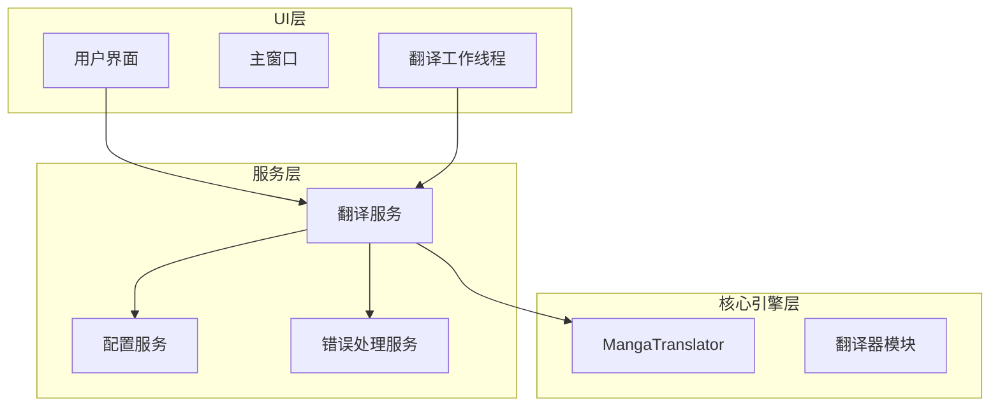
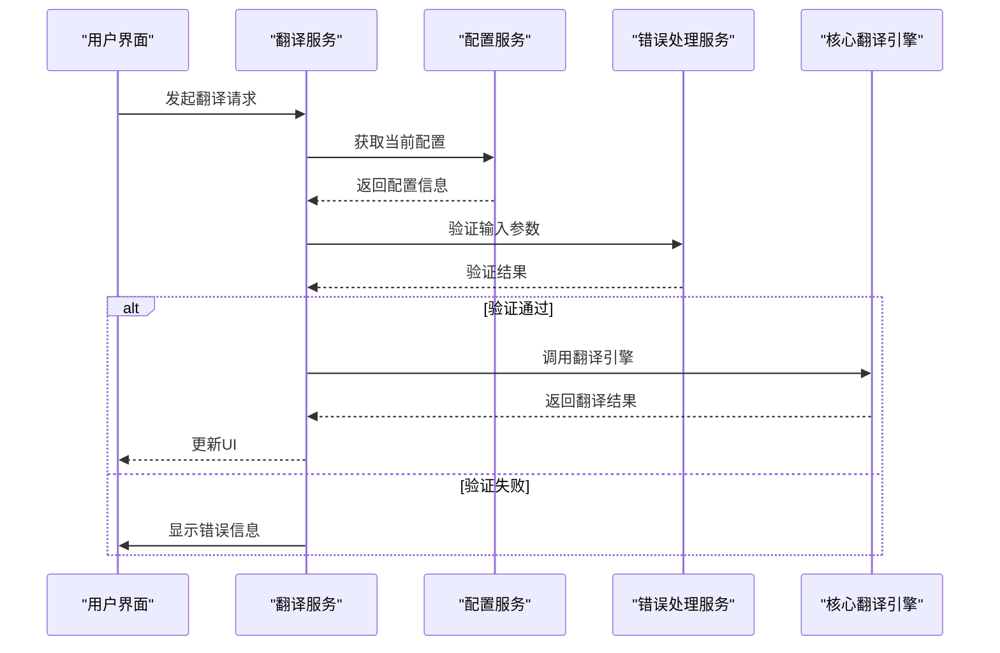
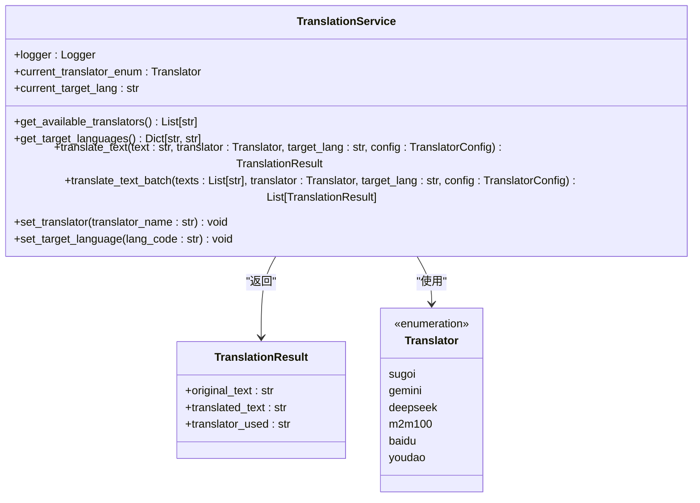
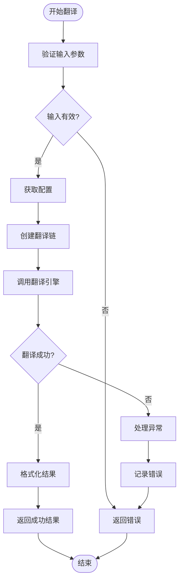
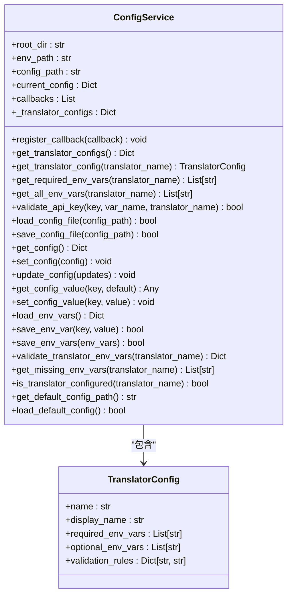
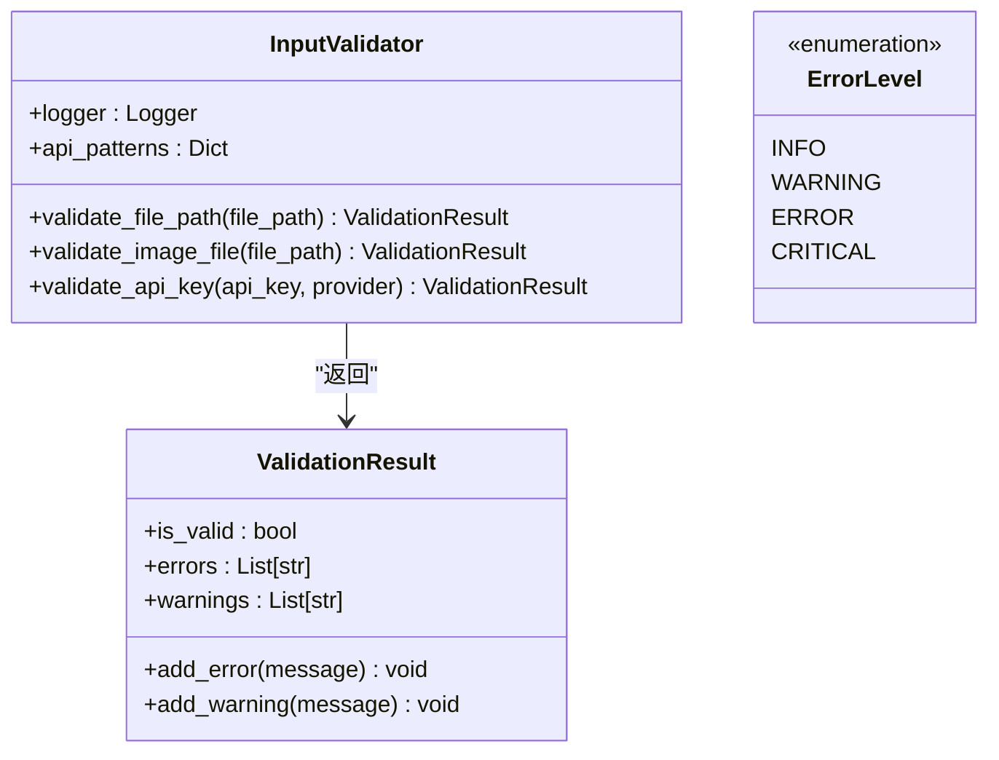

# 翻译服务集成

<cite>
**本文档引用的文件**
- [translation_service.py](file://desktop-ui/services/translation_service.py)
- [config_service.py](file://desktop-ui/services/config_service.py)
- [error_handler.py](file://desktop-ui/services/error_handler.py)
- [translation_worker.py](file://desktop-ui/translation_worker.py)
- [manga_translator.py](file://manga_translator/manga_translator.py)
</cite>

## 目录
1. [简介](#简介)
2. [项目结构](#项目结构)
3. [核心组件](#核心组件)
4. [架构概述](#架构概述)
5. [详细组件分析](#详细组件分析)
6. [依赖分析](#依赖分析)
7. [性能考虑](#性能考虑)
8. [故障排除指南](#故障排除指南)
9. [结论](#结论)

## 简介
本文档深入解析了`TranslationService`如何作为用户界面（UI）与核心翻译引擎之间的桥梁。重点描述了该服务如何通过异步任务队列调用`manga_translator.MangaTranslator`实例，处理在线翻译器（如Gemini、DeepSeek）的API密钥管理与离线翻译器（如M2M100）的模型加载。文档详细说明了服务的生命周期管理，包括初始化、任务提交、进度更新和错误处理机制。特别关注了重试机制、超时控制以及与`ConfigService`的配置联动。通过代码示例，展示了如何从UI触发翻译任务并处理返回结果，同时说明了在翻译失败时如何通过`ErrorHandler`向用户展示有意义的错误信息。

## 项目结构
本项目采用分层架构，主要分为UI层、服务层和核心翻译引擎层。UI层位于`desktop-ui`目录下，负责用户交互；服务层包含在`desktop-ui/services`中，提供业务逻辑和状态管理；核心翻译引擎位于`manga_translator`目录，实现实际的翻译功能。



**图示来源**
- [translation_service.py](file://desktop-ui/services/translation_service.py)
- [config_service.py](file://desktop-ui/services/config_service.py)
- [error_handler.py](file://desktop-ui/services/error_handler.py)
- [manga_translator.py](file://manga_translator/manga_translator.py)

## 核心组件
核心组件包括`TranslationService`、`ConfigService`和`ErrorHandler`。`TranslationService`是UI与翻译引擎之间的主要接口，负责协调翻译任务。`ConfigService`管理应用程序的配置和环境变量，确保翻译器所需的API密钥等信息正确加载。`ErrorHandler`提供统一的错误处理和输入验证功能，保证系统的健壮性。

**组件来源**
- [translation_service.py](file://desktop-ui/services/translation_service.py#L1-L154)
- [config_service.py](file://desktop-ui/services/config_service.py#L1-L303)
- [error_handler.py](file://desktop-ui/services/error_handler.py#L1-L98)

## 架构概述
系统架构采用模块化设计，各组件职责分明。UI通过`TranslationService`发起翻译请求，`TranslationService`根据当前配置调用相应的翻译器。配置信息由`ConfigService`管理，包括翻译器类型、目标语言和API密钥等。错误处理由`ErrorHandler`统一负责，确保用户能获得清晰的反馈。



**图示来源**
- [translation_service.py](file://desktop-ui/services/translation_service.py#L1-L154)
- [config_service.py](file://desktop-ui/services/config_service.py#L1-L303)
- [error_handler.py](file://desktop-ui/services/error_handler.py#L1-L98)

## 详细组件分析

### 翻译服务分析
`TranslationService`是系统的核心服务之一，负责管理翻译任务的整个生命周期。

#### 类结构分析


**图示来源**
- [translation_service.py](file://desktop-ui/services/translation_service.py#L1-L154)

#### 翻译流程分析


**图示来源**
- [translation_service.py](file://desktop-ui/services/translation_service.py#L1-L154)

### 配置服务分析
`ConfigService`负责管理应用程序的配置，包括JSON配置文件和环境变量。

#### 类结构分析


**图示来源**
- [config_service.py](file://desktop-ui/services/config_service.py#L1-L303)

### 错误处理服务分析
`ErrorHandler`提供统一的错误处理和输入验证功能。

#### 类结构分析


**图示来源**
- [error_handler.py](file://desktop-ui/services/error_handler.py#L1-L98)

## 依赖分析
各组件之间的依赖关系清晰，形成了一个松耦合的系统架构。

```mermaid
graph TD
TranslationService --> ConfigService : "依赖"
TranslationService --> ErrorHandler : "依赖"
TranslationService --> manga_translator : "使用"
ConfigService --> dotenv : "使用"
ErrorHandler --> re : "使用"
ErrorHandler --> os : "使用"
manga_translator --> transformers : "依赖"
manga_translator --> torch : "依赖"
```

**图示来源**
- [translation_service.py](file://desktop-ui/services/translation_service.py)
- [config_service.py](file://desktop-ui/services/config_service.py)
- [error_handler.py](file://desktop-ui/services/error_handler.py)

## 性能考虑
系统在性能方面做了多项优化：
1. 使用异步编程模型，避免阻塞UI线程
2. 配置信息缓存，减少重复文件读取
3. 批量翻译支持，提高多文本翻译效率
4. 延迟加载机制，只在需要时初始化资源

## 故障排除指南
常见问题及解决方案：

### 翻译器配置问题
**问题**：翻译器显示未配置
**解决方案**：
1. 检查`.env`文件是否存在
2. 确认所需环境变量已正确设置
3. 使用`ConfigService.validate_translator_env_vars()`方法验证配置

### API密钥验证失败
**问题**：API密钥格式不正确
**解决方案**：
1. 检查密钥是否符合正则表达式要求
2. 参考`InputValidator`中的验证模式
3. 确保密钥没有多余的空格或换行符

### 翻译任务失败
**问题**：翻译任务执行失败
**解决方案**：
1. 检查网络连接
2. 验证API服务是否可用
3. 查看日志文件获取详细错误信息
4. 尝试使用不同的翻译器

**组件来源**
- [config_service.py](file://desktop-ui/services/config_service.py#L1-L303)
- [error_handler.py](file://desktop-ui/services/error_handler.py#L1-L98)

## 结论
`TranslationService`成功实现了UI与核心翻译引擎之间的桥梁作用。通过与`ConfigService`和`ErrorHandler`的紧密协作，系统提供了稳定可靠的翻译功能。异步任务处理机制保证了UI的响应性，而完善的错误处理确保了良好的用户体验。整体架构清晰，组件职责分明，便于维护和扩展。