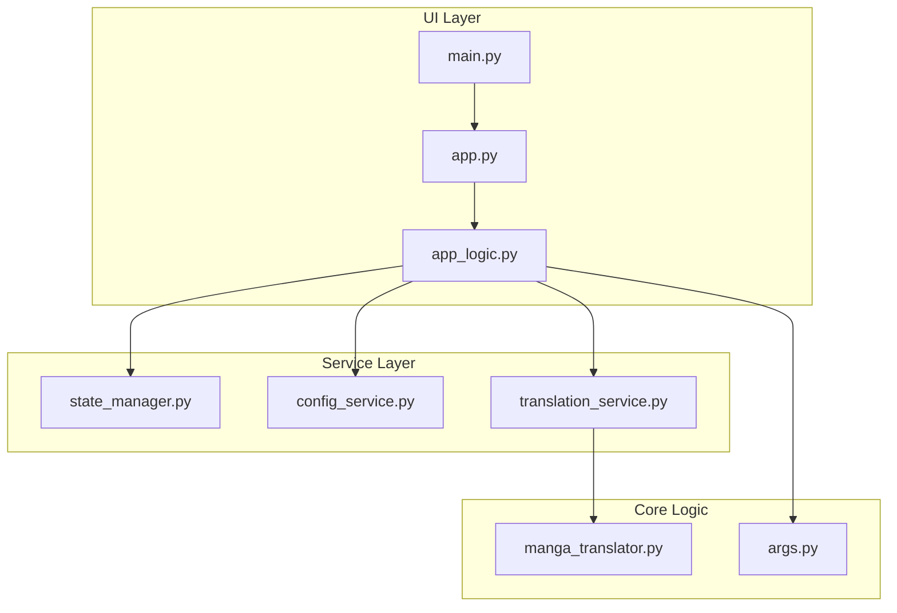
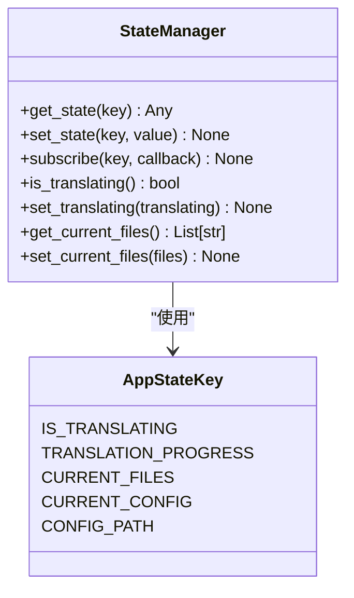
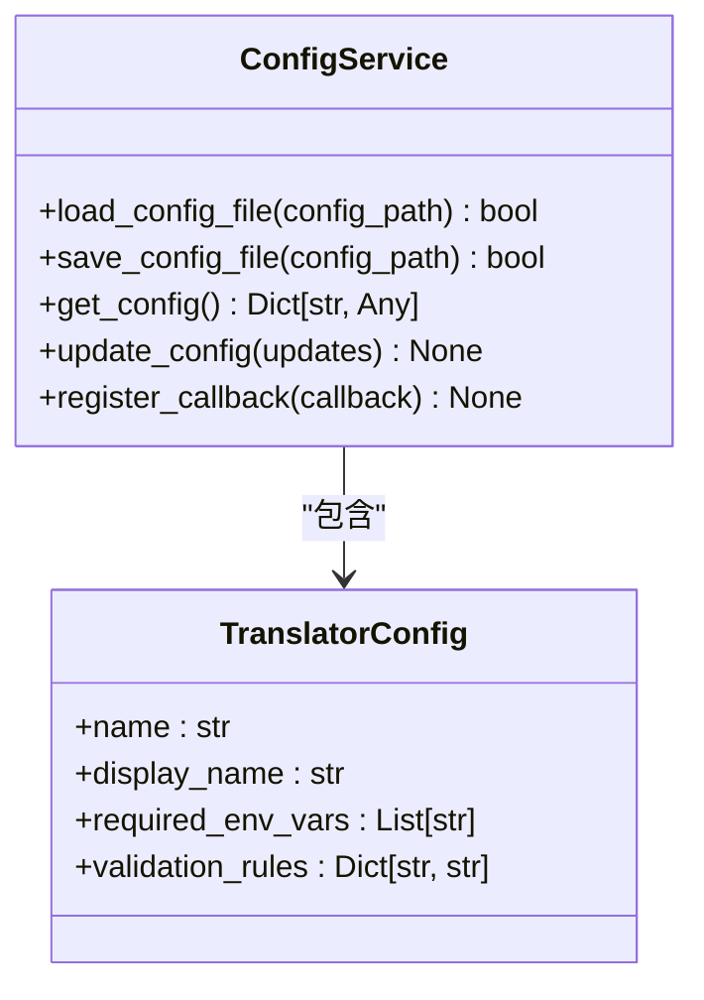

# 状态与事件流

<cite>
**本文档引用的文件**  
- [app_logic.py](file://desktop-ui/app_logic.py)
- [state_manager.py](file://desktop-ui/services/state_manager.py)
- [config_service.py](file://desktop-ui/services/config_service.py)
- [mouse_event_handler_new.py](file://desktop-ui/components/mouse_event_handler_new.py)
- [mask_editor.py](file://desktop-ui/components/mask_editor.py)
</cite>

## 目录
1. [项目结构分析](#项目结构分析)
2. [核心组件分析](#核心组件分析)
3. [状态管理机制](#状态管理机制)
4. [事件传播与用户交互](#事件传播与用户交互)
5. [配置服务与观察者模式](#配置服务与观察者模式)
6. [鼠标事件与遮罩编辑](#鼠标事件与遮罩编辑)
7. [异步任务与错误处理](#异步任务与错误处理)

## 项目结构分析

项目采用分层架构设计，主要分为UI层、服务层和核心逻辑层。`desktop-ui`目录包含应用的前端界面与交互逻辑，其中`app_logic.py`作为中央协调器，负责连接UI与后端服务。`services`目录封装了状态管理、配置管理、文件服务等核心功能模块，实现了关注点分离。



**图示来源**  
- [app_logic.py](file://desktop-ui/app_logic.py#L1-L317)
- [state_manager.py](file://desktop-ui/services/state_manager.py#L1-L251)
- [config_service.py](file://desktop-ui/services/config_service.py#L1-L303)

## 核心组件分析

### 应用逻辑控制器 (AppLogic)

`AppLogic`类是整个应用的中央协调器，负责接收用户操作并协调各服务模块。它通过依赖注入获取`ConfigService`、`StateManager`等服务实例，实现松耦合设计。

```python
class AppLogic:
    def __init__(self):
        self.config_service = get_config_service()
        self.state_manager = get_state_manager()
        self.ui_callbacks: Dict[str, Callable] = {}
```

该类采用事件驱动架构，通过`register_ui_callback`和`notify_ui`方法实现UI层与逻辑层的解耦通信。

**组件来源**  
- [app_logic.py](file://desktop-ui/app_logic.py#L34-L317)

### 状态管理器 (StateManager)

`StateManager`实现了一个线程安全的响应式状态管理系统，使用枚举`AppStateKey`定义所有可管理的状态键。

```python
class AppStateKey(Enum):
    IS_TRANSLATING = "is_translating"
    TRANSLATION_PROGRESS = "translation_progress"
    CURRENT_FILES = "current_files"
```

状态管理器支持观察者模式，允许组件订阅特定状态的变化。

**组件来源**  
- [state_manager.py](file://desktop-ui/services/state_manager.py#L10-L251)

## 状态管理机制

### 状态存储与访问

`StateManager`使用字典存储状态值，并通过锁机制保证线程安全。提供了一系列便捷方法用于访问和修改状态：



**图示来源**  
- [state_manager.py](file://desktop-ui/services/state_manager.py#L10-L251)

### 状态变更通知

当状态发生变化时，`StateManager`会通知所有订阅该状态的观察者：

```python
def _notify_observers(self, key: AppStateKey, new_value: Any, old_value: Any):
    observers = self._observers[key].copy()
    for observer in observers:
        try:
            observer(new_value)
        except Exception as e:
            self.logger.error(f"通知观察者失败 {key.value}: {e}")
```

这种设计模式确保了UI组件能够及时响应状态变化。

**组件来源**  
- [state_manager.py](file://desktop-ui/services/state_manager.py#L100-L115)

## 事件传播与用户交互

### 中央事件协调

`AppLogic`作为中央事件处理器，接收用户操作并更新全局状态：

```python
def start_backend_task(self) -> bool:
    # 更新状态
    self.state_manager.set_translating(True)
    self.state_manager.set_status_message("正在执行任务...")
    
    # 通知UI
    self.notify_ui('task_started')
    
    # 启动异步任务
    threading.Thread(target=self._run_backend_task_async).start()
    return True
```

**组件来源**  
- [app_logic.py](file://desktop-ui/app_logic.py#L183-L247)

### UI回调机制

应用使用回调字典实现UI事件通知：

```python
def register_ui_callback(self, event_name: str, callback: Callable):
    self.ui_callbacks[event_name] = callback

def notify_ui(self, event_name: str, data: Any = None):
    callback = self.ui_callbacks.get(event_name)
    if callback:
        try:
            callback(data)
        except Exception as e:
            self.logger.error(f"UI回调执行失败 {event_name}: {e}")
```

这种设计使得UI组件可以注册感兴趣的事件，实现松耦合通信。

**组件来源**  
- [app_logic.py](file://desktop-ui/app_logic.py#L28-L32)

## 配置服务与观察者模式

### 配置管理服务

`ConfigService`负责管理应用的JSON配置文件和环境变量：



**图示来源**  
- [config_service.py](file://desktop-ui/services/config_service.py#L1-L303)

### 观察者模式实现

配置服务支持观察者模式，允许其他组件监听配置变化：

```python
def register_callback(self, callback):
    self.callbacks.append(callback)

def set_config(self, config: Dict[str, Any]) -> None:
    self.current_config = config.copy()
    for callback in self.callbacks:
        try:
            callback()
        except Exception as e:
            self.logger.error(f"执行配置更新回调时出错: {e}")
```

`AppLogic`在初始化时注册了配置变更的监听：

```python
def __init__(self):
    self.config_service = get_config_service()
    self.config_service.register_callback(self._on_config_changed)
```

**组件来源**  
- [config_service.py](file://desktop-ui/services/config_service.py#L58-L74)
- [app_logic.py](file://desktop-ui/app_logic.py#L39-L44)

## 鼠标事件与遮罩编辑

### 鼠标事件处理

`mouse_event_handler_new.py`负责处理画布上的鼠标交互，包括框选文本区域等操作：

```python
# 虽然未提供完整代码，但从文件名和上下文推断
# 鼠标事件处理器会监听鼠标按下、移动、释放事件
# 实现框选、拖拽等交互功能
```

当用户框选文本区域时，事件处理器会触发相应的状态变更。

### 遮罩编辑器集成

`mask_editor.py`负责管理遮罩层的显示和编辑：

```python
# 推断：遮罩编辑器会订阅相关状态
# 当鼠标框选操作完成时，更新遮罩数据
# 并通过状态管理器通知其他组件
```

完整的事件流为：鼠标操作 → 事件处理器 → 状态管理器 → 遮罩编辑器更新。

**组件来源**  
- [mouse_event_handler_new.py](file://desktop-ui/components/mouse_event_handler_new.py)
- [mask_editor.py](file://desktop-ui/components/mask_editor.py)

## 异步任务与错误处理

### 异步任务执行

应用使用线程和asyncio执行耗时的后端任务：

```python
def start_backend_task(self) -> bool:
    threading.Thread(
        target=self._run_backend_task_async,
        args=(files, task_id, progress_callback, translator_json_config, workflow_args_context),
        daemon=True
    ).start()

def _run_backend_task_async(self, files, task_id, progress_callback, config, args):
    loop = asyncio.new_event_loop()
    asyncio.set_event_loop(loop)
    results = loop.run_until_complete(
        self.translation_service.translate_batch_async(files, progress_callback, config=config, args=args)
    )
```

**组件来源**  
- [app_logic.py](file://desktop-ui/app_logic.py#L208-L247)

### 防抖与任务队列

虽然代码中未显式实现防抖，但通过状态检查避免了重复任务启动：

```python
def start_backend_task(self) -> bool:
    if not files:
        self.logger.warning("文件列表为空，任务中止")
        return False
        
    if self.state_manager.is_translating():
        # 可以在此添加防抖逻辑
        return False
```

### 错误冒泡机制

应用实现了多层次的错误处理：

```python
def _run_backend_task_async(self, ...):
    try:
        # 执行任务
    except Exception as e:
        self.logger.error(f"后端任务执行异常: {e}")
        self.progress_manager.error_task(task_id, str(e))
        self.state_manager.set_translating(False)
        self.state_manager.add_error_message(f"任务失败: {str(e)}")
    finally:
        try:
            loop.close()
        except:
            pass
```

错误信息通过`add_error_message`方法添加到全局状态，供UI组件显示。

**组件来源**  
- [app_logic.py](file://desktop-ui/app_logic.py#L236-L247)