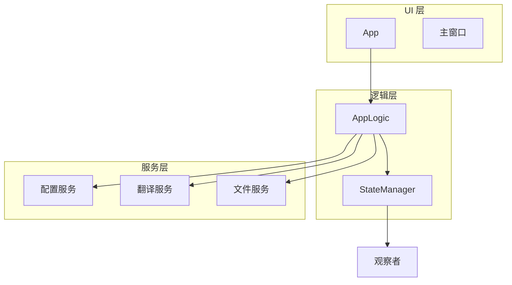
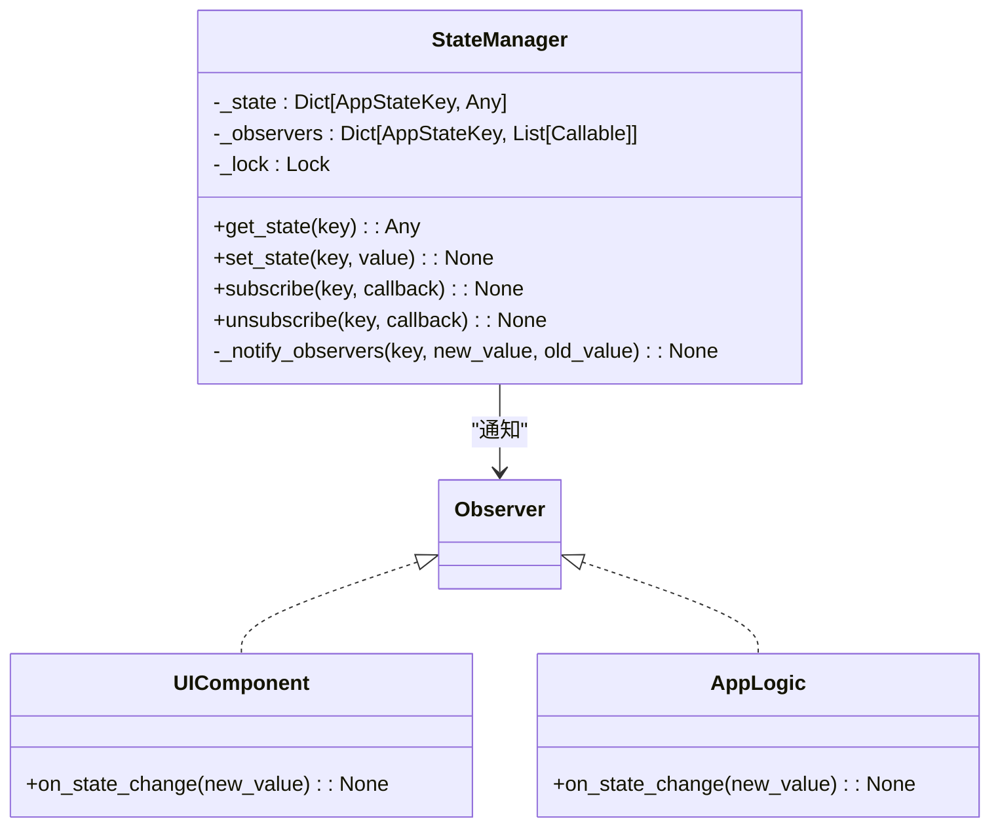
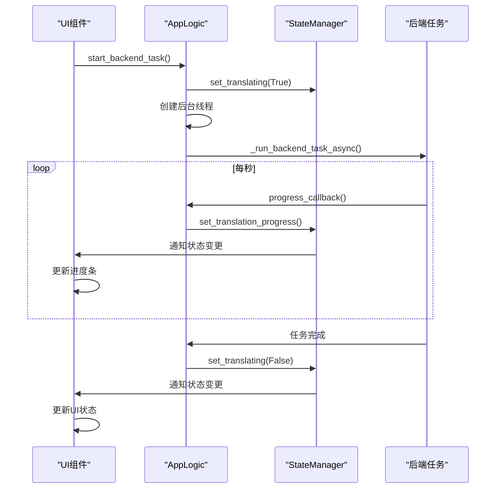

# 状态管理机制

<cite>
**本文档引用的文件**
- [state_manager.py](file://desktop-ui/services/state_manager.py#L1-L252)
- [app_logic.py](file://desktop-ui/app_logic.py#L1-L318)
- [main.py](file://desktop-ui/main.py#L1-L99)
- [__init__.py](file://desktop-ui/services/__init__.py#L1-L313)
</cite>

## 目录
1. [项目结构](#项目结构)
2. [核心组件](#核心组件)
3. [状态管理器设计与实现](#状态管理器设计与实现)
4. [应用逻辑与状态管理交互](#应用逻辑与状态管理交互)
5. [初始化流程与状态持久化](#初始化流程与状态持久化)
6. [状态变更监听与异步同步](#状态变更监听与异步同步)
7. [错误处理与冒泡机制](#错误处理与冒泡机制)
8. [线程安全与竞态条件防护](#线程安全与竞态条件防护)

## 项目结构

本项目为一个漫画图像翻译桌面应用，采用模块化分层架构。核心UI逻辑位于`desktop-ui`目录下，主要分为`app`（UI组件）、`services`（业务服务）和`core`（核心逻辑）等模块。状态管理机制的核心实现位于`desktop-ui/services/state_manager.py`，作为全局单例被`app_logic.py`等模块调用，通过`main.py`入口进行初始化。



**图示来源**
- [state_manager.py](file://desktop-ui/services/state_manager.py#L1-L252)
- [app_logic.py](file://desktop-ui/app_logic.py#L1-L318)

## 核心组件

系统的核心组件包括`StateManager`（状态管理器）、`AppLogic`（应用逻辑控制器）和`ServiceManager`（服务管理器）。`StateManager`负责维护全局应用状态，`AppLogic`作为中央控制器协调各服务并更新状态，`ServiceManager`则负责所有服务的初始化和依赖注入。

**本节来源**
- [state_manager.py](file://desktop-ui/services/state_manager.py#L1-L252)
- [app_logic.py](file://desktop-ui/app_logic.py#L1-L318)
- [__init__.py](file://desktop-ui/services/__init__.py#L1-L313)

## 状态管理器设计与实现

### 单例模式与全局访问

`StateManager`类采用单例模式实现，通过全局变量`_state_manager`和`get_state_manager()`函数确保整个应用中只有一个状态管理实例。这种设计保证了状态的全局唯一性和一致性。

```python
_state_manager = None

def get_state_manager() -> StateManager:
    global _state_manager
    if _state_manager is None:
        _state_manager = StateManager()
    return _state_manager
```

### 状态键枚举

状态管理器使用`AppStateKey`枚举来定义所有可能的状态键，这提供了类型安全和代码可读性，避免了字符串硬编码。

```python
class AppStateKey(Enum):
    IS_TRANSLATING = "is_translating"
    TRANSLATION_PROGRESS = "translation_progress"
    CURRENT_FILES = "current_files"
    # ... 其他状态键
```

### 状态存储与访问

状态存储在`_state`字典中，通过`get_state()`和`set_state()`方法进行访问和修改。所有状态操作都通过`threading.Lock()`加锁，确保线程安全。

```python
def get_state(self, key: AppStateKey) -> Any:
    with self._lock:
        return self._state.get(key)

def set_state(self, key: AppStateKey, value: Any, notify: bool = True) -> None:
    with self._lock:
        old_value = self._state.get(key)
        if old_value != value:
            self._state[key] = value
            if notify:
                self._notify_observers(key, value, old_value)
```

### 观察者模式

状态管理器实现了观察者模式，允许UI组件或其他服务订阅特定状态的变化。当状态改变时，所有订阅了该状态的观察者都会收到通知。



**图示来源**
- [state_manager.py](file://desktop-ui/services/state_manager.py#L1-L252)

**本节来源**
- [state_manager.py](file://desktop-ui/services/state_manager.py#L1-L252)

## 应用逻辑与状态管理交互

`AppLogic`类作为中央控制器，负责协调应用的业务逻辑，并通过`StateManager`更新全局状态。

### 依赖注入

`AppLogic`在初始化时通过`get_state_manager()`等便捷函数获取服务实例，实现了依赖注入。

```python
def __init__(self):
    self.state_manager = get_state_manager()
    self.config_service = get_config_service()
    # ... 其他服务
```

### 状态更新与UI重绘

当应用逻辑发生变化时，`AppLogic`会调用`StateManager`的相应方法更新状态，从而触发UI组件的重绘。

```python
def start_backend_task(self) -> bool:
    # ... 准备工作
    self.state_manager.set_translating(True)
    self.state_manager.set_status_message("正在执行任务...")
    # ... 启动后台任务
```

### 批量状态更新

对于需要同时更新多个状态的场景，`StateManager`提供了`update_state()`方法，可以批量更新状态并发送通知，减少不必要的UI重绘。

```python
def update_state(self, updates: Dict[AppStateKey, Any]) -> None:
    changes = []
    with self._lock:
        for key, value in updates.items():
            old_value = self._state.get(key)
            if old_value != value:
                self._state[key] = value
                changes.append((key, value, old_value))
    
    for key, new_value, old_value in changes:
        self._notify_observers(key, new_value, old_value)
```

**本节来源**
- [app_logic.py](file://desktop-ui/app_logic.py#L1-L318)
- [state_manager.py](file://desktop-ui/services/state_manager.py#L1-L252)

## 初始化流程与状态持久化

### 应用启动流程

应用的启动流程由`main.py`控制，通过延迟导入和分阶段初始化来优化启动速度。

```python
def main_ui():
    try:
        App = get_app_class()
        get_async_service, shutdown_async_service = get_async_services()
        async_service = get_async_service()
        app = App()
        app.mainloop()
    except Exception as e:
        # ... 错误处理
```

### 服务初始化

`ServiceManager`负责所有服务的初始化，采用分阶段异步加载策略：先同步初始化基础服务，再在后台线程初始化重量级服务，最后在UI主线程初始化UI相关服务。

```python
def initialize_services(self, root_widget=None) -> bool:
    self._init_essential_services()  # 同步
    threading.Thread(target=self._init_heavy_services, daemon=True).start()  # 异步
    if self._root_widget:
        self._root_widget.after(100, self._init_ui_services)  # 延迟
```

### 状态持久化

虽然当前代码中未直接体现，但通过`ConfigService`加载和保存配置文件，可以实现状态的持久化。`AppLogic`的`load_config_file`和`save_config_file`方法负责配置的加载和保存。

```python
def load_config_file(self, config_path: str) -> bool:
    success = self.config_service.load_config_file(config_path)
    if success:
        config = self.config_service.get_config()
        self.state_manager.set_current_config(config)
        return True
    return False
```

**本节来源**
- [main.py](file://desktop-ui/main.py#L1-L99)
- [__init__.py](file://desktop-ui/services/__init__.py#L1-L313)
- [app_logic.py](file://desktop-ui/app_logic.py#L1-L318)

## 状态变更监听与异步同步

### 状态监听

UI组件可以通过`subscribe`方法监听特定状态的变化，当状态改变时，注册的回调函数会被调用。

```python
def subscribe(self, key: AppStateKey, callback: Callable[[Any], None]) -> None:
    with self._lock:
        self._observers[key].append(callback)
```

### 异步任务状态同步

在执行后台任务时，通过进度回调函数将异步任务的状态同步到`StateManager`，确保UI能够实时反映任务进度。

```python
def progress_callback(progress: TranslationProgress):
    self.progress_manager.update_task(task_id, progress.current_step, progress.message)
    self.state_manager.set_translation_progress(progress.percentage)

threading.Thread(
    target=self._run_backend_task_async,
    args=(files, task_id, progress_callback, ...),
    daemon=True
).start()
```



**图示来源**
- [app_logic.py](file://desktop-ui/app_logic.py#L1-L318)
- [state_manager.py](file://desktop-ui/services/state_manager.py#L1-L252)

**本节来源**
- [app_logic.py](file://desktop-ui/app_logic.py#L1-L318)
- [state_manager.py](file://desktop-ui/services/state_manager.py#L1-L252)

## 错误处理与冒泡机制

### 错误状态管理

`StateManager`专门维护了一个`ERROR_MESSAGES`状态，用于存储应用中的错误信息。通过`add_error_message()`方法添加错误，`clear_error_messages()`方法清除错误。

```python
def add_error_message(self, error: str) -> None:
    errors = self.get_state(AppStateKey.ERROR_MESSAGES) or []
    errors.append({
        'message': error,
        'timestamp': time.time()
    })
    if len(errors) > 10:  # 只保留最近10个
        errors = errors[-10:]
    self.set_state(AppStateKey.ERROR_MESSAGES, errors)
```

### 错误冒泡

当发生错误时，错误信息会从底层服务逐层向上传递，最终通过`StateManager`更新全局错误状态，实现错误冒泡。

```python
def start_backend_task(self) -> bool:
    try:
        # ... 业务逻辑
    except Exception as e:
        self.logger.error(f"开始任务时发生异常: {e}")
        self.state_manager.add_error_message(f"任务失败: {str(e)}")
        return False
```

### UI反馈

UI组件监听`ERROR_MESSAGES`状态，当有新的错误信息时，自动更新界面显示，向用户反馈错误。

**本节来源**
- [state_manager.py](file://desktop-ui/services/state_manager.py#L1-L252)
- [app_logic.py](file://desktop-ui/app_logic.py#L1-L318)

## 线程安全与竞态条件防护

### 线程锁机制

`StateManager`使用`threading.Lock()`来保护所有状态操作，防止多线程环境下的竞态条件。

```python
def __init__(self):
    self._lock = threading.Lock()

def get_state(self, key: AppStateKey) -> Any:
    with self._lock:
        return self._state.get(key)
```

### 通知锁分离

在`update_state()`方法中，状态更新在锁内进行，而通知观察者在锁外进行，避免了在持有锁时执行可能耗时的回调函数，防止死锁。

```python
def update_state(self, updates: Dict[AppStateKey, Any]) -> None:
    changes = []
    with self._lock:  # 锁内：快速状态更新
        for key, value in updates.items():
            # ... 更新状态
            changes.append((key, value, old_value))
    
    # 锁外：发送通知，避免死锁
    for key, new_value, old_value in changes:
        self._notify_observers(key, new_value, old_value)
```

### 观察者副本

在通知观察者时，会创建观察者列表的副本，防止在遍历过程中观察者列表被修改。

```python
def _notify_observers(self, key: AppStateKey, new_value: Any, old_value: Any) -> None:
    observers = self._observers[key].copy()  # 创建副本
    for observer in observers:
        try:
            observer(new_value)
        except Exception as e:
            self.logger.error(f"通知观察者失败 {key.value}: {e}")
```

**本节来源**
- [state_manager.py](file://desktop-ui/services/state_manager.py#L1-L252)