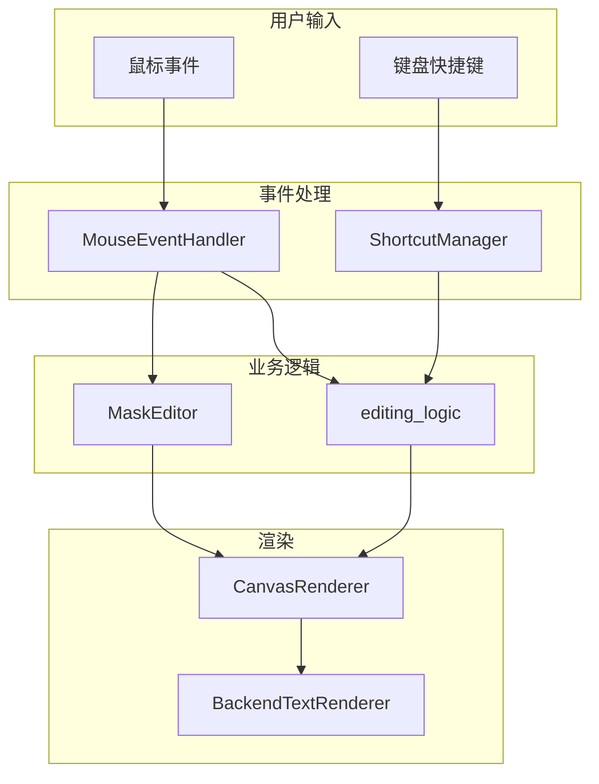
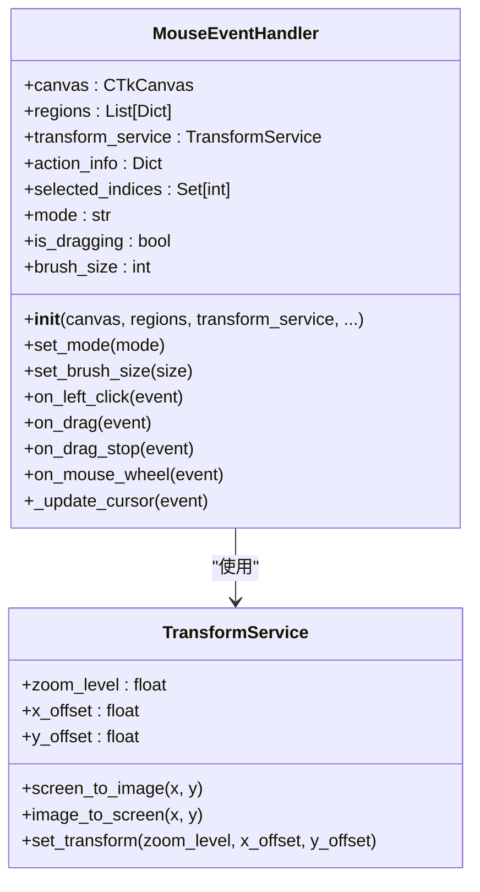
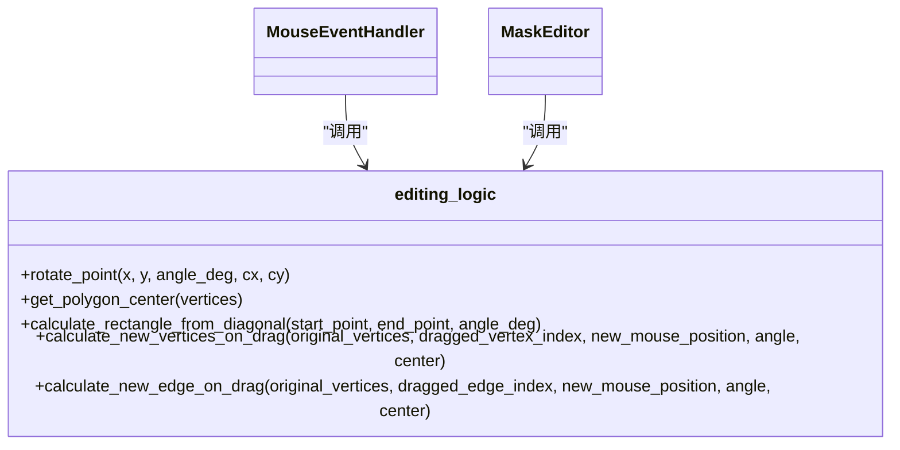
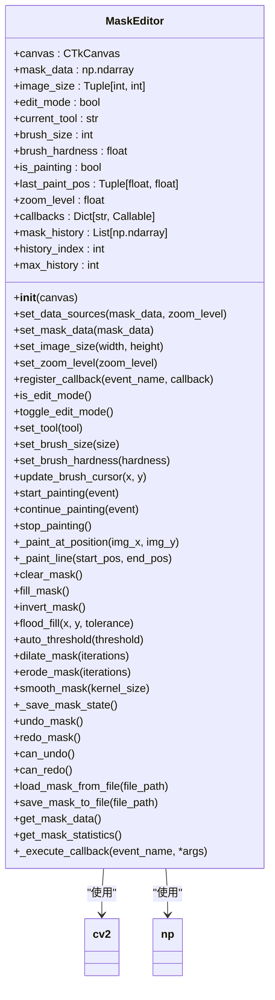
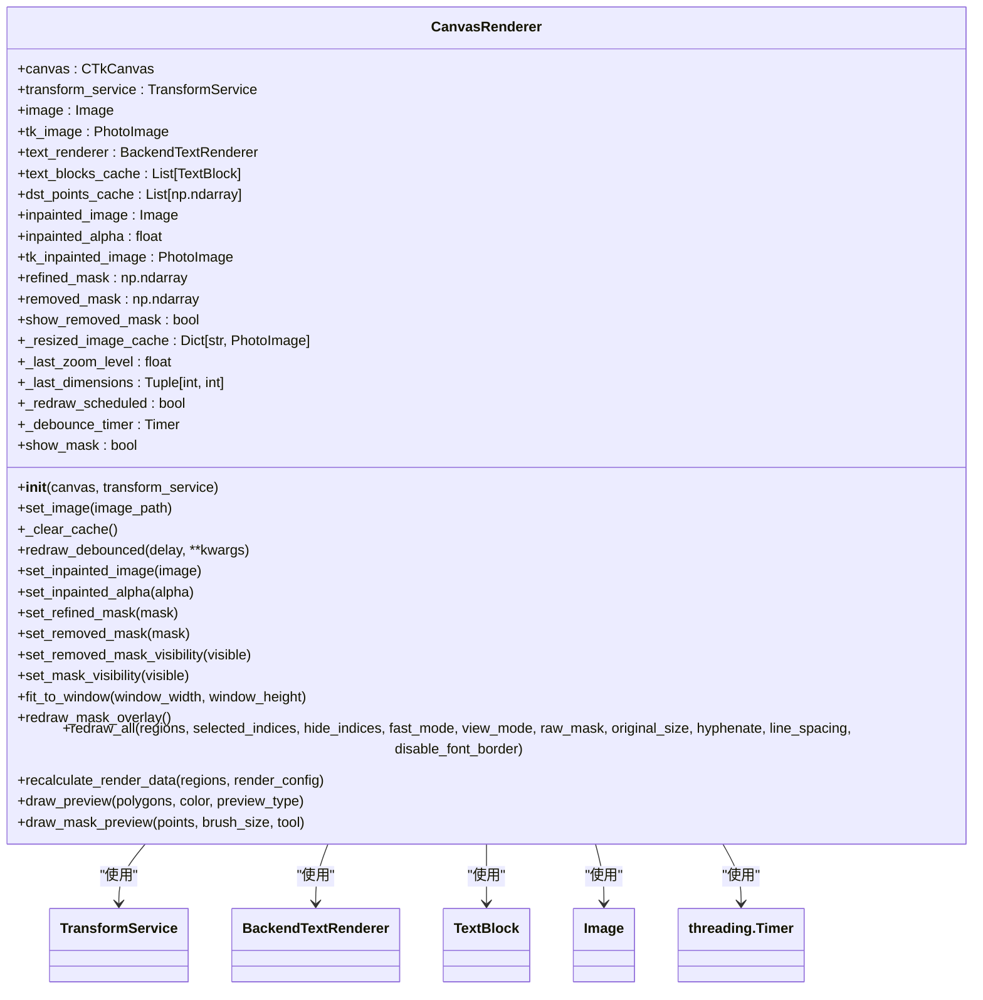
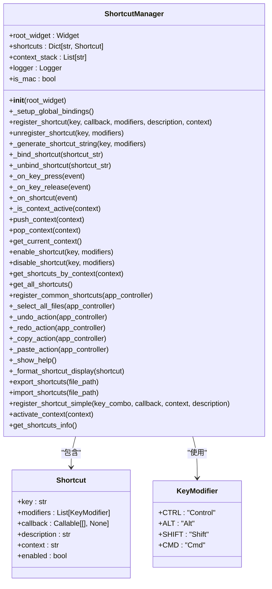
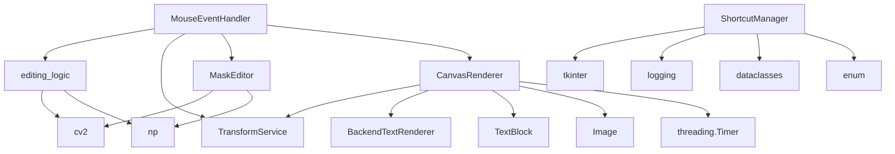

# 用户事件处理

<cite>
**本文档引用的文件**
- [mouse_event_handler_new.py](file://desktop-ui/components/mouse_event_handler_new.py)
- [editing_logic.py](file://desktop-ui/editing_logic.py)
- [mask_editor.py](file://desktop-ui/components/mask_editor.py)
- [canvas_renderer_new.py](file://desktop-ui/components/canvas_renderer_new.py)
- [shortcut_manager.py](file://desktop-ui/services/shortcut_manager.py)
</cite>

## 目录
1. [简介](#简介)
2. [项目结构](#项目结构)
3. [核心组件](#核心组件)
4. [架构概述](#架构概述)
5. [详细组件分析](#详细组件分析)
6. [依赖分析](#依赖分析)
7. [性能考虑](#性能考虑)
8. [故障排除指南](#故障排除指南)
9. [结论](#结论)

## 简介
本文档系统性地说明了用户交互事件（如鼠标拖拽、右键菜单、键盘快捷键）的捕获与处理流程。重点解析了`mouse_event_handler_new.py`如何绑定画布事件，并将原始输入转换为语义化操作（如创建文本框、调整遮罩）。阐述了`editing_logic.py`如何协调事件与业务逻辑，驱动`mask_editor.py`更新遮罩层并触发`canvas_renderer_new.py`重绘。涵盖了事件防抖、多点触控支持、快捷键冲突解决及异常输入处理的实现策略，提供了事件流调试与性能优化建议。

## 项目结构
本项目采用模块化设计，主要分为核心组件、服务和工具模块。核心组件包括画布渲染器、蒙版编辑器和鼠标事件处理器，负责用户界面的交互和渲染。服务模块提供了快捷键管理、状态管理和错误处理等功能。工具模块则包含各种辅助函数和类，用于支持核心功能的实现。

## 核心组件

`mouse_event_handler_new.py`是用户交互的核心，负责捕获和处理所有鼠标事件。`editing_logic.py`包含了所有与编辑相关的逻辑，如多边形中心计算和矩形生成。`mask_editor.py`专门处理蒙版编辑功能，支持画笔、橡皮擦等工具。`canvas_renderer_new.py`负责将图像和文本块渲染到画布上。`shortcut_manager.py`管理所有键盘快捷键的注册和触发。

**Section sources**
- [mouse_event_handler_new.py](file://desktop-ui/components/mouse_event_handler_new.py#L1-L984)
- [editing_logic.py](file://desktop-ui/editing_logic.py#L1-L224)
- [mask_editor.py](file://desktop-ui/components/mask_editor.py#L1-L451)
- [canvas_renderer_new.py](file://desktop-ui/components/canvas_renderer_new.py#L1-L353)
- [shortcut_manager.py](file://desktop-ui/services/shortcut_manager.py#L1-L463)

## 架构概述

**Diagram sources**
- [mouse_event_handler_new.py](file://desktop-ui/components/mouse_event_handler_new.py#L1-L984)
- [shortcut_manager.py](file://desktop-ui/services/shortcut_manager.py#L1-L463)
- [editing_logic.py](file://desktop-ui/editing_logic.py#L1-L224)
- [mask_editor.py](file://desktop-ui/components/mask_editor.py#L1-L451)
- [canvas_renderer_new.py](file://desktop-ui/components/canvas_renderer_new.py#L1-L353)

## 详细组件分析

### 鼠标事件处理分析
`MouseEventHandler`类负责处理所有鼠标事件。它通过绑定Tkinter的事件来捕获用户的鼠标操作，包括左键点击、拖拽、滚轮缩放等。事件处理器根据当前模式（选择、绘制、几何编辑、蒙版编辑）来决定如何处理这些事件。

**Diagram sources**
- [mouse_event_handler_new.py](file://desktop-ui/components/mouse_event_handler_new.py#L1-L984)
- [services/transform_service.py](file://desktop-ui/services/transform_service.py#L1-L100)

**Section sources**
- [mouse_event_handler_new.py](file://desktop-ui/components/mouse_event_handler_new.py#L1-L984)

### 编辑逻辑分析
`editing_logic.py`模块包含了所有与编辑相关的数学和几何计算。它提供了计算多边形中心、旋转点、生成矩形等功能。这些函数被`MouseEventHandler`和`MaskEditor`调用，用于实现精确的编辑操作。

**Diagram sources**
- [editing_logic.py](file://desktop-ui/editing_logic.py#L1-L224)
- [mouse_event_handler_new.py](file://desktop-ui/components/mouse_event_handler_new.py#L1-L984)
- [mask_editor.py](file://desktop-ui/components/mask_editor.py#L1-L451)

**Section sources**
- [editing_logic.py](file://desktop-ui/editing_logic.py#L1-L224)

### 蒙版编辑器分析
`MaskEditor`类提供了完整的蒙版编辑功能。它支持画笔、橡皮擦、填充、撤销/重做等操作。编辑器使用OpenCV进行图像处理，确保蒙版操作的高效性和准确性。

**Diagram sources**
- [mask_editor.py](file://desktop-ui/components/mask_editor.py#L1-L451)
- [cv2](file://cv2#L1-L1000)
- [np](file://numpy#L1-L1000)

**Section sources**
- [mask_editor.py](file://desktop-ui/components/mask_editor.py#L1-L451)

### 画布渲染器分析
`CanvasRenderer`类负责将图像、文本块和蒙版渲染到画布上。它实现了防抖重绘机制，避免频繁的重绘操作影响性能。渲染器还支持图像缓存，提高渲染效率。

**Diagram sources**
- [canvas_renderer_new.py](file://desktop-ui/components/canvas_renderer_new.py#L1-L353)
- [services/transform_service.py](file://desktop-ui/services/transform_service.py#L1-L100)
- [text_renderer_backend.py](file://desktop-ui/components/text_renderer_backend.py#L1-L100)
- [manga_translator.utils.TextBlock](file://manga_translator/utils/TextBlock.py#L1-L100)
- [PIL.Image](file://PIL/Image.py#L1-L1000)
- [threading.Timer](file://threading/Timer.py#L1-L100)

**Section sources**
- [canvas_renderer_new.py](file://desktop-ui/components/canvas_renderer_new.py#L1-L353)

### 快捷键管理器分析
`ShortcutManager`类负责管理所有键盘快捷键。它支持全局快捷键和上下文相关的快捷键，能够处理复杂的修饰符组合。管理器还提供了快捷键的注册、注销、启用、禁用等功能。

**Diagram sources**
- [shortcut_manager.py](file://desktop-ui/services/shortcut_manager.py#L1-L463)
- [tkinter](file://tkinter/__init__.py#L1-L1000)
- [logging](file://logging/__init__.py#L1-L1000)
- [dataclasses](file://dataclasses/__init__.py#L1-L100)
- [enum](file://enum/__init__.py#L1-L100)

**Section sources**
- [shortcut_manager.py](file://desktop-ui/services/shortcut_manager.py#L1-L463)

## 依赖分析

**Diagram sources**
- [mouse_event_handler_new.py](file://desktop-ui/components/mouse_event_handler_new.py#L1-L984)
- [editing_logic.py](file://desktop-ui/editing_logic.py#L1-L224)
- [mask_editor.py](file://desktop-ui/components/mask_editor.py#L1-L451)
- [canvas_renderer_new.py](file://desktop-ui/components/canvas_renderer_new.py#L1-L353)
- [shortcut_manager.py](file://desktop-ui/services/shortcut_manager.py#L1-L463)

**Section sources**
- [mouse_event_handler_new.py](file://desktop-ui/components/mouse_event_handler_new.py#L1-L984)
- [editing_logic.py](file://desktop-ui/editing_logic.py#L1-L224)
- [mask_editor.py](file://desktop-ui/components/mask_editor.py#L1-L451)
- [canvas_renderer_new.py](file://desktop-ui/components/canvas_renderer_new.py#L1-L353)
- [shortcut_manager.py](file://desktop-ui/services/shortcut_manager.py#L1-L463)

## 性能考虑
系统在设计时充分考虑了性能优化。`CanvasRenderer`实现了防抖重绘机制，避免频繁的重绘操作影响性能。图像缓存机制减少了重复的图像处理操作。`MaskEditor`使用OpenCV进行高效的图像处理。`ShortcutManager`通过全局绑定减少了事件监听的开销。这些优化措施确保了系统在处理大量数据时仍能保持流畅的用户体验。

## 故障排除指南
如果遇到事件处理问题，可以检查以下几点：
1. 确认`MouseEventHandler`的事件绑定是否正确。
2. 检查`TransformService`的坐标转换是否准确。
3. 验证`editing_logic`的几何计算是否正确。
4. 确认`MaskEditor`的蒙版数据是否正确。
5. 检查`CanvasRenderer`的渲染缓存是否正常工作。
6. 验证`ShortcutManager`的快捷键注册是否正确。

**Section sources**
- [mouse_event_handler_new.py](file://desktop-ui/components/mouse_event_handler_new.py#L1-L984)
- [editing_logic.py](file://desktop-ui/editing_logic.py#L1-L224)
- [mask_editor.py](file://desktop-ui/components/mask_editor.py#L1-L451)
- [canvas_renderer_new.py](file://desktop-ui/components/canvas_renderer_new.py#L1-L353)
- [shortcut_manager.py](file://desktop-ui/services/shortcut_manager.py#L1-L463)

## 结论
本文档详细解析了用户交互事件的捕获与处理流程。通过`MouseEventHandler`、`editing_logic`、`MaskEditor`、`CanvasRenderer`和`ShortcutManager`等组件的协同工作，系统实现了高效、准确的用户交互体验。各组件之间的清晰职责划分和良好的接口设计，使得系统具有良好的可维护性和扩展性。