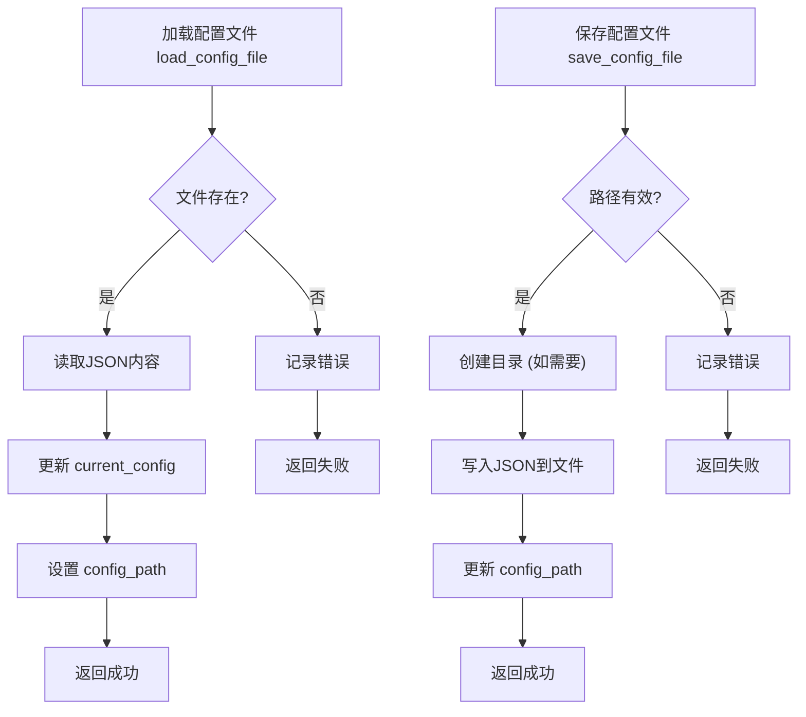
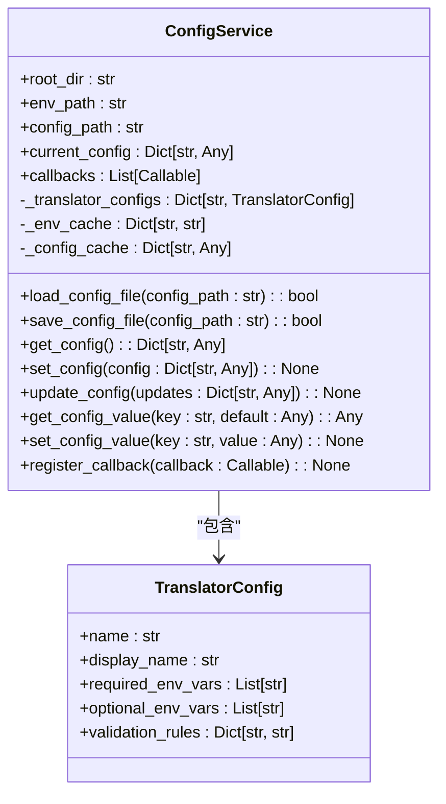
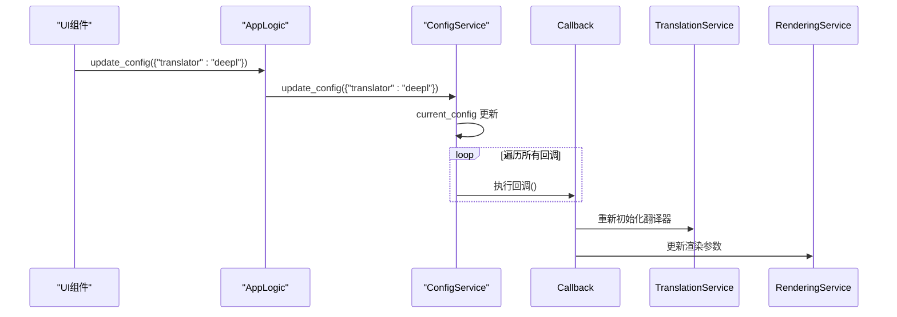

# 配置变更传播

<cite>
**本文档引用文件**   
- [config_service.py](file://desktop-ui/services/config_service.py)
- [app_logic.py](file://desktop-ui/app_logic.py)
</cite>

## 目录
1. [引言](#引言)
2. [核心机制概述](#核心机制概述)
3. [ConfigService 实现细节](#configservice-实现细节)
4. [观察者模式与回调注册](#观察者模式与回调注册)
5. [配置变更的传播流程](#配置变更的传播流程)
6. [配置验证与安全存储](#配置验证与安全存储)
7. [状态重置与工作流重启](#状态重置与工作流重启)
8. [总结](#总结)

## 引言
本文档详细阐述了 `ConfigService` 如何基于观察者模式实现配置的动态更新与跨组件同步。重点分析其如何加载 `config.json` 文件、暴露可监听的配置项（如 `translator`、`target_lang`），以及当用户在UI中修改设置时，如何通过事件通知机制触发所有订阅者（如 `TranslationService`、`RenderingService`）的响应。结合 `app_logic.py` 中的回调注册逻辑，深入探讨配置变更如何引发状态重置或工作流重启，并提供配置验证、默认值回退及敏感信息（API密钥）安全存储的实现细节。

## 核心机制概述
系统采用观察者模式（发布-订阅模式）来实现配置的动态更新。`ConfigService` 作为核心配置中心，负责加载、保存和管理应用程序的配置。当配置发生变更时，它会主动通知所有注册的监听者，确保整个应用的状态保持一致。

**Section sources**
- [config_service.py](file://desktop-ui/services/config_service.py#L0-L40)
- [app_logic.py](file://desktop-ui/app_logic.py#L0-L30)

## ConfigService 实现细节

### 配置加载与保存
`ConfigService` 提供了 `load_config_file` 和 `save_config_file` 方法，用于从磁盘读取和写入 `config.json` 文件。配置数据以字典形式存储在内存中的 `current_config` 字段。



**Diagram sources**
- [config_service.py](file://desktop-ui/services/config_service.py#L140-L187)

### 配置项的访问与更新
服务通过 `get_config_value` 和 `set_config_value` 方法提供对单个配置项的访问。`update_config` 方法允许批量更新配置。



**Diagram sources**
- [config_service.py](file://desktop-ui/services/config_service.py#L0-L40)

**Section sources**
- [config_service.py](file://desktop-ui/services/config_service.py#L140-L220)

## 观察者模式与回调注册

### 回调注册机制
`ConfigService` 维护一个 `callbacks` 列表，允许其他组件通过 `register_callback` 方法注册回调函数。当配置更新时，`set_config` 方法会遍历该列表并执行所有回调。



**Diagram sources**
- [config_service.py](file://desktop-ui/services/config_service.py#L189-L220)
- [app_logic.py](file://desktop-ui/app_logic.py#L85-L96)

### AppLogic 中的回调注册
`AppLogic` 类在初始化时会与 `ConfigService` 建立联系。当配置更新时，`AppLogic` 会同步更新 `StateManager` 中的状态，并通过 `notify_ui` 通知UI层。

```python
# app_logic.py 中的 update_config 方法
def update_config(self, config_updates: Dict[str, Any]) -> bool:
    try:
        self.config_service.update_config(config_updates)  # 触发所有回调
        updated_config = self.config_service.get_config()
        self.state_manager.set_current_config(updated_config) # 同步状态
        self.logger.info("配置更新成功")
        self.notify_ui('config_updated', updated_config)     # 通知UI
        return True
    except Exception as e:
        self.logger.error(f"更新配置异常: {e}")
        return False
```

**Section sources**
- [app_logic.py](file://desktop-ui/app_logic.py#L85-L96)

## 配置变更的传播流程
当用户在UI中修改设置时，完整的配置变更传播流程如下：
1.  UI组件调用 `AppLogic.update_config`。
2.  `AppLogic` 调用 `ConfigService.update_config` 更新内存中的配置。
3.  `ConfigService.set_config` 被调用，内部遍历 `callbacks` 列表。
4.  所有已注册的回调函数被执行，例如 `TranslationService` 可能会检查新的翻译器是否需要重新初始化。
5.  `AppLogic` 同时更新 `StateManager` 并通知UI配置已更新。

此流程确保了配置变更能够高效、可靠地传播到所有依赖组件。

**Section sources**
- [config_service.py](file://desktop-ui/services/config_service.py#L189-L220)
- [app_logic.py](file://desktop-ui/app_logic.py#L85-L96)

## 配置验证与安全存储

### API密钥验证
`ConfigService` 为不同的翻译器定义了 `TranslatorConfig`，其中包含 `validation_rules`。`validate_api_key` 方法使用正则表达式验证API密钥的格式。

```python
# config_service.py 中的验证规则示例
"openai": TranslatorConfig(
    name="openai",
    display_name="OpenAI",
    required_env_vars=["OPENAI_API_KEY"],
    validation_rules={
        "OPENAI_API_KEY": r"^sk-[a-zA-Z0-9]{48}$" # 验证OpenAI密钥格式
    }
)
```

### 环境变量安全存储
敏感信息（如API密钥）存储在项目根目录下的 `.env` 文件中，而非 `config.json`。`ConfigService` 使用 `python-dotenv` 库的 `load_env_vars` 和 `save_env_var` 方法来安全地读写这些信息，避免了密钥的明文暴露。

**Section sources**
- [config_service.py](file://desktop-ui/services/config_service.py#L40-L138)

## 状态重置与工作流重启
配置变更可以触发关键组件的状态重置或工作流重启。例如，在 `AppLogic.start_backend_task` 方法中，会动态构建后端参数 (`_build_backend_args`)，这些参数直接来源于 `ConfigService` 的当前配置。当用户更改了如 `load_text` 或 `prep_manual` 这类影响工作流的选项后，下一次启动任务时，系统会根据新的配置构建不同的参数，从而重启一个不同的工作流。

```python
# app_logic.py 中的 _build_backend_args 方法
def _build_backend_args(self) -> Any:
    current_config = self.config_service.get_config()
    args_list = []
    if current_config.get('load_text', False):
        args_list.append('--load-text')
    # ... 其他配置映射
    return reparse(args_list) # 重新解析参数，影响工作流
```

**Section sources**
- [app_logic.py](file://desktop-ui/app_logic.py#L190-L210)

## 总结
`ConfigService` 通过实现观察者模式，成功地将配置管理与应用的其他部分解耦。它不仅提供了配置的加载、保存和访问功能，还通过回调机制实现了配置变更的自动传播。结合 `AppLogic` 的业务逻辑，配置的更新能够触发状态同步、UI刷新、服务重初始化乃至整个工作流的重启。同时，通过将API密钥等敏感信息分离到 `.env` 文件并进行格式验证，系统在功能性和安全性之间取得了良好的平衡。