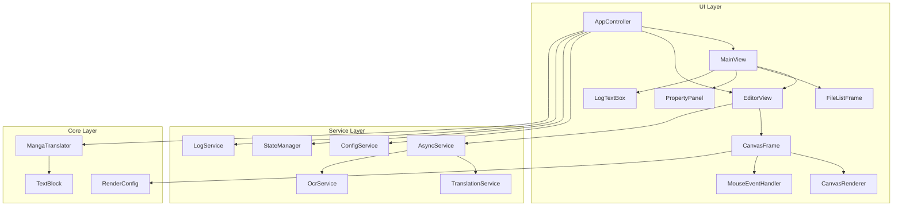

# 用户界面详解

<cite>
**本文档引用的文件**   
- [main.py](file://desktop-ui/main.py)
- [app.py](file://desktop-ui/app.py)
- [editor_frame.py](file://desktop-ui/editor_frame.py)
- [canvas_frame_new.py](file://desktop-ui/canvas_frame_new.py)
- [app_logic.py](file://desktop-ui/app_logic.py)
- [file_list_frame.py](file://desktop-ui/components/file_list_frame.py)
- [property_panel.py](file://desktop-ui/components/property_panel.py)
- [config_service.py](file://desktop-ui/services/config_service.py)
- [state_manager.py](file://desktop-ui/services/state_manager.py)
- [progress_dialog.py](file://desktop-ui/components/progress_dialog.py)
</cite>

## 目录
1. [项目结构](#项目结构)
2. [核心组件](#核心组件)
3. [主窗口布局与功能](#主窗口布局与功能)
4. [UI与后端服务的数据绑定](#ui与后端服务的数据绑定)
5. [核心交互模式](#核心交互模式)
6. [UI状态管理机制](#ui状态管理机制)
7. [进度对话框实现](#进度对话框实现)

## 项目结构

该桌面应用程序的项目结构清晰，遵循了模块化设计原则。主要分为以下几个部分：

- **MangaStudio_Data**: 包含应用核心逻辑、字典、配置文件和主题。
- **cache_tufup**: 用于缓存元数据。
- **desktop-ui**: 核心UI模块，包含所有用户界面组件、服务和逻辑。
- **dict**: 存放翻译字典。
- **examples**: 配置文件示例。
- **manga_translator**: 应用的核心后端逻辑，包括检测、上色、修复、OCR、渲染、翻译等子模块。
- **models**: 模型文件。
- **update_repository**: 更新相关的元数据。

UI部分（`desktop-ui`）是本次分析的重点，其内部结构如下：
- **components**: 可复用的UI组件，如画布渲染器、上下文菜单、文件列表框等。
- **core**: 核心引擎。
- **locales**: 本地化文件。
- **services**: 应用服务，如配置服务、状态管理、日志服务等。
- **utils**: 工具函数。
- **app.py**: 应用主控制器。
- **main.py**: 应用入口点。
- **app_logic.py**: 应用核心逻辑。
- **editing_logic.py**: 编辑逻辑。
- **editor_frame.py**: 视觉编辑器主框架。
- **canvas_frame_new.py**: 画布显示框架。



**图源**
- [app.py](file://desktop-ui/app.py)
- [editor_frame.py](file://desktop-ui/editor_frame.py)
- [canvas_frame_new.py](file://desktop-ui/canvas_frame_new.py)

## 核心组件

应用程序的核心是 `App` 类，它继承自 `customtkinter.CTk`，是整个UI的根窗口。`AppController` 类负责协调所有UI组件和后端服务。`MainView` 和 `EditorView` 是两个主要的视图，分别用于配置和翻译任务，以及进行视觉编辑。

`AppController` 通过 `init_services` 初始化了 `ConfigService` 和 `StateManager` 等关键服务，并通过 `get_config_service()` 获取对它们的引用，实现了UI与后端的连接。

**节源**
- [app.py](file://desktop-ui/app.py#L1-L2366)

## 主窗口布局与功能

主窗口（`MainView`）采用经典的两栏布局，左侧为输入输出（I/O）区域，右侧为设置和日志区域。

### 文件列表区 (File List Frame)
位于左侧，由 `FileListFrame` 组件实现。它提供了一个 `Listbox` 来显示添加的文件和文件夹，并配有“添加文件”、“添加文件夹”、“清空列表”和“移除所选项”等按钮。用户可以通过拖放或点击按钮来添加文件。

### 画布渲染区 (Canvas Render Area)
在 `EditorView` 中，由 `CanvasFrame` 组件实现。它包含一个 `CTkCanvas` 用于显示图像，并通过 `CanvasRenderer` 进行渲染。用户可以在此区域查看图像、文本框、蒙版和修复预览。

### 属性面板 (Property Panel)
在 `EditorView` 中，由 `PropertyPanel` 组件实现。当用户选中一个文本区域时，属性面板会显示该区域的详细信息，如原文、译文、字体大小、颜色、对齐方式等，并允许用户进行修改。

### 日志输出区 (Log Output Area)
位于 `MainView` 的右下角，由一个 `CTkTextbox` 实现。它通过 `TextAreaLogHandler` 和 `QueueIO` 将 `logging` 模块和 `stdout/stderr` 的输出重定向至此，为用户提供翻译过程的实时反馈。

**节源**
- [app.py](file://desktop-ui/app.py#L1600-L2366)
- [editor_frame.py](file://desktop-ui/editor_frame.py#L1-L1665)
- [components/file_list_frame.py](file://desktop-ui/components/file_list_frame.py)

## UI与后端服务的数据绑定

UI组件通过 `AppController` 与后端服务进行数据绑定和事件通信。

### 数据绑定
`AppController` 在 `create_main_view_settings_tabbed` 方法中，使用 `create_param_widgets` 函数遍历配置文件（如 `config-example.json`），为每个配置项动态创建相应的UI控件（如 `CTkEntry`, `CTkOptionMenu`, `CTkSwitch`）。这些控件的值通过 `get_widget_value` 函数读取，并通过 `_save_widget_change` 函数保存回配置文件和 `ConfigService`。

```python
def _save_widget_change(self, full_key, widget=None, value=None):
    # ... 从widget获取值 ...
    # 更新嵌套字典
    keys = full_key.split('.')
    d = config_data
    for key in keys[:-1]:
        d = d.setdefault(key, {})
    d[keys[-1]] = value
    # 保存到文件
    with open(self.current_config_path, 'w', encoding='utf-8') as f:
        json.dump(config_data, f, indent=4, ensure_ascii=False)
    # 同步到服务
    config_service = get_config_service()
    if config_service:
        config_service.set_config(config_data)
```

### 事件通信
UI组件通过回调函数与 `AppController` 通信。例如，`MainView` 中的“开始翻译”按钮绑定了 `controller.start_translation` 方法。`EditorFrame` 中的工具栏按钮和上下文菜单也通过 `register_callback` 将事件注册到 `AppController` 或 `EditorFrame` 本身。

```python
# 在 EditorFrame 中注册回调
self.toolbar.register_callback('export_image', self._export_rendered_image)
self.context_menu.register_callback('translate_text', self._translate_selected_regions)
```

**节源**
- [app.py](file://desktop-ui/app.py#L800-L1599)
- [app_logic.py](file://desktop-ui/app_logic.py)
- [services/config_service.py](file://desktop-ui/services/config_service.py)

## 核心交互模式

### 拖放添加文件
`MainView` 的 `file_listbox` 本身不支持拖放，但 `AppController` 的 `add_files` 和 `add_folder` 方法通过 `filedialog.askopenfilenames` 和 `filedialog.askdirectory` 实现了文件选择，用户可以通过文件对话框添加文件。

### 右键上下文菜单
在 `EditorView` 中，`EditorContextMenu` 组件实现了右键菜单。当用户在画布上右键点击时，`_show_context_menu` 方法会被调用，显示一个包含“添加文本框”、“复制”、“粘贴”、“删除”、“OCR识别”、“翻译文本”等选项的菜单。这些选项通过回调函数与 `EditorFrame` 的功能连接。

```python
def _show_context_menu(self, event):
    self.last_mouse_event = event
    self.context_menu.show_menu(event, len(self.selected_indices))
```

### 实时参数调整反馈
当用户在 `MainView` 中更改设置时，`_debounced_save_widget_change` 函数会延迟500毫秒保存更改，以避免在用户快速输入时频繁写入文件。对于渲染参数，更改会立即通过 `create_param_widgets` 中的 `command` 回调函数触发 `_on_renderer_changed` 等方法，从而更新UI状态。

**节源**
- [app.py](file://desktop-ui/app.py#L1600-L2366)
- [editor_frame.py](file://desktop-ui/editor_frame.py#L1-L1665)
- [components/context_menu.py](file://desktop-ui/components/context_menu.py)

## UI状态管理机制

UI状态管理主要通过 `EditorStateManager` 类（在 `services/editor_history.py` 中）实现，它为 `EditorFrame` 提供了撤销/重做功能。

### 状态管理
`EditorStateManager` 维护了 `undo_stack` 和 `redo_stack` 两个栈。当用户执行一个操作（如移动、缩放、旋转文本框）时，`EditorFrame` 会调用 `history_manager.save_state` 方法，将操作类型、索引、旧数据和新数据作为一个 `Action` 对象压入 `undo_stack`。

```python
def _on_region_moved(self, index, old_data, new_data):
    self.regions_data[index] = new_data
    self.history_manager.save_state(ActionType.MOVE, index, old_data, new_data)
    self._update_canvas_regions()
    self._update_history_buttons()
```

### 事件循环
`App` 类的 `mainloop()` 启动了Tkinter的事件循环。`AppController` 通过 `app.after()` 方法将异步任务（如 `_async_init_heavy_components`）调度到事件循环中执行，确保UI不会被阻塞。`process_log_queue` 方法也通过 `app.after(100, ...)` 定期检查日志队列，将后台进程的日志安全地更新到UI上。

**节源**
- [editor_frame.py](file://desktop-ui/editor_frame.py#L1-L1665)
- [services/editor_history.py](file://desktop-ui/services/editor_history.py)

## 进度对话框实现

`ProgressDialog` 组件（在 `components/progress_dialog.py` 中）用于显示长时间运行任务的进度。

### 创建与显示
当用户在 `EditorFrame` 中点击“渲染”按钮时，`_render_inpainted_image` 方法会被调用。它首先检查 `inpainting_in_progress` 标志，然后创建一个 `ProgressDialog` 实例并显示。

```python
def _render_inpainted_image(self):
    if self.inpainting_in_progress:
        show_toast(self, "渲染已经在进行中...", "info")
        return
    # ... 显示进度对话框 ...
    self.async_service.submit_task(self._generate_inpainted_preview(mask_copy))
```

### 进度同步
`_generate_inpainted_preview` 是一个异步任务。它通过 `async_service` 在后台线程中执行。任务本身会定期更新一个内部的进度变量，并通过 `ProgressDialog` 提供的接口（如 `update_progress`）来更新UI。`ProgressDialog` 内部也使用 `app.after()` 来定期检查和更新进度条，确保与后台任务的进度保持同步。

虽然 `progress_dialog.py` 文件未被直接读取，但其工作模式遵循了UI与异步服务通信的标准模式：UI组件创建对话框并启动任务，异步任务在完成后通过回调或共享状态更新UI。

**节源**
- [editor_frame.py](file://desktop-ui/editor_frame.py#L800-L1599)
- [components/progress_dialog.py](file://desktop-ui/components/progress_dialog.py)