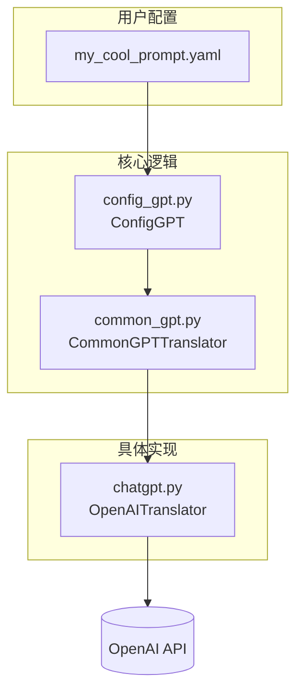
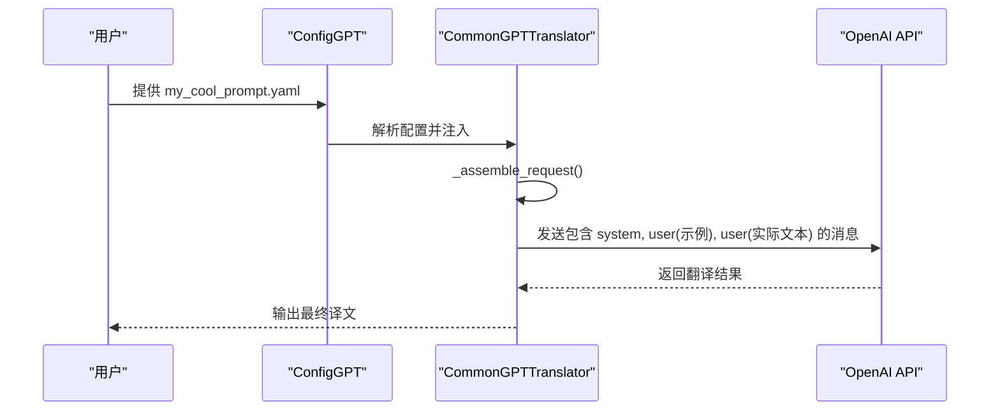
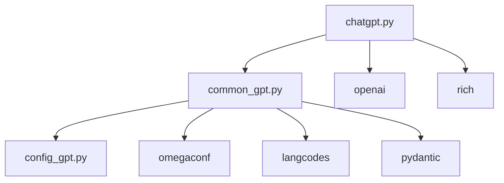

# GPT提示工程

<cite>
**本文档中引用的文件**  
- [my_cool_prompt.yaml](file://MangaStudio_Data/gpt_configs/my_cool_prompt.yaml)
- [common_gpt.py](file://manga_translator/translators/common_gpt.py)
- [config_gpt.py](file://manga_translator/translators/config_gpt.py)
- [chatgpt.py](file://manga_translator/translators/chatgpt.py)
</cite>

## 目录
1. [引言](#引言)  
2. [项目结构](#项目结构)  
3. [核心组件](#核心组件)  
4. [架构概述](#架构概述)  
5. [详细组件分析](#详细组件分析)  
6. [依赖分析](#依赖分析)  
7. [性能考量](#性能考量)  
8. [故障排除指南](#故障排除指南)  
9. [结论](#结论)

## 引言
本技术文档深入探讨了漫画图像翻译器项目中的GPT提示工程机制。重点分析了`my_cool_prompt.yaml`配置文件的结构、`common_gpt.py`中的提示构建逻辑，以及如何将自定义提示注入到`ChatGPTTranslator`等翻译器中。文档旨在为开发者和高级用户提供一个全面的指南，以理解并优化AI翻译的提示词设计，从而提升翻译质量、一致性和风格化表现。

## 项目结构
项目采用模块化设计，主要功能被组织在`manga_translator`目录下。与GPT提示工程直接相关的文件位于`translators`子目录中。`gpt_configs`目录存放用户自定义的提示模板，而`config_gpt.py`和`common_gpt.py`则提供了处理这些配置的核心逻辑。

**文档来源**
- [my_cool_prompt.yaml](file://MangaStudio_Data/gpt_configs/my_cool_prompt.yaml)
- [common_gpt.py](file://manga_translator/translators/common_gpt.py)
- [config_gpt.py](file://manga_translator/translators/config_gpt.py)

## 核心组件
本节分析与GPT提示工程最相关的四个核心文件。

### my_cool_prompt.yaml 配置文件
该文件是用户自定义GPT行为的入口，定义了温度、提示模板和示例等关键参数。

**Section sources**
- [my_cool_prompt.yaml](file://MangaStudio_Data/gpt_configs/my_cool_prompt.yaml#L0-L59)

### common_gpt.py 通用GPT翻译器
该文件定义了`CommonGPTTranslator`基类，封装了提示组装、请求构建和响应解析的通用逻辑。

**Section sources**
- [common_gpt.py](file://manga_translator/translators/common_gpt.py#L0-L506)

### config_gpt.py GPT配置管理
该文件通过`ConfigGPT`类管理所有与GPT相关的配置，包括从YAML文件读取用户设置和提供默认值。

**Section sources**
- [config_gpt.py](file://manga_translator/translators/config_gpt.py#L0-L382)

### chatgpt.py OpenAI翻译器实现
该文件实现了`OpenAITranslator`类，是`CommonGPTTranslator`的具体实现，负责与OpenAI API进行交互。

**Section sources**
- [chatgpt.py](file://manga_translator/translators/chatgpt.py#L0-L799)

## 架构概述
GPT提示工程的架构围绕配置文件、配置管理器和具体翻译器三个核心组件构建。用户通过YAML文件定义提示，`ConfigGPT`类负责解析这些配置，而`CommonGPTTranslator`及其子类则利用这些配置来构建API请求。



**Diagram sources**
- [my_cool_prompt.yaml](file://MangaStudio_Data/gpt_configs/my_cool_prompt.yaml)
- [config_gpt.py](file://manga_translator/translators/config_gpt.py)
- [common_gpt.py](file://manga_translator/translators/common_gpt.py)
- [chatgpt.py](file://manga_translator/translators/chatgpt.py)

## 详细组件分析
本节深入分析提示工程的实现细节。

### 提示模板与系统提示
提示模板（`prompt_template`）和系统提示（`chat_system_template`）是引导AI行为的关键。`prompt_template`会在用户输入前被添加，而`chat_system_template`则定义了AI的“角色”和“人格”。

```python
# 在 my_cool_prompt.yaml 中
prompt_template: '请将以下漫画文本翻译成口语化且自然的 {to_lang}，保持原始语气：'
chat_system_template: >
  你是一位专门从事日本漫画翻译的专家。
  你的翻译必须自然、口语化，并捕捉角色的个性。
  你只能提供翻译文本，不要有任何额外的解释或评论。
  如果文本只是拟声词（如"ドーン"或"BAM"），请原样输出。
  翻译成 {to_lang}。
```

**Section sources**
- [my_cool_prompt.yaml](file://MangaStudio_Data/gpt_configs/my_cool_prompt.yaml#L40-L50)

### 少样本学习（Few-Shot Learning）
通过`chat_sample`字段，用户可以提供输入-输出示例对，这是一种强大的“少样本学习”技术，能有效引导模型生成符合期望风格的译文。

```python
# 在 my_cool_prompt.yaml 中
chat_sample:
  English:
    - <|1|>はじめまして！<|2|>よろしくお願いします。
    - <|1|>Nice to meet you!<|2|>Please take care of me.
```

在`common_gpt.py`中，`_assemble_request`方法会将这些示例作为`user`和`assistant`消息添加到请求中，从而为模型提供上下文。



**Diagram sources**
- [my_cool_prompt.yaml](file://MangaStudio_Data/gpt_configs/my_cool_prompt.yaml)
- [common_gpt.py](file://manga_translator/translators/common_gpt.py#L250-L280)
- [config_gpt.py](file://manga_translator/translators/config_gpt.py)

### 提示构建逻辑
`_assemble_prompts`方法负责将多个待翻译的查询（queries）组装成一个符合API要求的提示。它会检查提示的长度（通过`withinTokenLimit`方法），如果过长，则会将查询拆分成多个批次。

```python
# common_gpt.py 中的 _assemble_prompts 方法
def _assemble_prompts(self, from_lang: str, to_lang: str, queries: List[str]):
    # ... (长度检查和分批逻辑)
    for id_num, query in enumerate(queryList, start=1):
        prompt += f"\n<|{id_num}|>{query.strip()}"
    return prompt
```

**Section sources**
- [common_gpt.py](file://manga_translator/translators/common_gpt.py#L150-L200)

## 依赖分析
GPT提示工程模块依赖于多个外部库和内部模块。



**Diagram sources**
- [common_gpt.py](file://manga_translator/translators/common_gpt.py)
- [config_gpt.py](file://manga_translator/translators/config_gpt.py)
- [chatgpt.py](file://manga_translator/translators/chatgpt.py)

## 性能考量
提示工程对性能有直接影响。较高的`temperature`值会增加输出的随机性，可能导致不一致的翻译。`_MAX_TOKENS_IN`限制了单次请求的输入长度，过长的文本会被拆分，增加了API调用次数和总耗时。此外，`_MAX_REQUESTS_PER_MINUTE`实现了速率限制，防止触发API的流量控制。

## 故障排除指南
当翻译结果不符合预期时，可参考以下步骤进行排查：

1.  **检查配置文件**：确认`my_cool_prompt.yaml`中的`include_template`为`true`，并且`prompt_template`和`chat_system_template`的语法正确。
2.  **验证示例格式**：确保`chat_sample`中的示例使用了`<|数字|>`前缀，并且输入和输出的行数匹配。
3.  **查看日志**：启用`verbose_logging`可以输出完整的GPT提示和响应，便于调试。
4.  **调整参数**：如果出现空翻译或格式错误，尝试降低`temperature`值或检查`_MAX_TOKENS`设置是否过小。

**Section sources**
- [my_cool_prompt.yaml](file://MangaStudio_Data/gpt_configs/my_cool_prompt.yaml)
- [common_gpt.py](file://manga_translator/translators/common_gpt.py)
- [chatgpt.py](file://manga_translator/translators/chatgpt.py)

## 结论
本项目通过`my_cool_prompt.yaml`配置文件和`common_gpt.py`中的精巧设计，实现了高度可定制的GPT提示工程。开发者和用户可以通过调整系统提示、提供上下文示例和微调参数，来引导AI生成高质量、风格化的漫画翻译。理解这一机制是优化翻译结果的关键。