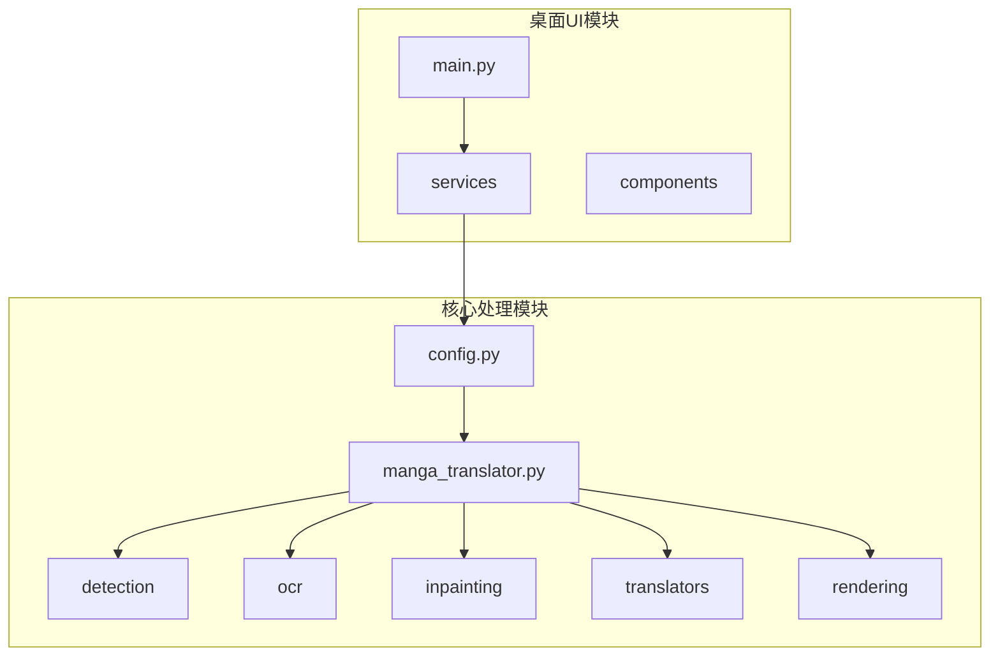
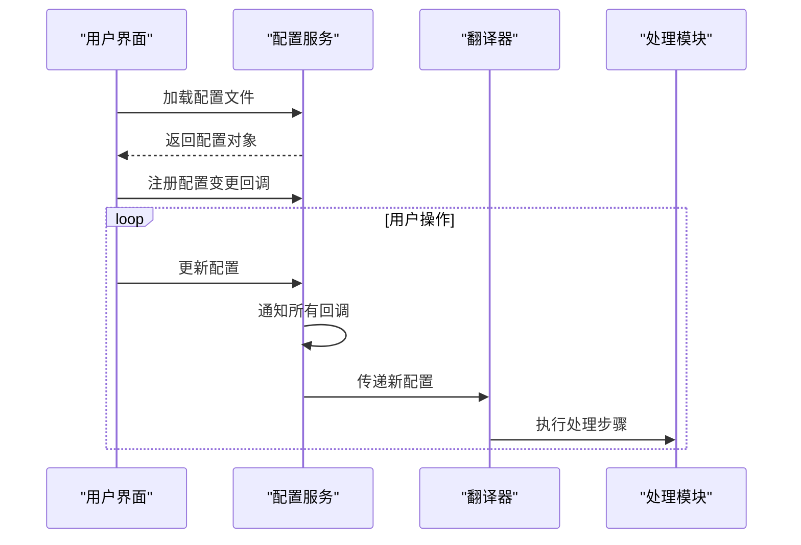
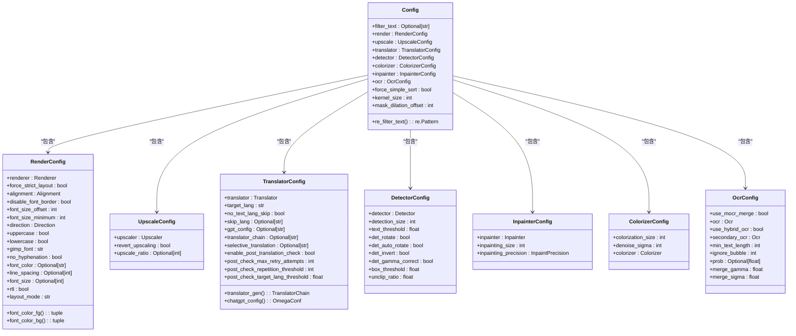
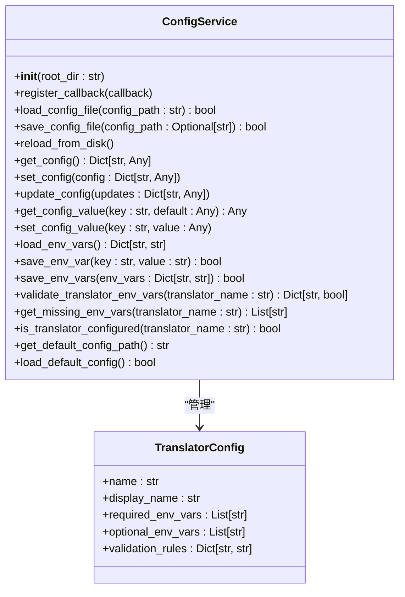
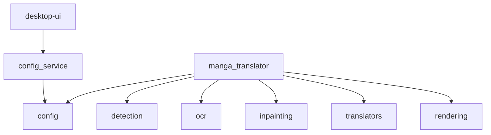

# 主配置文件详解

<cite>
**本文档引用的文件**   
- [config.py](file://manga_translator/config.py)
- [config-example.json](file://examples/config-example.json)
- [config_service.py](file://desktop-ui/services/config_service.py)
</cite>

## 目录
1. [项目结构](#项目结构)
2. [核心组件](#核心组件)
3. [架构概览](#架构概览)
4. [详细组件分析](#详细组件分析)
5. [依赖分析](#依赖分析)
6. [性能考量](#性能考量)
7. [故障排除指南](#故障排除指南)
8. [结论](#结论)

## 项目结构

项目采用模块化分层架构，主要分为核心处理模块（`manga_translator`）和桌面用户界面（`desktop-ui`）两大部分。核心模块负责图像翻译的完整流水线处理，包括检测、OCR、翻译、修复和渲染。UI模块则提供图形化操作界面和配置管理服务。



**图示来源**
- [config.py](file://manga_translator/config.py)
- [manga_translator.py](file://manga_translator/manga_translator.py)

**章节来源**
- [config.py](file://manga_translator/config.py)
- [manga_translator.py](file://manga_translator/manga_translator.py)

## 核心组件

`config.py` 文件定义了整个图像翻译系统的核心配置模型，使用 Pydantic 构建了类型安全的配置结构。`Config` 模型作为根配置，聚合了翻译、检测、修复、OCR、渲染等各个子模块的配置。`ConfigService` 类则负责在UI层加载、保存和管理这些配置。

**章节来源**
- [config.py](file://manga_translator/config.py)
- [config_service.py](file://desktop-ui/services/config_service.py)

## 架构概览

系统采用配置驱动的流水线架构。`Config` 模型作为单一数据源，贯穿整个翻译流程。`ConfigService` 在UI启动时加载配置，当用户修改设置时，通过回调机制通知所有依赖组件更新其行为。



**图示来源**
- [config_service.py](file://desktop-ui/services/config_service.py)
- [manga_translator.py](file://manga_translator/manga_translator.py)

## 详细组件分析

### Config 模型分析

`Config` 模型是整个系统配置的核心，它通过嵌套的 Pydantic 模型组织了所有功能模块的设置。



**图示来源**
- [config.py](file://manga_translator/config.py)

**章节来源**
- [config.py](file://manga_translator/config.py)

#### 翻译模块配置

`TranslatorConfig` 模型管理翻译相关的所有设置。

- **translator**: `Translator` 枚举类型，指定使用的翻译引擎，如 `sugoi`, `chatgpt`, `deepl` 等。
- **target_lang**: 字符串类型，指定目标语言，如 `ENG`, `CHS`。
- **no_text_lang_skip**: 布尔值，若为 `True`，则不会跳过已为目标语言的文本。
- **skip_lang**: 字符串类型，指定要跳过的源语言，可用逗号分隔多个语言。
- **gpt_config**: 字符串类型，指向 GPT 配置文件的路径。
- **translator_chain**: 字符串类型，定义翻译链，例如 `"google:JPN;sugoi:ENG"`。
- **selective_translation**: 字符串类型，根据检测到的语言选择不同的翻译器。
- **enable_post_translation_check**: 布尔值，启用译后验证检查。
- **post_check_max_retry_attempts**: 整数类型，翻译验证失败的最大重试次数。
- **post_check_repetition_threshold**: 整数类型，触发幻觉检测的连续重复字符最小数量。
- **post_check_target_lang_threshold**: 浮点数类型，翻译文本中目标语言的最小比例。

`translator_gen` 属性是一个关键的动态属性，它根据 `selective_translation`、`translator_chain` 或基础 `translator` 和 `target_lang` 设置，动态生成一个 `TranslatorChain` 对象，该对象决定了翻译流程的实际执行顺序。

#### 修复模块配置

`InpainterConfig` 模型控制图像修复过程。

- **inpainter**: `Inpainter` 枚举类型，指定使用的修复模型，如 `lama_large`, `sd` (Stable Diffusion)。
- **inpainting_size**: 整数类型，用于修复的图像尺寸，过大会导致内存溢出。
- **inpainting_precision**: `InpaintPrecision` 枚举类型，指定修复精度，如 `fp32`, `bf16`，推荐使用 `bf16` 以提高性能。

#### OCR模块配置

`OcrConfig` 模型管理光学字符识别设置。

- **use_mocr_merge**: 布尔值，是否在 Manga OCR 推理时使用边界框合并。
- **ocr**: `Ocr` 枚举类型，指定使用的 OCR 模型，如 `48px`, `mocr`。
- **use_hybrid_ocr**: 布尔值，启用混合 OCR 模式，当主引擎失败时使用备用引擎。
- **secondary_ocr**: `Ocr` 枚举类型，混合模式下使用的备用 OCR 引擎。
- **min_text_length**: 整数类型，文本区域的最小文本长度。
- **ignore_bubble**: 整数类型，忽略非气泡区域文本的阈值，推荐值为 5 到 10。
- **prob**: 浮点数或 `None`，文本区域有效的最小概率。
- **merge_gamma** 和 **merge_sigma**: 浮点数类型，控制文本行合并的容差。

#### 渲染模块配置

`RenderConfig` 模型定义了文本渲染的样式和布局。

- **renderer**: `Renderer` 枚举类型，指定渲染器，如 `default`, `manga2eng`。
- **force_strict_layout**: 布尔值，强制渲染器严格遵守边界框。
- **alignment**: `Alignment` 枚举类型，文本对齐方式。
- **disable_font_border**: 布尔值，禁用字体边框。
- **font_size_offset**: 整数类型，字体大小偏移量。
- **direction**: `Direction` 枚举类型，强制文本水平/垂直/无方向渲染。
- **uppercase** / **lowercase**: 布尔值，将文本转换为大写/小写。
- **gimp_font**: 字符串类型，GIMP 渲染使用的字体族。
- **no_hyphenation**: 布尔值，是否禁用连字符。
- **font_color**: 字符串类型，覆盖 OCR 检测到的文本颜色，使用十六进制格式，如 `FFFFFF:000000` 表示白字黑底。
- **rtl**: 布尔值，面板和文本区域排序的从右到左阅读顺序。

`font_color_fg` 和 `font_color_bg` 是两个计算属性，它们将 `font_color` 字符串解析为 RGB 元组，供渲染器直接使用。

### 配置服务分析

`ConfigService` 类是UI层与配置数据之间的桥梁。



**图示来源**
- [config_service.py](file://desktop-ui/services/config_service.py)

**章节来源**
- [config_service.py](file://desktop-ui/services/config_service.py)

`ConfigService` 的核心功能包括：
- **配置文件管理**: 通过 `load_config_file` 和 `save_config_file` 方法加载和保存 JSON 格式的配置文件。
- **环境变量管理**: 通过 `load_env_vars` 和 `save_env_var` 等方法管理 `.env` 文件中的 API 密钥等敏感信息。
- **配置验证**: `validate_translator_env_vars` 和 `is_translator_configured` 方法用于检查特定翻译器所需的环境变量是否完整且格式正确。
- **回调机制**: `register_callback` 方法允许其他UI组件订阅配置变更，实现配置的动态更新。

### 配置文件模板

`config-example.json` 文件提供了一个完整的配置文件模板，展示了所有可配置项及其默认值。

```json
{
  "filter_text": null,
  "kernel_size": 3,
  "mask_dilation_offset": 20,
  "translator": {
    "translator": "chatgpt",
    "target_lang": "CHS",
    "no_text_lang_skip": false,
    "gpt_config": "../examples/gpt_config-example.yaml"
  },
  "ocr": {
    "use_mocr_merge": false,
    "ocr": "48px",
    "use_hybrid_ocr": false,
    "secondary_ocr": "mocr",
    "min_text_length": 0,
    "ignore_bubble": 0,
    "prob": 0.001,
    "merge_gamma": 0.8,
    "merge_sigma": 2.5
  },
  "detector": {
    "detector": "default",
    "detection_size": 2048,
    "text_threshold": 0.5,
    "det_rotate": false,
    "det_auto_rotate": false,
    "det_invert": false,
    "det_gamma_correct": false,
    "box_threshold": 0.01,
    "unclip_ratio": 2.5
  },
  "inpainter": {
    "inpainter": "lama_mpe",
    "inpainting_size": 2048,
    "inpainting_precision": "fp32"
  },
  "render": {
    "renderer": "default",
    "alignment": "auto",
    "disable_font_border": false,
    "font_size_offset": 0,
    "font_size_minimum": 0,
    "direction": "auto",
    "uppercase": false,
    "lowercase": false,
    "gimp_font": "Arial-Unicode-Regular.ttf",
    "no_hyphenation": false,
    "font_color": ":FFFFFF",
    "rtl": true,
    "layout_mode": "smart_scaling"
  },
  "upscale": {
    "upscaler": "esrgan",
    "revert_upscaling": false
  },
  "colorizer": {
    "colorization_size": 576,
    "denoise_sigma": 30,
    "colorizer": "none"
  }
}
```

此模板可以直接复制并修改，以适应不同的翻译需求。

## 依赖分析

系统内部组件依赖关系清晰，核心模块 `manga_translator` 依赖于 `config` 模块来获取运行时配置。UI模块 `desktop-ui` 依赖于 `config_service` 来持久化和管理用户设置。



**图示来源**
- [config.py](file://manga_translator/config.py)
- [config_service.py](file://desktop-ui/services/config_service.py)

**章节来源**
- [config.py](file://manga_translator/config.py)
- [config_service.py](file://desktop-ui/services/config_service.py)

## 性能考量

配置中的多个参数直接影响系统性能和资源消耗：
- **detection_size** 和 **inpainting_size**: 较大的尺寸能提高检测和修复质量，但会显著增加显存占用和处理时间。
- **inpainting_precision**: 使用 `bf16` 或 `fp16` 可以减少显存使用并加速计算，但可能略微降低精度。
- **models_ttl**: 配置中未直接暴露，但 `MangaTranslator` 类中的 `models_ttl` 参数控制模型在内存中保留的时间，设置为 0 表示永不卸载，可以提高连续处理多张图片的速度，但会占用更多显存。

## 故障排除指南

- **配置加载失败**: 检查 `config-example.json` 文件路径是否正确，文件格式是否为有效的 JSON。
- **翻译器无法使用**: 使用 `ConfigService` 的 `is_translator_configured` 方法检查所需环境变量是否已正确设置。
- **修复过程显存溢出**: 尝试降低 `inpainting_size` 或 `detection_size` 的值。
- **OCR 识别率低**: 尝试启用 `det_rotate` 或 `det_invert` 等检测器选项，或切换到不同的 OCR 模型。

**章节来源**
- [config.py](file://manga_translator/config.py)
- [config_service.py](file://desktop-ui/services/config_service.py)

## 结论

`config.py` 中定义的 `Config` 模型是整个图像翻译系统的核心，它通过结构化的、类型安全的配置，实现了对翻译流程的精细控制。`ConfigService` 则为UI提供了强大的配置管理能力，支持动态更新和持久化。理解这些配置项的含义和相互关系，是高效使用和定制该系统的关键。