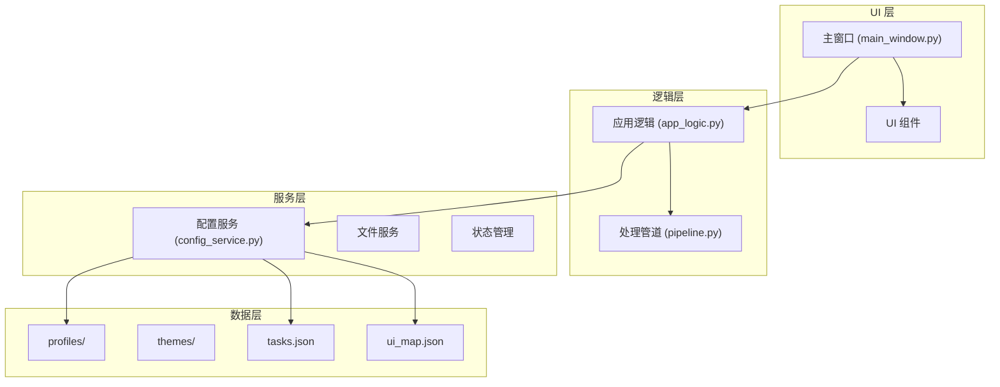
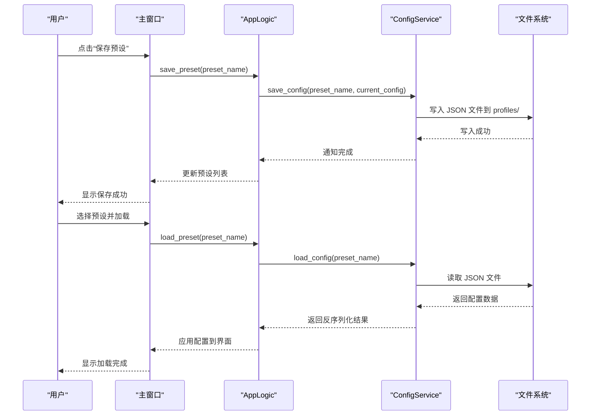
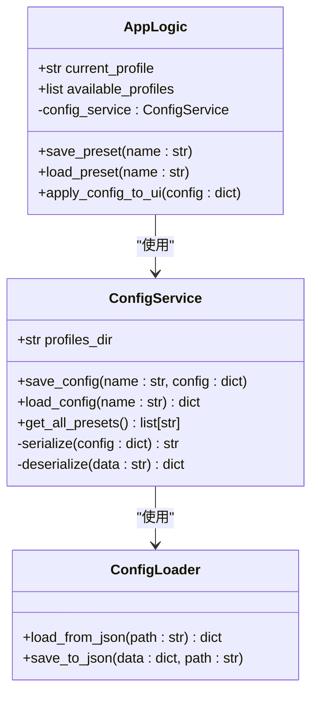
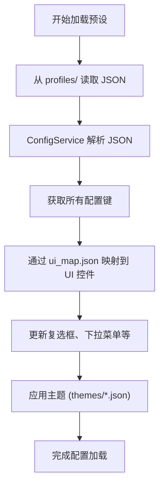
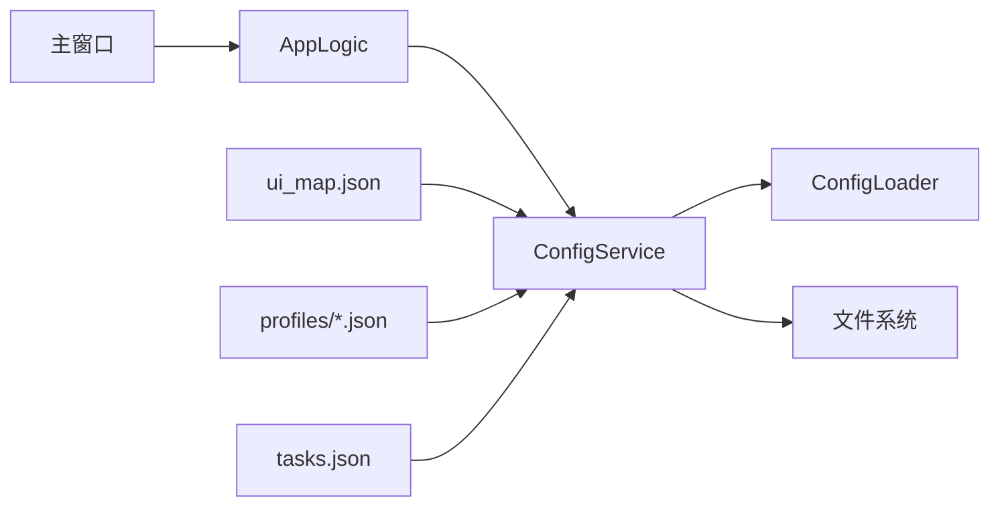

# 检查点与预设管理

<cite>
**本文档中引用的文件**  
- [app_logic.py](file://desktop-ui/app_logic.py)
- [config_service.py](file://desktop-ui/services/config_service.py)
- [config_loader.py](file://MangaStudio_Data/app/core/config_loader.py)
- [Admin Preset (Creator's custom config - hardware dependent).json](file://MangaStudio_Data/profiles/Admin Preset (Creator's custom config - hardware dependent).json)
- [main_window.py](file://MangaStudio_Data/app/ui/main_window.py)
- [ui_map.json](file://MangaStudio_Data/ui_map.json)
- [tasks.json](file://MangaStudio_Data/tasks.json)
</cite>

## 目录
1. [简介](#简介)
2. [项目结构](#项目结构)
3. [核心组件](#核心组件)
4. [架构概述](#架构概述)
5. [详细组件分析](#详细组件分析)
6. [依赖分析](#依赖分析)
7. [性能考量](#性能考量)
8. [故障排除指南](#故障排除指南)
9. [结论](#结论)

## 简介
本文件详细说明了“检查点”（Checkpoint）系统在漫画图像翻译工具中的实现机制和使用方法。该系统允许用户在图形用户界面（UI）中为特定任务保存和加载配置快照，这些快照以JSON格式存储于`MangaStudio_Data/profiles/`目录下。文档将深入分析`AppLogic`与`ConfigService`如何协同工作以实现配置的持久化与切换，并提供创建、管理和应用预设的最佳实践，包括为不同硬件环境（如CPU/GPU）或不同漫画风格定制专用预设的方法。

## 项目结构
项目采用模块化分层架构，主要分为前端UI、核心逻辑、服务层和数据存储四大部分。配置文件和预设数据集中存放在`MangaStudio_Data`目录下的特定子目录中，确保良好的组织性和可维护性。



**图示来源**
- [main_window.py](file://MangaStudio_Data/app/ui/main_window.py#L1-L50)
- [app_logic.py](file://desktop-ui/app_logic.py#L1-L40)
- [config_service.py](file://desktop-ui/services/config_service.py#L1-L35)

**本节来源**
- [main_window.py](file://MangaStudio_Data/app/ui/main_window.py#L1-L100)
- [app_logic.py](file://desktop-ui/app_logic.py#L1-L100)

## 核心组件
系统的核心组件包括`AppLogic`、`ConfigService`和配置文件管理器。`AppLogic`负责协调UI操作与后台服务之间的交互；`ConfigService`封装了所有与配置读写相关的功能，支持从JSON文件加载和保存配置；而`config_loader.py`则提供了底层的序列化和反序列化能力。

**本节来源**
- [app_logic.py](file://desktop-ui/app_logic.py#L20-L150)
- [config_service.py](file://desktop-ui/services/config_service.py#L10-L80)
- [config_loader.py](file://MangaStudio_Data/app/core/config_loader.py#L5-L60)

## 架构概述
整个系统的架构围绕配置驱动的设计理念构建，允许用户通过UI界面灵活地保存、加载和切换不同的配置预设。当用户执行“保存预设”操作时，`AppLogic`调用`ConfigService`将当前UI状态和处理参数序列化为JSON并写入`profiles/`目录。加载时则反向操作，恢复完整状态。



**图示来源**
- [app_logic.py](file://desktop-ui/app_logic.py#L80-L140)
- [config_service.py](file://desktop-ui/services/config_service.py#L40-L100)
- [main_window.py](file://MangaStudio_Data/app/ui/main_window.py#L60-L120)

## 详细组件分析

### AppLogic 与 ConfigService 协同机制
`AppLogic`作为中央控制器，接收来自UI的事件请求，并调用`ConfigService`进行实际的配置持久化操作。这种职责分离提高了代码的可测试性和可维护性。

#### 类图展示核心类关系


**图示来源**
- [app_logic.py](file://desktop-ui/app_logic.py#L1-L150)
- [config_service.py](file://desktop-ui/services/config_service.py#L1-L100)
- [config_loader.py](file://MangaStudio_Data/app/core/config_loader.py#L1-L50)

**本节来源**
- [app_logic.py](file://desktop-ui/app_logic.py#L1-L200)
- [config_service.py](file://desktop-ui/services/config_service.py#L1-L120)

### 预设配置的存储结构
所有预设均以JSON格式存储在`MangaStudio_Data/profiles/`目录下，文件名即为预设名称。每个JSON文件包含完整的UI状态和处理参数，例如OCR引擎选择、翻译模型、渲染样式等。

示例内容（简化）：
```json
{
  "ocr_engine": "manga_ocr",
  "translator": "sakura",
  "render_font": "default",
  "theme": "sakura_sunset",
  "inpainting_model": "lama",
  "upscaling_factor": 2,
  "gpu_acceleration": true,
  "post_processing": {
    "remove_noise": true,
    "sharpen": false
  }
}
```

**本节来源**
- [Admin Preset (Creator's custom config - hardware dependent).json](file://MangaStudio_Data/profiles/Admin Preset (Creator's custom config - hardware dependent).json#L1-L50)
- [config_service.py](file://desktop-ui/services/config_service.py#L60-L90)

### UI 映射与任务配置
`ui_map.json`定义了UI控件与配置键之间的映射关系，使得`AppLogic`能够自动将配置值绑定到对应控件上。`tasks.json`则存储了批量处理任务的配置模板。



**图示来源**
- [ui_map.json](file://MangaStudio_Data/ui_map.json#L1-L30)
- [tasks.json](file://MangaStudio_Data/tasks.json#L1-L25)
- [config_service.py](file://desktop-ui/services/config_service.py#L70-L110)

**本节来源**
- [ui_map.json](file://MangaStudio_Data/ui_map.json#L1-L50)
- [tasks.json](file://MangaStudio_Data/tasks.json#L1-L40)
- [config_service.py](file://desktop-ui/services/config_service.py#L50-L120)

## 依赖分析
系统各组件之间存在清晰的依赖层级，避免了循环依赖问题。UI层仅依赖逻辑层，逻辑层依赖服务层，服务层依赖数据访问工具。



**图示来源**
- [app_logic.py](file://desktop-ui/app_logic.py#L1-L150)
- [config_service.py](file://desktop-ui/services/config_service.py#L1-L100)
- [config_loader.py](file://MangaStudio_Data/app/core/config_loader.py#L1-L50)

**本节来源**
- [app_logic.py](file://desktop-ui/app_logic.py#L1-L200)
- [config_service.py](file://desktop-ui/services/config_service.py#L1-L150)

## 性能考量
- **序列化开销**：大型配置文件可能导致加载延迟，建议对不常变动的部分进行拆分。
- **磁盘I/O**：频繁保存预设可能影响响应速度，可引入内存缓存机制。
- **UI绑定效率**：通过`ui_map.json`集中管理映射关系，避免硬编码，提升维护性。

## 故障排除指南
- **预设未出现在列表中**：检查`profiles/`目录权限及JSON文件格式是否正确。
- **加载后UI未更新**：确认`ui_map.json`中键名与配置一致。
- **主题不生效**：确保主题文件存在于`themes/`目录且名称匹配。
- **GPU设置未保存**：检查配置是否包含`gpu_acceleration`字段并正确序列化。

**本节来源**
- [config_service.py](file://desktop-ui/services/config_service.py#L90-L130)
- [app_logic.py](file://desktop-ui/app_logic.py#L130-L180)
- [Admin Preset (Creator's custom config - hardware dependent).json](file://MangaStudio_Data/profiles/Admin Preset (Creator's custom config - hardware dependent).json#L1-L60)

## 结论
检查点与预设管理系统通过`AppLogic`与`ConfigService`的紧密协作，实现了配置的高效持久化与快速切换。该设计不仅提升了用户体验，还为多环境适配（如CPU/GPU）、多风格处理（如不同漫画类型）提供了坚实基础。建议用户根据硬件能力和翻译风格创建专用预设，以最大化工具效能。