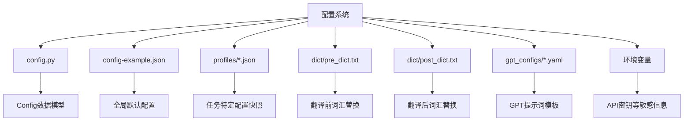
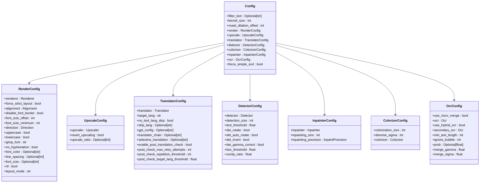
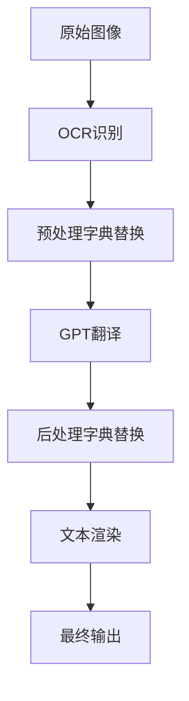
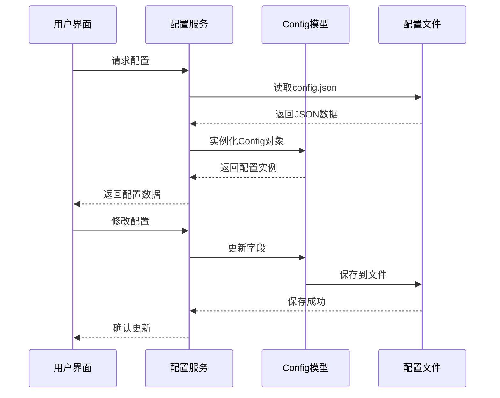

# 配置系统

<cite>
**本文档引用的文件**  
- [config.py](file://manga_translator/config.py)
- [config-example.json](file://examples/config-example.json)
- [pre_dict.txt](file://dict/pre_dict.txt)
- [post_dict.txt](file://dict/post_dict.txt)
- [gpt_config-example.yaml](file://examples/gpt_config-example.yaml)
</cite>

## 目录
1. [项目结构](#项目结构)  
2. [核心配置模型详解](#核心配置模型详解)  
3. [全局JSON配置文件](#全局json配置文件)  
4. [预处理与后处理字典](#预处理与后处理字典)  
5. [GPT提示配置](#gpt提示配置)  
6. [检查点（Profiles）机制](#检查点profiles机制)  
7. [配置服务与运行时加载](#配置服务与运行时加载)  
8. [环境变量与API密钥管理](#环境变量与api密钥管理)  

## 项目结构

本项目的配置系统由多个层级组成，涵盖代码定义、JSON全局配置、用户界面检查点、字典替换规则以及GPT提示模板。主要配置相关文件分布如下：



**Diagram sources**  
- [config.py](file://manga_translator/config.py)
- [examples/config-example.json](file://examples/config-example.json)
- [dict/pre_dict.txt](file://dict/pre_dict.txt)
- [dict/post_dict.txt](file://dict/post_dict.txt)

## 核心配置模型详解

`config.py` 文件中定义了完整的配置数据模型，使用 Pydantic 和 OmegaConf 实现类型安全和灵活配置。

### Config 主模型结构

`Config` 类是根配置模型，包含多个子模块配置：



**Diagram sources**  
- [manga_translator/config.py](file://manga_translator/config.py#L150-L363)

**Section sources**  
- [manga_translator/config.py](file://manga_translator/config.py#L150-L363)

### 枚举类型定义

配置系统使用枚举类型确保选项的合法性：

| 枚举类型 | 可选值 | 说明 |
|---------|------|------|
| `Renderer` | default, manga2Eng, manga2EngPillow, gimp, none | 渲染器类型 |
| `Alignment` | auto, left, center, right | 文本对齐方式 |
| `Direction` | auto, h, v | 文本方向 |
| `InpaintPrecision` | fp32, fp16, bf16 | 修复精度 |
| `Detector` | default, dbconvnext, ctd, craft, paddle, none | 检测器类型 |
| `Inpainter` | default, lama_large, lama_mpe, sd, none, original | 修复模型 |
| `Colorizer` | none, mc2 | 上色器 |
| `Ocr` | 32px, 48px, 48px_ctc, mocr | OCR模型 |
| `Translator` | youdao, baidu, deepl, papago, caiyun, chatgpt, sakura, deepseek, gemini, groq, custom_openai, offline, nllb, m2m100, mbart50, qwen2 等 | 翻译引擎 |
| `Upscaler` | waifu2x, esrgan, 4xultrasharp | 放大器 |

**Section sources**  
- [manga_translator/config.py](file://manga_translator/config.py#L20-L149)

## 全局JSON配置文件

`config-example.json` 提供了全局配置的模板，可作为默认配置文件使用。

### 配置文件结构分析

```json
{
  "filter_text": null,
  "kernel_size": 3,
  "mask_dilation_offset": 20,
  "translator": {
    "translator": "chatgpt",
    "target_lang": "CHS",
    "no_text_lang_skip": false,
    "gpt_config": "../examples/gpt_config-example.yaml"
  },
  "ocr": {
    "use_mocr_merge": false,
    "ocr": "48px",
    "use_hybrid_ocr": false,
    "secondary_ocr": "mocr",
    "min_text_length": 0,
    "ignore_bubble": 0,
    "prob": 0.001,
    "merge_gamma": 0.8,
    "merge_sigma": 2.5
  },
  "detector": {
    "detector": "default",
    "detection_size": 2048,
    "text_threshold": 0.5,
    "det_rotate": false,
    "det_auto_rotate": false,
    "det_invert": false,
    "det_gamma_correct": false,
    "box_threshold": 0.01,
    "unclip_ratio": 2.5
  },
  "inpainter": {
    "inpainter": "lama_mpe",
    "inpainting_size": 2048,
    "inpainting_precision": "fp32"
  },
  "render": {
    "renderer": "default",
    "alignment": "auto",
    "disable_font_border": false,
    "font_size_offset": 0,
    "font_size_minimum": 0,
    "direction": "auto",
    "uppercase": false,
    "lowercase": false,
    "gimp_font": "Arial-Unicode-Regular.ttf",
    "font_path": "Arial-Unicode-Regular.ttf",
    "no_hyphenation": false,
    "font_color": ":FFFFFF",
    "rtl": true,
    "layout_mode": "smart_scaling"
  },
  "upscale": {
    "upscaler": "esrgan",
    "revert_upscaling": false
  },
  "colorizer": {
    "colorization_size": 576,
    "denoise_sigma": 30,
    "colorizer": "none"
  }
}
```

### 关键配置项说明

| 配置项 | 数据类型 | 默认值 | 业务含义 |
|-------|--------|-------|--------|
| `filter_text` | string/null | null | 正则表达式过滤特定文本区域 |
| `kernel_size` | int | 3 | 文字擦除区域的卷积核大小 |
| `mask_dilation_offset` | int | 20 | 扩展文本掩码以清除残留像素 |
| `translator.translator` | Translator | sugoi | 主要翻译引擎 |
| `translator.target_lang` | string | ENG | 目标语言（如CHS、ENG） |
| `translator.no_text_lang_skip` | bool | false | 是否跳过已为目标语言的文本 |
| `translator.gpt_config` | string/null | null | GPT配置文件路径 |
| `ocr.ocr` | Ocr | 48px | OCR模型选择 |
| `detector.detector` | Detector | default | 文本检测器 |
| `inpainter.inpainter` | Inpainter | lama_large | 图像修复模型 |
| `render.renderer` | Renderer | default | 文本渲染器 |
| `upscale.upscaler` | Upscaler | esrgan | 图像放大器 |

**Section sources**  
- [examples/config-example.json](file://examples/config-example.json)

## 预处理与后处理字典

预处理字典（`pre_dict.txt`）和后处理字典（`post_dict.txt`）用于在翻译前后进行词汇替换，提升翻译质量。

### 字典文件格式

```
# 格式：源词[至少一个Tab/空格]目标词[至少一个Tab/空格][#注释 或 //注释]
傲娇	Tsundere	# 表面冷漠内心温柔的角色
第([0-9]+)话	Episode $1	# 匹配集数
```

### 预处理字典 (pre_dict.txt)

在翻译前进行词汇替换，用于标准化输入文本：

```txt
# Anime Character Type
傲娇	Tsundere
元气少女	Genki Girl
天然呆	Dandere

# Anime Term
萌化	Moe-fication
燃	Burning/Hype
中二病	Chuunibyou

# Character Names and Gender
野比大雄	Nobita Nobi
源静香	Shizuka Minamoto

# Regular Expression
第([0-9]+)话	Episode $1
(男|女)主角	(Male|Female) Protagonist
```

### 后处理字典 (post_dict.txt)

在翻译后进行词汇替换，用于统一输出术语：

```txt
# Anime Character Type
傲娇	Tsundere
元气少女	Genki Girl

# ACG
同人志	Doujinshi
御宅族	Otaku
声优	Voice Actor
```

### 工作流程



**Diagram sources**  
- [dict/pre_dict.txt](file://dict/pre_dict.txt)
- [dict/post_dict.txt](file://dict/post_dict.txt)

**Section sources**  
- [dict/pre_dict.txt](file://dict/pre_dict.txt)
- [dict/post_dict.txt](file://dict/post_dict.txt)

## GPT提示配置

GPT提示配置文件（如 `gpt_config-example.yaml`）定义了与GPT模型交互的提示词模板。

### 配置结构

虽然未提供具体文件内容，但从 `TranslatorConfig.gpt_config` 字段可知，系统支持通过YAML文件自定义GPT提示。

### 自定义方法

1. 创建YAML配置文件
2. 定义系统提示（system prompt）和用户提示模板
3. 在 `config.json` 中通过 `gpt_config` 字段引用该文件路径

### 典型应用场景

- 自定义翻译风格（正式、口语化、幽默等）
- 添加领域知识（动漫术语、角色名等）
- 控制输出格式（JSON、纯文本等）

**Section sources**  
- [examples/gpt_config-example.yaml](file://examples/gpt_config-example.yaml)

## 检查点（Profiles）机制

通过UI界面可以创建和管理“检查点”（Profiles），这些是任务特定的配置快照，存储在 `profiles/` 目录下。

### 检查点文件

- 文件路径：`profiles/*.json`
- 示例文件：`Admin Preset (Creator's custom config - hardware dependent).json`
- 作用：保存特定任务的完整配置，便于重复使用

### 与全局配置的关系


检查点会覆盖全局配置中的相应字段，实现任务级别的配置管理。

**Section sources**  
- [profiles/Admin Preset (Creator's custom config - hardware dependent).json](file://MangaStudio_Data/profiles/Admin Preset (Creator's custom config - hardware dependent).json)

## 配置服务与运行时加载

`config_service.py` 负责实现配置的动态加载与监听。

### 核心功能

- 加载JSON配置文件
- 监听配置变化
- 提供运行时配置访问接口
- 支持配置热更新

### 数据流



**Diagram sources**  
- [desktop-ui/services/config_service.py](file://desktop-ui/services/config_service.py)

## 环境变量与API密钥管理

敏感信息如API密钥应通过环境变量管理，而非硬编码在配置文件中。

### 推荐做法

1. 在 `.env` 文件中定义环境变量：
   ```env
   OPENAI_API_KEY=your_key_here
   DEEPL_AUTH_KEY=your_key_here
   ```

2. 在代码中通过 `os.getenv()` 读取：
   ```python
   import os
   api_key = os.getenv('OPENAI_API_KEY')
   ```

3. 在 `config.json` 中留空或使用占位符：
   ```json
   "gpt_config": "../examples/gpt_config-example.yaml"
   ```

### 安全性考虑

- 避免将API密钥提交到版本控制系统
- 使用环境变量或密钥管理服务
- 提供示例配置文件（如 `config-example.json`）时不包含真实密钥

**Section sources**  
- [examples/config-example.json](file://examples/config-example.json)