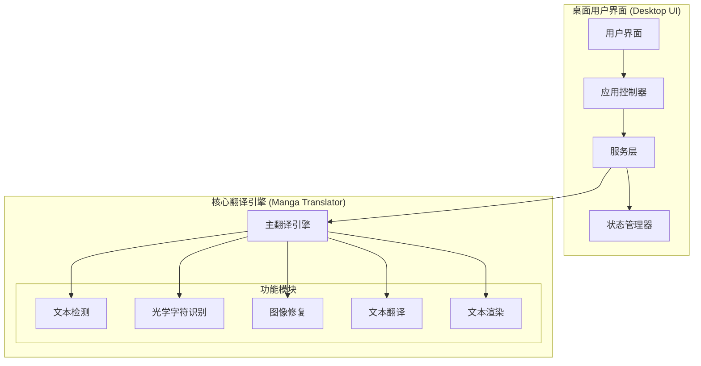
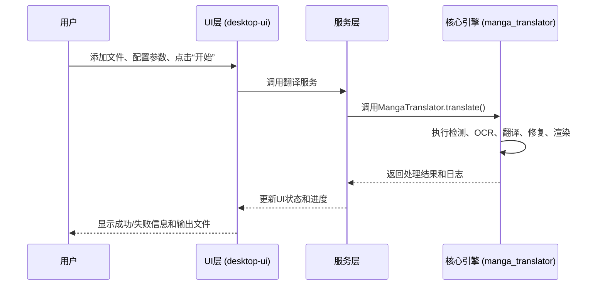
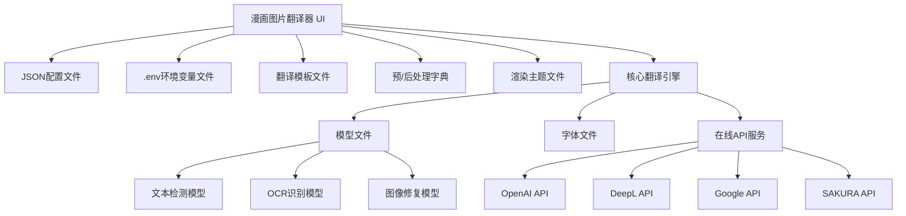

# 项目概述

<cite>
**本文档引用的文件**   
- [README.md](file://README.md)
- [README_CN.md](file://README_CN.md)
- [manga_translator.py](file://manga_translator/manga_translator.py)
- [config.py](file://manga_translator/config.py)
- [main.py](file://desktop-ui/main.py)
- [app.py](file://desktop-ui/app.py)
- [app_logic.py](file://desktop-ui/app_logic.py)
- [config_service.py](file://desktop-ui/services/config_service.py)
- [translation_service.py](file://desktop-ui/services/translation_service.py)
</cite>

## 目录
1. [项目概述](#项目概述)
2. [核心架构与设计](#核心架构与设计)
3. [主要用户群体与工作流价值](#主要用户群体与工作流价值)
4. [UI层与核心引擎层的职责划分](#ui层与核心引擎层的职责划分)
5. [典型使用场景](#典型使用场景)
6. [系统上下文图](#系统上下文图)
7. [关键术语解释](#关键术语解释)

## 项目概述

本项目是一个集成化的漫画图像翻译桌面应用，其核心目标是为用户提供一个功能完整、易于使用的图形界面（GUI），以简化和增强对原生命令行工具 `manga-image-translator` 的使用体验。该项目由 `hgmzhn` 开发，旨在将强大的后端翻译引擎与现代化的前端用户界面相结合，实现从图像输入到翻译输出的端到端自动化翻译流程。

该应用的设计初衷是解决原生 `manga-image-translator` 项目在易用性上的不足。原项目虽然功能强大，但主要依赖命令行操作，对非技术用户和需要频繁进行手动校对的汉化组成员来说门槛较高。本项目通过提供一个直观的桌面应用，将复杂的配置和处理流程可视化，使用户能够通过点击和拖拽等简单操作完成整个翻译任务，极大地降低了使用难度。

其整体架构理念遵循“前后端分离”的原则。前端（`desktop-ui`）专注于用户交互、状态管理和任务调度，提供现代化的UI和强大的可视化编辑器。后端（`manga_translator`）则作为独立的、功能完备的核心引擎，负责处理所有复杂的图像处理和翻译逻辑。这种设计确保了核心功能的稳定性和可维护性，同时允许UI层独立迭代和优化，为用户带来最佳的使用体验。

## 核心架构与设计

本项目的架构清晰地划分为两个主要部分：桌面用户界面（Desktop UI）和核心翻译引擎（Manga Translator Core Engine）。这种分层设计实现了关注点分离，使得系统更易于开发、测试和维护。

**Diagram sources**
- [main.py](file://desktop-ui/main.py#L1-L99)
- [app.py](file://desktop-ui/app.py#L1-L2367)
- [manga_translator.py](file://manga_translator/manga_translator.py#L1-L3172)

**Section sources**
- [README.md](file://README.md#L1-L598)
- [manga_translator.py](file://manga_translator/manga_translator.py#L1-L3172)

## 主要用户群体与工作流价值

本项目主要服务于以下三类用户群体，为他们的工作流带来了显著的价值：

1.  **漫画汉化组**: 这是最核心的用户群体。他们需要处理大量的漫画章节，进行批量翻译。本应用的批量处理功能和可视化编辑器极大地提升了他们的工作效率。他们可以一次性添加整章图片，设置好配置后一键启动翻译。对于需要精细调整的页面，内置的编辑器允许他们手动修正OCR识别错误或调整文本渲染效果，确保最终成品的高质量。

2.  **独立译者**: 独立译者通常处理个人项目或小型作品。他们需要一个灵活且功能强大的工具。本应用提供的多种翻译器选择（如Sakura、ChatGPT、DeepL等）、自定义词典和渲染主题，允许他们根据个人偏好和项目需求进行深度定制。预/后处理字典功能可以帮助他们统一术语，保证翻译风格的一致性。

3.  **开发者**: 对于希望将翻译功能集成到自己项目中的开发者，本应用的模块化设计提供了清晰的参考。他们可以研究UI层与核心引擎的交互方式，利用核心引擎的API构建自己的应用。同时，开发者也可以通过贡献代码来扩展翻译器或OCR模型，共同推动项目发展。

在实际工作流中，该应用的价值体现在将原本繁琐的命令行操作和配置文件编辑，转变为直观的图形化操作。用户无需记忆复杂的命令行参数，所有设置都通过下拉菜单、复选框和滑块来完成。这不仅减少了出错的可能性，也使得整个翻译过程更加流畅和高效。

## UI层与核心引擎层的职责划分

项目中的 `desktop-ui` 和 `manga_translator` 两个核心目录，分别代表了UI层和核心引擎层，它们的职责划分明确，通过定义良好的接口进行交互。

*   **UI层 (`desktop-ui`)**:
    *   **职责**: 负责所有与用户相关的交互。这包括构建图形用户界面（如主窗口、设置面板、文件列表）、处理用户输入（如点击按钮、拖拽文件）、管理应用状态（如当前文件列表、配置参数）以及显示处理进度和日志。
    *   **关键组件**:
        *   `main.py`: 应用程序的入口点，负责初始化UI框架和启动主循环。
        *   `app.py`: 主应用控制器，协调各个UI组件和后端服务。
        *   `services/`: 服务层，包含配置管理、文件管理、翻译服务等，是UI与后端引擎的桥梁。
        *   `components/`: 可复用的UI组件，如文件列表、进度条、编辑器画布等。

*   **核心引擎层 (`manga_translator`)**:
    *   **职责**: 负责执行所有底层的图像处理和翻译任务。它接收来自UI层的指令和配置，然后独立地完成从图像加载、文本检测、OCR识别、文本翻译、图像修复到最终文本渲染的完整流程。
    *   **关键组件**:
        *   `manga_translator.py`: 核心调度器，定义了翻译流程的主干逻辑。
        *   `config.py`: 定义了所有配置项的数据结构和默认值。
        *   各功能模块 (`detection`, `ocr`, `inpainting`, `translators`, `rendering`): 实现具体算法的独立模块。

两层之间的交互关系是：UI层通过 `app_logic.py` 和 `services` 目录下的服务（如 `translation_service.py`）收集用户配置和文件列表，然后调用核心引擎的 `MangaTranslator` 类的 `translate` 方法。核心引擎执行完毕后，将结果（如处理后的图像路径、日志信息）返回给UI层进行展示。

**Diagram sources**
- [app.py](file://desktop-ui/app.py#L1-L2367)
- [app_logic.py](file://desktop-ui/app_logic.py#L1-L318)
- [manga_translator.py](file://manga_translator/manga_translator.py#L1-L3172)

**Section sources**
- [app.py](file://desktop-ui/app.py#L1-L2367)
- [app_logic.py](file://desktop-ui/app_logic.py#L1-L318)
- [manga_translator.py](file://manga_translator/manga_translator.py#L1-L3172)

## 典型使用场景

本项目支持多种使用场景，满足不同用户的需求：

*   **批量处理漫画章节**: 用户可以将一整章的漫画图片（如001.png, 002.png, ...）所在的文件夹拖入应用。在设置好翻译器（如Sakura）、目标语言（简体中文）和渲染参数后，点击“开始翻译”按钮。应用会自动遍历文件夹中的所有图片，依次执行翻译流程，并将结果保存到指定的输出目录，极大地简化了批量处理的工作。

*   **自定义翻译风格**: 用户可以通过多种方式自定义翻译风格。例如，使用“预/后处理字典”来确保特定术语（如角色名、专有名词）的翻译一致性。通过选择不同的“渲染主题”（如 `sakura_sunset.json`）来改变最终输出的字体、颜色和背景效果。此外，用户还可以通过“GPT配置”文件，为ChatGPT等AI翻译器编写自定义提示词（Prompt），以获得更符合预期的翻译结果。

*   **手动校对与编辑**: 对于OCR识别错误或自动翻译不理想的情况，用户可以使用内置的“视觉编辑器”。在编辑器中，他们可以手动调整文本区域的边界、旋转文本框、甚至直接修改识别出的原文或译文，然后重新渲染，确保最终效果完美。

## 系统上下文图

下图展示了本应用、其依赖的服务、模型和配置文件之间的系统级依赖关系。

**Diagram sources**
- [README.md](file://README.md#L1-L598)
- [config.py](file://manga_translator/config.py#L1-L364)

## 关键术语解释

*   **检查点 (Checkpoint)**: 在机器学习领域，检查点通常指模型在训练过程中的某个时间点的快照，包含了模型的权重和状态。在本项目中，它指的是下载并存储在 `models/` 目录下的各种预训练模型文件（如检测模型、OCR模型），这些文件是执行相应任务所必需的。

*   **预/后处理字典 (Pre/Post Dictionary)**: 这是两个文本文件（`pre_dict.txt` 和 `post_dict.txt`），用于在翻译流程的不同阶段进行文本替换。`pre_dict.txt` 中的规则会在文本被送入翻译器之前应用，常用于将缩写或特殊符号替换为完整形式。`post_dict.txt` 中的规则会在翻译完成后应用，常用于将翻译结果中的术语统一为用户指定的表达。

*   **渲染主题 (Render Theme)**: 指的是存储在 `MangaStudio_Data/themes/` 目录下的 `.json` 文件（如 `sakura_sunset.json`）。这些文件定义了一套完整的视觉样式，包括字体、颜色、边框、背景等渲染参数。用户可以通过选择不同的主题，一键改变最终翻译图片的整体外观风格。